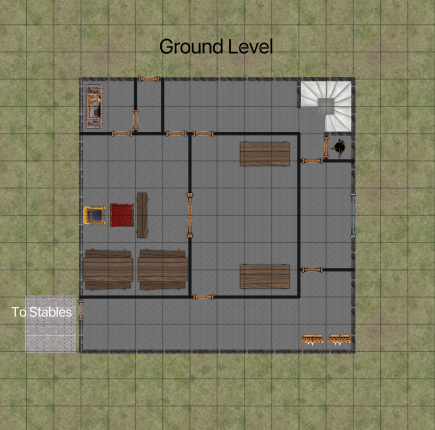
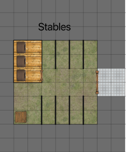

..  _`location.eagles.castle`:

Sir Warrant's Castle
----------------------

..  TODO:: Finish this.

See :ref:`chapter.rod_is_lost`.

-   The reception hall on the ground level.

-   The stables behind the tower.

    Sir Warrant's Castle, Ground Floor

    Scale: Square = 2m (6')

    Sir Warrant's Castle Stables, Ground Floor

    Scale: Square = 2m (6')
