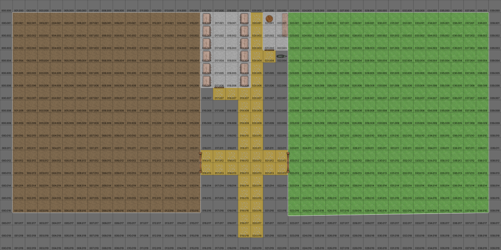

..  _`location.eagles.theoaks`:

The Oaks Riding Stable
----------------------

Out past the wall on the 
This riding stable seems like it's falling apart while you're looking at it.

Some of the rails from the poorly made, unpainted, 3-rail fence have fallen, and there are piles of manure that haven't been cleaned up.
(Any decent corral will have a 4-rail fence, often painted white.)

One of the paddocks has tufts of grass, suggesting it hasn't been used in over a year.

The difficulty of observing the neglect is merely Moderate.
Each of the following skills and attribute adds to the dice for a difficulty check:
-   *riding*
-   *streetwise*
-   Acumen attribute

Since these are cumulative, any combination that creates 15 pips makes the check automatic: it's obvious to the character. For example, 3D of Acumen plus 1D of riding plus 1D of streetwise is 15 pips.

See :ref:`chapter.desperation` and :ref:`chapter.foxs_tail`.

..  design notes:

    100 m^2 per horse is for the wealthy patrons.
    For 8 horses, this is a 30m x 30m corral.
    15 squares x 15 squares

    50-75 m^2 per horse for the poor folks.
    For 12 horses, this is a second 30m x 30m corral.
    15 squares x 15 squares

    Room between for 4-width tack house and 3-width farrier shed and 1-width path = 8 squares.

    Tack house with a dozen cabinets. 6x4 squares + 4 squares porch.

    Farrier shed with workbench. 2 x 3 squares.

    39 squares = 80m horizontal
    20 squares = 40m vertical

    The Oaks Riding Stable, in City of Eagles

    Scale: Square = 2m (6').

If the party made a total mess of interrogating the barkeep a *The Fox's Tail*, the stables will be empty of people.
Some horses, tack and harness are left behind. Two Fox's Tail tankards can be found with a careful search.

If the party skipped *The Fox's Tail*, the stables are filled with the Stable Boss, and 4 hands.
They're all itching for a fight.

If the party members all make a *stealth* Acumen roll, they can surprise the stable hands.
The fight will be confined to the interior of the stables.
If anyone fails the *stealth* Acumen roll, the hands will see you coming and will attack in the street.

The place is run-down, the horses look sick and the tack and harness is shoddy.

The boss is a fanatical follower of the Jackal.
He spends his days watching the road.
He's supposed to gather information, but is occasionally asked to do some dirty work.
This is mostly thumping uncooperative merchants, stealing trinkets, and tailing people to see who they talked to.

(Difficulty Easy.)
Survivors will readily admit they take care of horses for priests from the Temple of the Jackal.

This stable services the horses for 'Steward' and other highly placed characters in the Cult of the Jackal.
(See :ref:`location.keep.cultists`.)

(Difficulty Difficult.)
The Boss personally handles Jackal Temple saddle bags.
If the Boss is one of the survivors, he knows about moving letters from the bag to *Fox's Tail*, or from *Fox's Tail* to a saddlebag.
Some letters are to him; which have orders he must convey to the barkeep.
He gets his payroll from a saddlebag that passes through town every week or two.

If the Boss is not a survivor, the letters are known, but the payroll isn't something anyone but the boss knows about.

(Difficulty Easy.)
The Boss knows very little outside of specific commands to watch or to follow or to interfere.
All his men are actually hired by the barkeep at the *Fox's Tail*. He doesn't know why he can't hire his own boys.
He pays them regularly, only keeping back a little once in a while if he can demonstrate they failed in some assignment.

(Difficulty Moderate.)
Survivors will name two prominent Jackal collaborators in town:

-   The barkeep at *The Fox's Tail*.

-   The city librarian brings letters or gets letters.

He won't actually name Steward, however: he fears the spy-master, and won't mention him.

..  admonition:: GM Note

    See :ref:`location.keep.cultists` for details
    on the external intelligence organization.
    Specifically, the spymaster known as Steward.

..  only:: Hero

    ::

            Name: Xorn Spy in Eagles -- Boss at Oaks Stable.
            Characteristics:
            10	STR	0
            14	DEX	12
            10	CON	0
            10	BODY	0
            13	INT	3
            12	EGO	4
            10	PRE	0
            10	COM	0
            2	PD	0
            2	ED	0
            2.4	SPD	0
            4	REC	0
            20	END	0
            20	STUN	0
            6	Running	0
            2	Swimming	0
            Cost: 19
            Skills & Abilities:
            7	Conversation	13-
            3	Knowledge	12-
            2	Weapons Familiarity	Group
            7	Streetwise	13-
            5	Stealth	13-
            5	Sleight of Hand	13-
            2	Combat - Swordsman	+1 OCV
            25+ Disadvantage
            -15	Spy for Xorn:  Secret Identity,
            -10	Afraid of Xorn: Uncommon Situation, Strong Intensity,
            Costs: char skills total disadv base
            19 + 31 = 50 = 25 + 25
            Rolls & Effects:
            Base OCV	5
            Base DCV	5
            Base ECV	4
            Phases	?
            Lift	100 Kg
            Jump	2 Hexes
            CON Roll	11-
            DEX Roll	12-
            INT Roll	12-
            EGO Roll	11-

..  only:: Hero

    ::

        Name: Xorn Spy Henchman Eagles
        Characteristics:
        STR:11	DEX:17	CON:10	BODY:12	INT:10
        EGO:10	PRE:10	COM:10	PD:2	ED:2
        SPD:3	REC:4	END:20	STUN:23	Running:6
        Swimming:2
        Powers and Skills: Weapons Familiarity Group,Streetwise 13-,Stealth 13-,Sleight of Hand 12-,Combat +2 OCV,	Swordsman; 	;
        25+ Disadvantages:
        Spy for Xorn:  Secret Identity, ; Follower of Jackal: Uncommon Situation, Strong Intensity, Rabid!

..  include:: ../../characters/ch_3_bandit_thugs.txt

