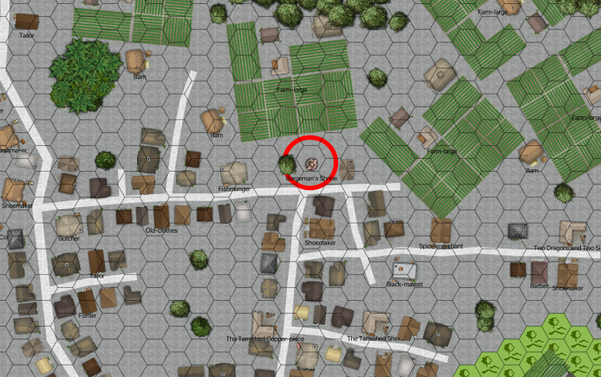

..  _`location.whitewater.haelan`:

#####################################
  Priestess Bargeman's Hælan Shrine
#####################################

This is a plinth topped with what might be a turtle.
There's a shady tree nearby, with someone sleeping underneath it.

The party can wait or you can bother the person.

-   If the party waits, it will be a while before the person wakes up.

    -   Anyone making a difficulty Moderate *Streetwise* roll will notice people looking at the party and trying to sneak away without being noticed.

-   If the party disturbs the person, they will shrug them off with a "yeah, yeah, I was just resting my eyes from the bright sun."

When  they finally see you, they don't seem surprised.

(Difficulty Difficult to see they really **are** surprised.)

    Priestess Bargeman's Hælan Shrine

    Scale: Hex = 10m (30')

Priestess Bargeman  wants information.
They'll pepper you with questions: who you are, why you're here, where in Hillshire are you from? (Your accents are prominent.)

They have very good conversation skills (*speaking*, *streetwise*, *persuasion*, and *charm*.)
If you make an opposed difficulty skill roll (*charm* or *persuasion* Charisma skills) and beat them, you can find out enough to realize they're a double agent.

(Difficulty Easy.)
Once they entered the temple, they needed to perfect a skill,
and poling a barge seemed good. Every barge has a handful of "Bargeman from WhiteWater" or "Bargeman from Under the Falls".
they become "Priestess Bargeman."

..  admonition:: GM Note

    Followers of Hælan won't be able to figure this story out at all.
    It sounds like a Folme or maybe a Witan practice.

(Difficulty Difficult.)
They're actually a follower of Bealu, posing as a follower of Hælan.

(Difficulty Very Difficult.)
They're *also* posing as follower of the Jackal cult.

(Difficulty Very Difficult.)
They're loyal to neither the Jackal Cult nor Sir Bond, but They sells information back and forth.

Bargeman recruits pilgrims to join the throng in the Jackal Temple.
They are allowed to worship the Jackal in peace for a few days, then they must join (and become novices) or return to their homes.

It's a four-day trip, they stay about a week, and then return. The schedule is fixed; it's a matter of getting enough together to make the trip safely.

You're in luck. The next scheduled departure would be tomorrow.
They check a board laying against the plinth with a circle calendar showing six seasons and sixty days with notches for the 5 (or six) extra days.
They confirm there was no extra day before midsummer this year, right?

Their instructions are clear: Be back at the west gate first thing tomorrow morning and the party can go as one group.

..  admonition:: GM Note

    They doesn't really know much of the bigger picture.

They'll take you down to the lower city, but stop short of the Candler factory.
They'll point you down a high road that leads toward the river.
The directions are simple: Follow the smell and take the last turn to the South.

..  only:: hero

    ::

            Name: Bargeman -- Double Agent in White Water
            Characteristics:
            10	STR	0
            14	DEX	12
            10	CON	0
            10	BODY	0
            12	INT	2
            12	EGO	4
            10	PRE	0
            10	COM	0
            2	PD	0
            2	ED	0
            3	SPD	6
            4	REC	0
            20	END	0
            20	STUN	0
            6	Running	0
            2	Swimming	0
            Cost: 24
            Skills & Abilities:
            7	Conversation	13-
            3	Knowledge	12-
            1	Weapons Familiarity	Group
            5	Streetwise	12-
            5	Magic	13-
            3	Religion - Ercha	11-
            2	Familiarity Bear clan and Jackal worship	8-
            25+ Disadvantage
            -15	Double Agent:  Secret Identity,
            -10	Eastern-Influenced: Uncommon Situation, Strong Intensity,  Ercha Follower, hates Xorn and White Water.  Independent of Eagles, also.
            Costs: char skills total disadv base
            24 + 26 = 50 = 25 + 25
            Background:
            Follower of Ercha, infiltrating both Xorn and White Water spy apparatus.  Appears to be follower of Jackal and member of Bear clan.
            Equipment:  Some kind of magical weapon
            Rolls & Effects:
            Base OCV	5
            Base DCV	5
            Base ECV	4
            Phases	4/8/12
            Lift	100 Kg
            Jump	2 Hexes
            CON Roll	11-
            DEX Roll	12-
            INT Roll	11-
            EGO Roll	11-

..  include:: ../../characters/ch_5_jackal_doubleagent.txt
