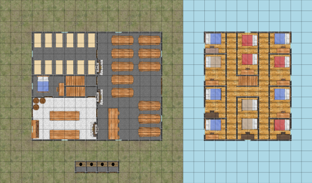

..  _`location.whitewater.wildmare`:

########################
  The Wild Mare Tavern
########################

To follow Candler's offer and join the Bandit Army, the party needs to meet at the *Wild Mare* Tavern.

    Wild Mare Tavern

    Scale: 1 square = 2m

This place is a horrifying dump.

The doors upstairs don't seem to have catches on them.
There are rats.

There are eight people in the tavern:

-   The Wild Mare Bartender.

-   The Bandit Group Guide, who's clearly in charge.

-   Four drunks that seem like they know each other.

-   Two more people, who look new, and uncomfortable, but are making heroic use of "liquid courage" supplied by the bartender.

The Guide sneers at the party, "You don't look like the right kinds of lads, ready to throw a few fists around when it's needed."

The Guide will single out the biggest member of the party and start a one-on-one bare-knuckles fight with one of the thugs in this tavern.

..  admonition:: GM Note

    See :external:ref:`fantasy.damage.stun`.

The guide will end the fight when a character is stunned or takes 2 or more points of body damage.

You'll be sent off to your room in humiliation.
The next morning, you're still going to be walking to Hillshire.

Only two of the thugs in the tavern are actually going.
The one that beat you, and another, who looks happy to have stayed out of the fight.

..  include:: ../../characters/wildmare_bandit_thugs.txt
