..  _`location.keep`:

####################################
  Temple of the Cult of the Jackal
####################################

Concealed in a wide, flat hollow, high in the hills, lies this obscure structure.
It's neither large, nor imposing.
It's not designed to intimidate by hulking on the edge of a steep hill, and providing a commanding view of a valley.
It's nestled deep in the hills, designed to remain as a secure, hidden retreat, surrounded by higher peaks.

..  note:: Jackals are not part of this continent's wildlife.

    Somewhere on the continent to the North, there's a place with a Jackal-headed god, who looks like the Egyptian Anubis.

    People who are casually aware of the cult often substitute "wolf" for "jackal" because that's an animal they know.
    Traders and travelers in the western continent may use "coyote", because it makes them sound more worldly.

    The true followers never make a mistake. To them, the term "jackal" becomes a kind of passcode; something outsiders wouldn't know.

The temple's valley is a bit less than a kilometer long in the E-W direction.
A number of little streams in rocky channels converge in a pond, and drop over a fall to a lower, narrower valley.
In the N-S direction, it's a bit less than a half-kilometer wide.

The location of the Temple is a closely-guarded secret.
Pilgrims need directions, and must contact one of the spies in Eagles to get directions and the password.

The most effective entry is to get captured by the bandit army and dragged up here.

General
=======

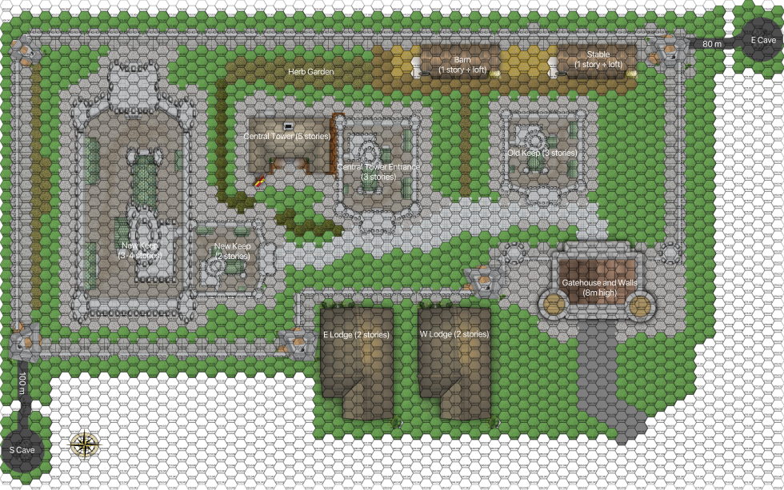

    Temple Grounds

    Scale: Hex = 2m (6').

The structure is just under 140 m along the north-facing wall.
The western wall is 60 m long.
The eastern wall is 40 m long.
The southern wall has two turns in it: walking the top is 162 m.
The total circuit, marched by the guards is a hair over 400m.

..  admonition:: GM Note

    Given a typical character's Move value of 10m/r, it's possible for an officer to hustle around the wall in about four minutes.
    Since there's no reason to hurry, a typical circuit takes about 12-16 minutes, with long pauses at each tower to stare into the distance.

    As a general guideline -- if a character makes a simple Acumen-related observation skill roll --
    use 4D minutes as the time for a circuit by a guard.

There are a few obvious structures that comprise the larger temple structure.

-   **Wall**.
    The compound wall is crenelated, only 8-10m high, with five small towers in the corners.
    The visible force is about 30 men. The towers are 10m high.

    The rumor about other-worldly goblins patrolling the forest around the keep after nightfall is true.

-   **Gate House**.
    The Gate House is 8-9m high, with a flat roof, and crenelation, allowing armed archers to shoot down into the road.
    It has a double door, which open during the day.
    The front has archer slits that house some guards with cross-bows, plus the keeper of the gate.
    Inside the gatehouse are spiral stairs leading to the roof.

    A concealed door (difficulty Easy 8, to discover because it's heavily used) reveals stairs  descending into a small basement.

    Pilgrims are admitted with a little discussion beyond some secret phrases or gestures.

    Hirelings and merchants with supplies must present paperwork to be granted access to the temple.

-   **The New Keep**.
    The New Keep is the cult's nerve center.
    It houses the human guards, as well as his planning staff and intelligence gatherers.
    It has the main dungeons, as well as some magical equipment for spying out the doings in various cities.

-   **The Central Tower**.
    The Central Tower is the Temple of the Jackal.
    Religious ceremonies and magical procedures are performed here.
    The central nave is open for five stories, and occasionally has birds and what-not flying around.

    The forest is ancient, and does have trees taller than this tower.
    From the cleared road, and the surrounding hills, the tower is prominent because it erupts out of a large clearing.

-   **The Old Keep**.
    The Old Keep is an ancient building with old-style haphazard stone work.
    It has been added-to and extended over the centuries.

    While it once was the main building, it is now the private residence of Xorn and his main henchmen.

-   **Barn and Stables**.
    Up against the north wall are two small wooden structures.
    They have the usual features of barns and stables: horses, manure, farming tools, hay.

    Outside the barn is a 30m × 4m garden plot with some herbs and vegetables.

-   **The Lodges**.
    There are two outside lodges for Pilgrims: called the East Lodge and the West Lodge.
    These are 14m by 20m buildings.
    They're two stories above ground, with exposed foundations suggesting a basement.
    (They're not like common rural farmhouses built over the animal pen.)

Less obvious are two caves.
The East Cave and South Cave are snuggled in deep, dry ravines, hidden by piles of boulders.
With some careful searching (difficulty Moderate 14) the caves can be found.
The ravines in which the caves are concealed are suspiciously dry; the water flows down a gulley not far away.
The caves are inhabited by a horde of otherworldy goblins.

It's not clear precisely how a horde of goblins were pulled into this realm, or for what purpose.
It's not even clear when they might have arrived; they may be marooned here.

..  _`location.keep.schedules`:

Schedules
--------------------

There's a typical daily schedule that applies to most days.
There is some variation, shown in the Activity Details table.

..  csv-table:: Daily Schedule

    "Forenoon (8AM to Noon)","- Gates opened so Pilgrims from the lodges allowed in
    - Bandits may emerge for raiding or patrols
    - See Activity Details
    - 2 men per corner tower, 6 in Gate House"
    "Afternoon (noon to 4PM)","- major mid-day meal starts at noon, other duties around the compound
    - See Activity Details
    - 2 men per corner tower, 6 in Gate House"
    "Evening (4PM to 8PM)","- Priests come out of the temple tower at 4PM
    - Bandits may return from raiding or patrols
    - Evening meal served
    - Pilgrims sent out to the lodges before sunset
    - Gates closed shortly before 8PM
    - 2 men per corner tower, 6 in Gate House"
    "Dog (8PM to midnight)","- Second evening meal for those up all night
    - Goblins often leave their caves to patrol the forests after sunset
    - 1 Man per corner tower, 2 in Gate House"
    "Night (midnight to 4AM)","- Goblins raise whatever havoc they want, outside walls
    - 1 Man per corner tower, 2 in Gate House"
    "Morning (4AM to 8AM)","- Goblins return before dawn; quiet time from dawn to 8AM
    - 1 Man per corner tower, 2 in Gate House"

The nighttime Goblin raiding stays outside the Keep's valley, making it a difficult activity to observe from the Pilgrim lodges or anyplace else near the Keep.

The activities vary from day to day.
There doesn't seem to be any pattern.

..  admonition:: Activity Details

    Roll 1D to pick the day's activities.

    ..  csv-table:: Activity Details

        Roll,Activity,Location
        1,"Religious Worship Services", "Central Tower"
        2,"Xorn's public audiences, court, witness punishment", "Old Keep"
        3,"Pilgrim training time", "Central Tower"
        4,"A few bandit patrols leave forenoon, return before evening", "Outdoors"
        5,"The whole bandit army erupts forenoon, returns before evening with loot", "Outdoors"
        6,"Maintenance and cleanup indoors", "Roll:

        1. New Keep
        2. Central Tower
        3. Old Keep
        4. Gatehouse
        5. Barn and Stable
        6. Lodges"

Characters
==========

There are three distinct forces within the Temple.

-   The Cult of the Jackal. This is a force composed of clerics, novices, and pilgrims. This group is the base for the externally focused intelligence operation in City of Eagles and City of White Water.

-   The Bandit Army with mages and various thugs and criminals.

-   There is **also** a horde of Goblins that sometimes infests the temple valley.

The Cult of the Jackal is the religious arm.

Xorn
----

See :ref:`character.xorn` in the :ref:`character` chapter.

Residence: `Central Tower Fourth Level`_ and `Central Tower Fifth Level`_.

..  _`location.keep.cultists`:

Cult of the Jackal
------------------

The organization has two divisions, internal and external.

-   **Internal Security**.
    These priests are in charge of scrying and torture.
    There are devices in the top of the New Keep that are used to discern caravan movements along the road, and direct the bandit army to intercept them.

    The head of this organization the Senior Priest -- Internal (budget 22D + 13D).

    Office: `New Keep Ground Level`_, Room 9. More commonly, however, they're found in the `New Keep Fourth Level`_, rooms 1 and 2.

    Residence: Old Keep, Level 3, Room 2.

    There are direct reports to the Senior Priest of Internal Security: a priest and a magician.

    -   High Priest -- Torturer

        Office: `Old Keep Second Level`_, Room 2.

        Residence: `Old Keep Third Level`_, Room 5.

    -   High Mage -- Scrying

        Office: `Old Keep Second Level`_, Room 2

        Residence: `Old Keep Third Level`_, Room 6

-   **External Intelligence**.
    These priests are in charge of communications, spies and disinformation.
    This organization is in contact with agents in City of Eagles and City of White Water.

    The head of this organization is a Senior Priest External (budget 18D + 10D).

    Office: `New Keep Ground Level`_, Room 7.

    Residence: `Old Keep Third Level`_, Room 4.

    The organization has two High Priests within the temple, writing and reading correspondence,
    and handling external operations, including finance and payroll for hirelings.
    There are two more High Priests operating in the field.

    -   Level 2-3 High Priest -- Communications

        Office: `New Keep Ground Level`_, Room 7.

        Residence: `Old Keep Third Level`_, Room 7.
        Hot-bunking with Operations.
        Really, quite awkward.

    -   Level 2-3 High Priest -- Operations

        Office: `New Keep Ground Level`_, Room 7.

        Residence: `Old Keep Third Level`_, Room 7.
        Hot-bunking with Communications.
        Not happy with this.

    -   Level 2-3 High Priest.

        Deployed in City of Eagles.
        His cover is to represent some vague 'investors' from Southlands looking for trade opportunities: call him 'Steward'.

        Two henchmen:

        - Boss at *The Oaks* riding Stable.

        - Bartender from *The Fox's Tail*.

        See :ref:`chapter.the_exchange` for details on the spymaster in City of Eagles.

    -   Level 2-3 High Priest.

        Deployed in City of White Water at a fat rendering plant out of town.  Makes and sells candles from a shop in town.

        See :ref:`chapter.white_water` for details on the spymaster in City of White Water.

The two Senior priests and the five High Priests all have  similar descriptions:

..  include:: ../../characters/jackal_high_priest.txt
..  include:: ../../characters/jackal_internal.txt
..  include:: ../../characters/jackal_external.txt

..  _`character.staff`:

Staff Positions
----------------

There 1D priests with various lower-level roles.

There are 2D novices, aspiring to be priests.

There may be as many as 3D pilgrims hanging around, hoping to become novices, or maybe just taking in the glory before they scatter to their villages and towns.

..  include:: ../../characters/jackal_priests.txt

..  only:: hero

    ::

        Name: Xorn Security -- Torturer
        Characteristics:
        15	STR	5
        16	DEX	18
        12	CON	4
        12	BODY	4
        16	INT	6
        12	EGO	4
        16	PRE	6
        10	COM	0
        4	PD	1
        4	ED	2
        3	SPD	4
        5	REC	0
        24	END	0
        26	STUN	0
        6	Running	0
        2	Swimming	0
        Cost: 54
        Skills & Abilities:
        1	Weapons Familiarity	Group
        7	Religion	13-
        4	HKA	1/2d6 K
        5	Strike	7d6
        4	Block
        5	Deduction	13-
        3	Knowledge	13-
        5	Riding	13-
        3	Conversation	12-
        9	Interrogation	15-

        50+ Disadvantage
        -15	Fear Xorn: Common Situation, Strong Intensity,

        -10	Jackal Follower: Uncommon Situation, Strong Intensity,

        -10	Cruel/Sadistic: Uncommon Situation, Strong Intensity,

        -15	Won't Suffer Insults: Common Circumstances, 11- Chance,

        Costs: char skills total disadv base
        54 + 46 = 100 = 50 + 50

        Rolls & Effects:
        Base OCV	5
        Base DCV	5
        Base ECV	4
        Phases	4/8/12
        Lift	200 Kg
        Jump	3 Hexes
        CON Roll	11-
        DEX Roll	12-
        INT Roll	12-
        EGO Roll	11-

    Xorn Security -- Intelligence 1-3 (100 pt)
    -------------------------------------------

    ::

        Name: Xorn Security -- Intelligence
        Characteristics:
        17	STR	7
        16	DEX	18
        12	CON	4
        12	BODY	4
        16	INT	6
        12	EGO	4
        16	PRE	6
        10	COM	0
        4	PD	1
        4	ED	2
        3	SPD	4
        6	REC	0
        24	END	0
        27	STUN	0
        6	Running	0
        2	Swimming	0
        Cost: 56
        Skills & Abilities:
        1	Weapons Familiarity	Group
        7	Religion	13-
        4	HKA	1/2d6 K
        5	Strike	7d6
        4	Block
        5	Deduction	13-
        3	Knowledge	13-
        7	Magic	14-
        5	Riding	13-
        3	Conversation	12-

        50+ Disadvantage
        -15	Fear Xorn: Common Situation, Strong Intensity,

        -10	Jackal Follower: Uncommon Situation, Strong Intensity,

        -10	Self-Sacrificing: Uncommon Situation, Strong Intensity,

        -15	Won't Suffer Insults: Common Circumstances, 11- Chance,

        Costs: char skills total disadv base
        56 + 44 = 100 = 50 + 50

        Rolls & Effects:
        Base OCV	5
        Base DCV	5
        Base ECV	4
        Phases	4/8/12
        Lift	263.901582 Kg
        Jump	3.4 Hexes
        CON Roll	11-
        DEX Roll	12-
        INT Roll	12-
        EGO Roll	11-

    Communications 1-2 (100 pt)
    ----------------------------

    ::

        Name: Xorn Magic Users
        Characteristics:
        15	STR	5
        16	DEX	18
        12	CON	4
        10	BODY	0
        16	INT	6
        12	EGO	4
        10	PRE	0
        10	COM	0
        3	PD	0
        2	ED	0
        3	SPD	4
        5	REC	0
        24	END	0
        24	STUN	0
        6	Running	0
        2	Swimming	0
        Cost: 41
        Skills & Abilities:
        1	Weapons Familiarity	Group
        5	Religion	12-
        4	HKA	1/2d6 K
        5	Strike	7d6
        4	Block
        7	Magic	14-
        3	Riding	12-

        50+ Disadvantage
        -15	Fear Xorn: Common Situation, Strong Intensity,

        -10	Jackal Follower: Uncommon Situation, Strong Intensity,

        -10	Greedy: Uncommon Situation, Strong Intensity,Stealing from the temple
        -15	Won't Suffer Insults: Common Circumstances, 11- Chance,

        Costs: char skills total disadv base
        41 + 29 = 100 = 50 + 50

        Rolls & Effects:
        Base OCV	5
        Base DCV	5
        Base ECV	4
        Phases	4/8/12
        Lift	200 Kg
        Jump	3 Hexes
        CON Roll	11-
        DEX Roll	12-
        INT Roll	12-
        EGO Roll	11-

    Spells #1 (Necromancy)
    ~~~~~~~~~~~~~~~~~~~~~~

    ::

        Spells death	9	37	10d6 Dispel	Side Effect (2d6 Transform)
        Create Undead	8	45	Summon (8 x 25pt Creature)	Side Effect (2d6 Transform)
        Touch of Decay	12	50	Drain 1d6 BODY	Side Effect (2d6 Transform)
        Detect Magic	1	3	Detect Magic	Side Effect (2d6 Transform)

    Spells #2 (Fire)
    ~~~~~~~~~~~~~~~~~

    ::

        Fire Blast	10	40	8d6 EB	Side Effect (Drain 3d6 STUN)
        Fire Bolt	7	30	2d6 RKA	Side Effect (6d6 EB)
        Fire Shield	2	8	4 PD/ED Force Field	Side Effect (3d6 Flash)
        Fireball	11	45	6d6 EB	Side Effect (4d6 EB)

    Low-Level Officers (6, 50 pt ea.)
    ---------------------------------

    ::

        Name: Xorn Officer Four
        Characteristics:
        STR:15	DEX:15	CON:13	BODY:11	INT:10
        EGO:10	PRE:12	COM:10	PD:3	ED:3
        SPD:2.5	REC:6	END:26	STUN:25	Running:6
        Swimming:2
        Powers and Skills: Combat +2,Weapon Familiarity Category,Transport Familiarity 8-,Gambling 11-,Professional Skills 11-,Riding 12-,Survival 11-,	; 	;
        25+ Disadvantages:
        Fear Xorn: Common Situation, Not much interaction with the high priest.
        ; Lives for Military: Common Situation, ; Ambitious: Uncommon Situation, Trying to climb the ladder of success, but stuck on the second rung.;
        Background:
        4: Wants more action and more autonomy than normal feudal powers permit.
        5: Wants to cruelly repress the troops under his command.
        6: Wants to institutionalize mayhem.

    30 guards (50 pt)
    -------------------------

    ::

        Name: Guards
        Characteristics:
        STR:14	DEX:16	CON:11	BODY:12	INT:10
        EGO:12	PRE:10	COM:10	PD:3	ED:2
        SPD:3	REC:5	END:22	STUN:25	Running:6
        Swimming:2
        Powers and Skills: Weapons Familiarity Group,Religion 11-,Combat +2,
        25+ Disadvantages:
        Fear Xorn: Common Situation, Strong Intensity, ; Jackal Follower: Uncommon Situation, Strong Intensity

Bandit Army
------------

The Bandit army's base is the Jackal's Temple.
However, their field of operations is throughout the eastern edge of Hillshire and the western edge of Southlands.
See :ref:`location.keep`.

The bandit army is -- well -- bandits.
There is little coordination among the forces.
They use looted armor and weapons.
They steal ideas from the goblins that live in the caves near the temple.

It is bloody chaos.

The organization is as follows:

-   General

    During the day, found in the field, raiding.

    Residence: New Keep, Level 2, rooms 10, 12, 14.

-   Colonel

    During the day, found in the field, raiding.

    Residence: New Keep, Level 2, Rooms 14, 17, 18.

-   High Mage

    During the day, found in the field, raiding.

-   Staffing Admin. Major

    Office: New Keep, Level 1, Room 3

    Residence: New Keep, Level 2, Rooms 8, 11, 13, 16

-   Finance Admin. Major

    Office: New Keep, Level 1, Room 6

    Residence: New Keep, Level 2, Rooms 8, 11, 13, 16

-   Finance Admin. Clerk

    Office: New Keep, Level 1, Room 13

    Residence: In barracks

-   Staffing Admin. Clerk

    Office: New Keep, Level 1, Room 16

    Residence: In barracks

-   The rest of the army is a rabble of thugs and criminals, numbering somewhere around 30.

..  include:: ../../characters/bandit_army.txt

..  only:: hero

    ::

        Name: Bandit Army General
        Characteristics:
        19	STR	9
        19	DEX	27
        15	CON	10
        13	BODY	6
        10	INT	0
        10	EGO	0
        14	PRE	4
        10	COM	0
        4	PD	0
        3	ED	0
        3	SPD	1
        7	REC	0
        30	END	0
        30	STUN	0
        6	Running	0
        2	Swimming	0
        Cost: 57
        Skills & Abilities:
        6	Combat	+2
        2	Weapon Familiarity	Category
        5	Stealth	14-
        5	Interrogation	13-
        1	Transport Familiarity	8-
        5	Animal Handler	12-
        3	Gambling	11-
        5	Survival	12-
        4	Professional Skills	13-
        7	Paramedic	16-

        50+ Disadvantage
        -15	Fear Xorn: Common Situation, Strong Intensity,
        -20	Maniacal: Common Situation, Total Intensity Thinks he's invincible
        -15	Ambitious: Common Situation, Strong Intensity, Trying to climb the ladder of success, stepping on everyone possible.
        Costs: char skills total disadv base
        57 + 43 = 100 = 50 + 50
        Background:
        First Officer in Xorn's Cadre.  Ambitious, professional soldier.  Good KS of his job.  Health and fitness buff.  Goes running and stretching and stuff.
        Quote:
        I've never let this stop me before.
        Tactics:
        Knows value of support -- logistics, maintenance, etc.  A healer himself.
        Rolls & Effects:
        Base OCV	6
        Base DCV	6
        Base ECV	3
        Phases	4/8/12
        Lift	348.220225 Kg
        Jump	3.8 Hexes
        CON Roll	12-
        DEX Roll	13-
        INT Roll	11-
        EGO Roll	11-

    Bandit Army Colonel (100 pt)
    --------------------------------

    ::

        Name: Bandit Army Colonel
        Characteristics:
        18	STR	8
        19	DEX	27
        16	CON	12
        14	BODY	8
        10	INT	0
        10	EGO	0
        14	PRE	4
        10	COM	0
        6	PD	2
        5	ED	2
        3	SPD	1
        7	REC	0
        32	END	0
        31	STUN	0
        6	Running	0
        2	Swimming	0
        Cost: 64
        Skills & Abilities:
        6	Combat	+2
        2	Weapon Familiarity	Category
        5	Stealth	14-
        5	Interrogation	13-
        1	Transport Familiarity	8-
        7	Gambling	13-
        7	Survival	13-
        3	Professional Skills	12-

        50+ Disadvantage
        -15	Fear Xorn: Common Situation, Strong Intensity,

        -20	Maniacal: Common Situation, Total Intensity,
            Thinks he invincible
        -15	Ambitious: Common Situation, Strong Intensity,
            Trying to climb the ladder of success, stepping on everyone possible.

        Costs: char skills total disadv base
        64 + 36 = 100 = 50 + 50

        Background:
        Wild-man from the hills, tamed and leading other crazies in Xorn's army.  Chews tobacco, spits, scratches and acts like a country bumpkin.
        Quote:
        Well, hells bells!
        Tactics:
        Loves the idea of an all-out fight.
        Rolls & Effects:
        Base OCV	6
        Base DCV	6
        Base ECV	3
        Phases	4/8/12
        Lift	303.143313 Kg
        Jump	3.6 Hexes
        CON Roll	12-
        DEX Roll	13-
        INT Roll	11-
        EGO Roll	11-

        Name: Bandit Army High Mage
        Characteristics:
        15	STR	5
        17	DEX	21
        16	CON	12
        10	BODY	0
        10	INT	0
        10	EGO	0
        14	PRE	4
        10	COM	0
        3	PD	0
        4	ED	0
        2.8	SPD	1
        6	REC	0
        32	END	0
        26	STUN	0
        6	Running	0
        2	Swimming	0
        Cost: 43
        Skills & Abilities:
        6	Combat	+2
        2	Weapon Familiarity	Category
        1	Transport Familiarity	8-
        3	Gambling	11-
        3	Professional Skills	12-
        9	Magic	14-

        50+ Disadvantage
        -15	Fear Xorn: Common Situation, Strong Intensity,

        -20	Maniacal: Common Situation, Total Intensity,
            Thinks he invincible
        -15	Ambitious: Common Situation, Strong Intensity,
            Trying to climb the ladder of success, stepping on everyone possible.

        Costs: char skills total disadv base
        43 + 27 = 100 = 50 + 50

        Background:
        Magician with a craving for large-unit combat.
        Quote:
        This will teach you humility
        Tactics:
        Wants to crush a large group with magical power
        Rolls & Effects:
        Base OCV	6
        Base DCV	6
        Base ECV	3
        Phases	?
        Lift	200 Kg
        Jump	3 Hexes
        CON Roll	12-
        DEX Roll	12-
        INT Roll	11-
        EGO Roll	11-

Bandit Army Mage Spells
-----------------------

..  include:: ../../spells/bandit_spells.txt

..  only:: hero

    ..  csv-table:

        War Blast	7	30	6d6 EB	Side Effect (6d6 EB, STUN only)
        War Bolt	7	30	2d6 RKA	Side Effect (2d6 RKA)
        Battle Shield	4	16	8 PD/ED Force Field	Side Effect (x1.5 STUN & BODY)
        Dispel	7	30	8d6 Dispel	Side Effect (Aid 3d6 to opponent)
        Bravery	7	30	Aid 2d6 PRE	Side Effect (Aid Opponents)

..  only:: hero

    ::

        Name: Bandit Army Mage
        Characteristics:
        STR:10	DEX:15	CON:10	BODY:10	INT:10
        EGO:10	PRE:12	COM:10	PD:2	ED:2
        SPD:2.5	REC:4	END:20	STUN:20	Running:6
        Swimming:2
        Powers and Skills: Combat +1,Weapon Familiarity Category,Transport Familiarity 8-,Professional Skills 11-,Magic 12-,	; 	;
        25+ Disadvantages:
        Fear Xorn: Common Situation, Not much interaction with the high priest.
        ; Back-stabbing: Common Situation, ; Greedy: Uncommon Situation, Looking for money to carry on magical research;
        Background:
        Wants more money and freedom to research than normal feudal powers permit.

Goblin Hordes
--------------

Great Leader. (Attributes: 20D, skills 11D, options 2D.)

Officers. (Attributes: 18D, skills 9D, options 2D.)

Guards and Foragers. (Attributes: 16D, skills 7D, options 2D.)

..  include:: ../../characters/goblin_horde.txt

Wall and Corner Towers
======================

The wall is 8m high for the most part. The towers are 10m.

The towers are numbered clockwise around the compound.

..  csv-table::
    :header-rows: 1

    Tower,Hex Coordinate,Description
    1,68.4,"NE Corner"
    2,49.24,"SE Corner, W of gate house"
    3,30.30,"S Wall, W of lodge"
    4,2.30,"SW Corner"
    5,2.4,"NW Corner"

They're all largely empty. Each has a weapons rack with 1D shabby swords, 2D worn spears, 1D crossbows, and a shallow crate of 5D+10 bolts.

Gate House
==========

The road leads up to the gate house. To it's west, there are two lodges, outside the wall, and seemingly undefended.

The gate is flanked by walls with a few arrow slits to allow archers to shoot down on someone approaching the gate.

The outermost door -- made of heavy timbers, iron straps, and massive studs -- appears to never close.
There are weeds growing around it.

The inner portcullis is raised and lowered every day.

Gate House Ground Level
------------------------

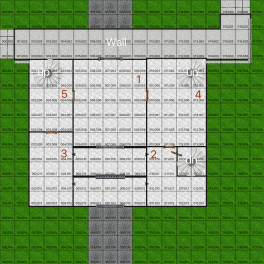

    Gate House, Ground Level.

    Scale: Square = 2m (6').

#.  Two-story entrance tunnel. (About 7m high.)
    There's an outer door, an inner iron bar portcullis, and beyond that, an inner door.

    Inside the tunnel, there are arrow slits on this level and the floor above to allow guards to shoot down from above.

#.  Guard Room.  One guard with crossbow and a few quarrels. They help raise and lower the portcullis.
    The south west guard room has a large space missing from it.
    There's a concealed door (difficulty Moderate 15 to find; difficulty Moderate 12 to get it open) and a spiral stair going down.

#.  Guard Room.  One guard with crossbow and a few quarrels. They help raise and lower the portcullis.

#.  Spiral Stair to the upper floor, room 1.

#.  Spiral Stair to the upper floor, room 2.

Gate House Second Level
-----------------------

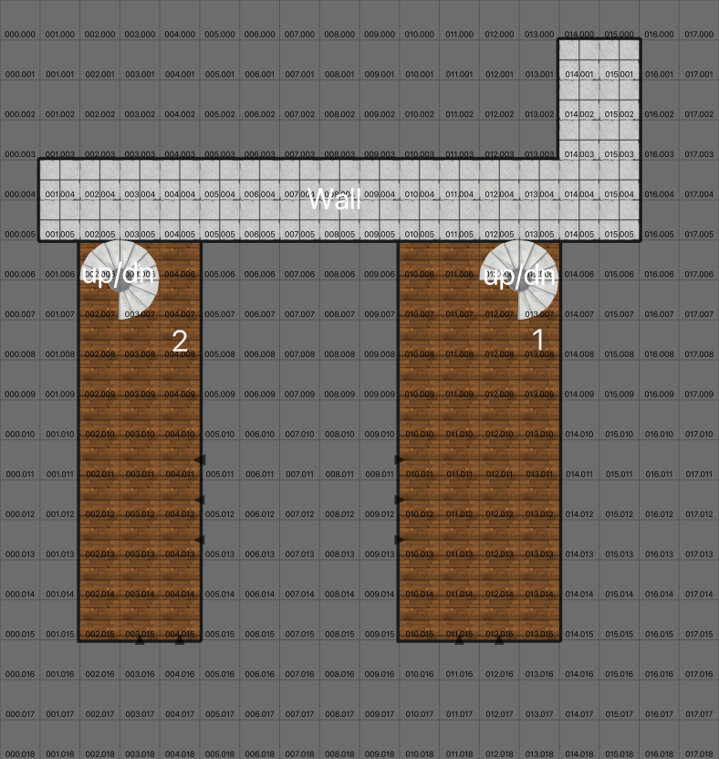

    Gate House, Second Level.

    Scale: Square = 2m (6').

#.  During the day, there may be 1D guards with crossbows. There's a spiral stair up (to the roof) and down to room 5.
    At night, this is generally empty.

#.  During the day, there may be 1D guards with crossbows. There's a spiral stair up (to the roof) and down to room 4.
    At night, this is generally empty.

From the rooftop, there's access to the wall.

Gate House First Sublevel
--------------------------

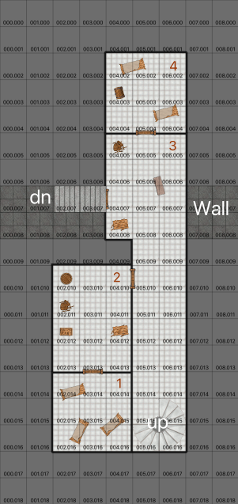

    Gate House, First Sublevel

    Scale: Square = 2m (6').

#.  Old Barracks.  Once had accommodations for eight.
#.  Old Supply.  Rotted food and barrels of brackish water.
#.  Old Office Area.  Desks and chairs. A spiral stair leads up to the ground level, concealed by a hidden door.
#.  Old Officer's Barracks.   Once had accommodations for two.

The array of cells are accessible to the `Old Keep`_.
Some cells have current prisoners.
These will be merchants waylaid along the road who may have some use.

..  _`location.keep.new_keep`:

New Keep
========

This is the main operations center.

..  _`location.keep.new_keep.level_1`:

New Keep Ground Level
---------------------

..  figure:: ../figures/NewKeep.png

    The New Keep, Ground Level

    Scale: Square = 2m (6').

#.  Cloak Area, 6D gold, 20D silver, in various pockets and purses hanging in the various wardrobes.

#.  Guard, looking out window, at desk.

    Desk has daily and weekly schedules, as well as petty cash, a list of pilgrims, a list of prisoners, and a list of accomplices in various towns who are allowed entrance

#.  Staffing Admin. Officer

    Level 2-3. Human Resources. Complete personnel files for guards, clerics, accomplices, spies, etc.

    ..  todo:: Residence and character

    See :ref:`character.staff`

#.  20 Helms and 30 Shields

#.  20 Pole Arms, 10 Short Swords, 10 Short Bows, 200 arrows

#.  Finance Admin. Officer

    Level 2-3. Finance and Bookkeeping. Complete general ledger, including bribes, etc., as well as supplies.

    ..  todo:: Residence and character

    See :ref:`character.staff`

#.  Comm. Officers 1 & 2

    Code books.  Notes to accomplices in various towns.  Plan A, Plan B boxes of fixed message sequences for massive revolts.

#.  Latrine

#.  Internal Security Intelligence Mages.

    Notes from crystal ball gazing, etc.

#.  Guest room 1.

    Miscellaneous visitors.  1D <= 3 chance of accomplice from some town.
    4/6 chance of City of Eagles.
    2/6 change of City of White Water.

#.  Internal Security (Torture) Priests.

    Transcripts from prisoners.

#.  Guest room 2.

    Miscellaneous visitors.  1D <= 3 chance of accomplice from some town.
    4/6 chance of City of Eagles.
    2/6 change of City of White Water.

#.  Clerk, Finance.

    Complete lists of weapons, armor, food, animals, furniture, religious items, magical items, etc.

    See :ref:`character.staff`

#.  Library, Files.

    Maps, charts, note, books, etc.  Spiral stair goes up and down

#.  War Room.  Large maps, charts, notes, books, etc.

#.  Clerk, Training.

    Off-duty plans for entire staff, pilgrims, clerics, etc.  Weapons, magic.

    See :ref:`character.staff`

#.  Mess Hall.

    Room for over 100 if they crowded the benches.  Always 1D+2 off-duty types here.
    Less than half the tables in regular use.

#.  Pantry 1.  Meats

#.  Pantry 2.  Vegetables

#.  Kitchens.  Two cooks, two helpers, two scullery.

..  _`location.keep.new_keep.level_2`:

New Keep Second Level
---------------------

..  figure:: ../figures/NewKeepUp1.png

    The New Keep, Second Level

    Scale: Square = 2m (6').

#.  Two guards with crossbows. Bored.

#.  Two guards with swords, and a junior mage w/ **Rod of Missiles**.  See ✪ on the map.
    Items are detailed below.

    ..  only:: hero

        2D EB, 50% armor piercing, 1/2 DCV (concentrate), 5 round autofire

#.  Barracks 1, 14 beds

#.  Barracks 2, 24 beds

#.  Barracks 3, three low-level officers

#.  Large Hall, muster area

#.  Rec Room

    Empty during the day.

    2D here during Dog Watch.

    1D here during Night and Morning Watch. These are a mix of the sleep-deprived and the roaring drunks.

#.  Officer's Suite 1, bed room

#.  Secret Room with spiral stair going up and down

#.  General's Apartment, living room.  Richly appointed.

    Sculpture, books, paintings, ancient harp worth 500 Gold Pieces.

#.  Officer's Suite 1, living room.  Nicely appointed

#.  General's Apartment, study

    ..  only:: hero

        Magic Sword (3d6KHA +2OCV or +2DCV)
        Helm vs. Fear (Aid 3d6 PRE)
        PowerShield (Absorb 2d6HKA into STR, +2DCV)

    In the chest, there are three pieces of equipment:

    -   The **Sword of the Survivor**
    -   The **Helm of Bravery**
    -   The **Power Shield**

#.  Officer's Suite 2, bed room.  6D + 50 Gold.

#.  General's Apartment, bed room.  3D × 10 + 200 Gold.

#.  Colonel's Apartment, living room.  Well appointed.

#.  Officer's Suite 2, living room.  Nicely appointed

#.  Colonel's Apartment, bed room.  3D × 3 + 100 Gold.

    Small incense censor and **Bottled Wind** artifact.

#.  Colonel's Apartment, study

    Magic Book.  Eight spells with an Air focus.

    ..  only:: hero

        :header-rows: 1
        :delim: ;

        Spell;Cost;AP;Effect;Side Effect
        Fresh Air;1;5;Life Support
        Gust;7;30;TK (STR10), 6hex line
        Gale Wind;13;60;TK (STR20), 6x2 line;Side Effect TK STR20
        Glide;2;10;Glide 10 hexes
        Summon Winds;6;20;Change Env (8 hexes)
        Sense Air Currents;4;17;Detect Movement +2
        Body of Mist;10;40;Desolid;x2 damage from Air spells
        Tornado;38;337;TK (STR50), 3d6 RKA, Side Effect 6d6 EB

    ..  include:: ../../spells/new_keep_spells.txt

New Keep Third Level
---------------------

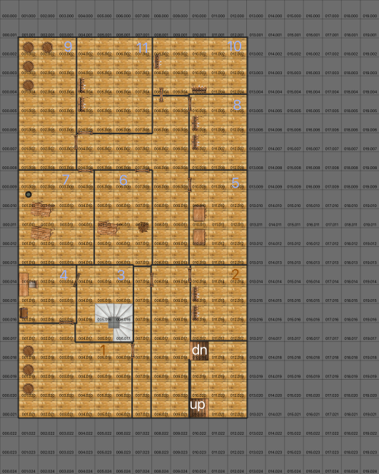

    The New Keep, Third Level

    Scale: Square = 2m (6').

#.  Bored General Stores guards
#.  Rack of crossbows
#.  Secret room with spiral stair going up and down
#.  Old records of general stores
#.  Hauberks and other armor
#.  Junk
#.  Junk
#.  Helms
#.  Lanterns, Torches, Candles, Tinder, Flint, etc.
#.  Shields
#.  Quarrels

New Keep Fourth Level
---------------------

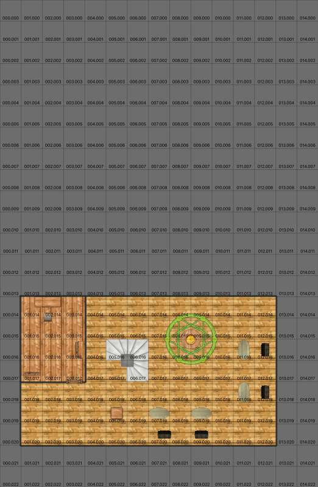

    The New Keep, Fourth Level

    Scale: Square = 2m (6').

#.  Spiral Stair.

    Scrying devices used by the intelligence mages.

    -   **Crystal of Precognition**

    -   **Linked Mirror**

    -   **Cat's Eye Ring**

    -   **Cup of Visions**

    Of these, the crystal and the mirror work reliably.

    The Ring and the Cup are locked in chests. The Mirror and the Crystal are brought out periodically.
    The Bandits keep the other mirror and check in periodically to show their status.

#.  Officer in charge of intelligence devices.
    See Internal Intelligence, High Priest -- Scrying.
    :ref:`location.keep.cultists`.

New Keep First Sublevel
------------------------

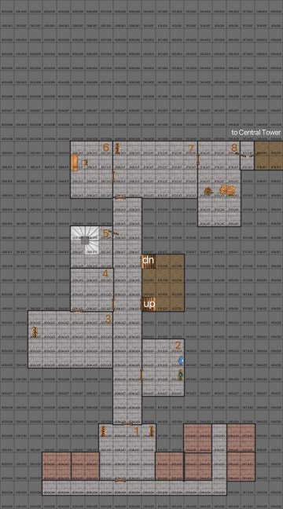

    The New Keep, First Sublevel

    Scale: Square = 2m (6').

#.  Four Prison Guards.
#.  Latrine. A dribble of water weeps through the wall into a fountain and drains away through a crack in the floor.
#.  Torture 1.  Always one prisoner here
#.  Ready for torture 1.
#.  Spiral stair
#.  Office for Internal Intelligence, High Priest -- Torturer.  See :ref:`location.keep.cultists`.
#.  Formerly a torture area, but rarely used. There's a secret pass-through to the Central Tower now.
#.  Torture supply area

New Keep Second Sublevel
------------------------

See `The UnderKeep`_.

New Keep Items
--------------

..  include:: ../../items/new_keep_items.txt

..  include:: ../../items/new_keep_swords.txt

..  _`location.keep.central_tower`:

Central Tower
=============

A very new, and imposingly huge building, it rises over 12m into the air, looming over the 8m-high walls.

Central Tower Ground Level
--------------------------

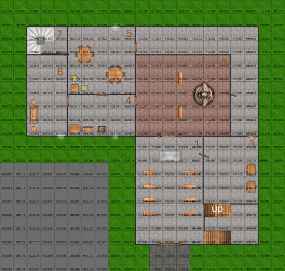

    Central Tower, Ground Level

    Scale: Square = 2m (6').

#.  Public chapel for ordinary observations.

#.  Sacred Sanctum, open for three stories up to skylights.
    A Two-meter tall statue of Anubis (on a 1 m plinth) looms over the two benches.
    Only the most-favored are admitted here. Note the false door in the wooden panel behind the statue.

#.  Priest's area behind secret doors. Two wardrobes of miscellaneous religious trinkets for various seasons.

#.  Vestments, and more serious religious items used in the Sanctum

#.  Priests' area to gather before and after religious observations.

#.  Liturgical apparatus including two holy books with stories of the Jackal.

#.  Secret spiral stairs going up and down.

Central Tower Second Level
--------------------------

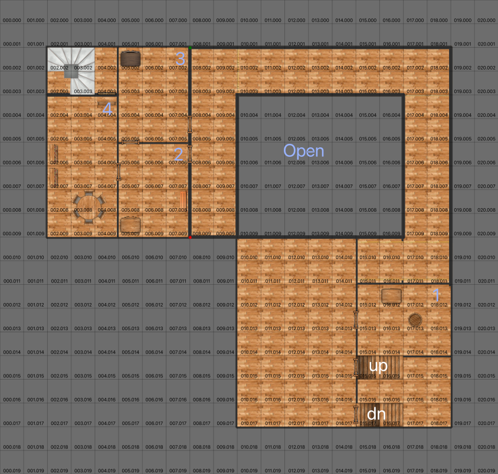

    Central Tower, Second Level

    Scale: Square = 2m (6').

#.  Closet, cleaning supplies
#.  Choir
#.  Musical Instruments, mostly drums
#.  Music and storage
#.  Spiral Stair going up and down

Central Tower Third Level
--------------------------

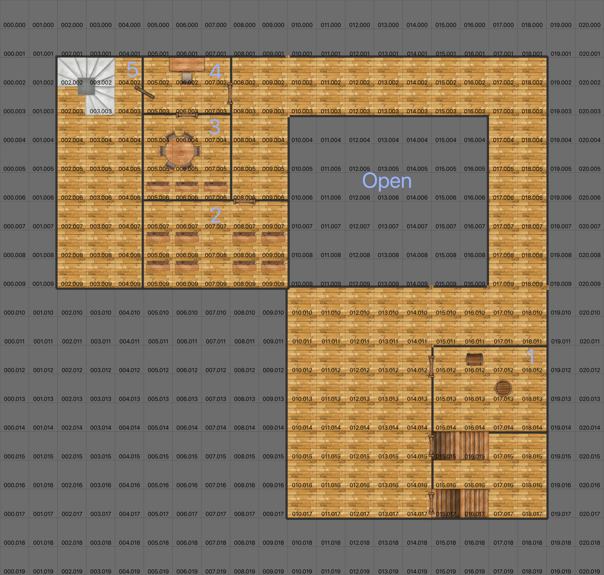

    Central Tower, Third Level

    Scale: Square = 2m (6').

#.  Closet, cleaning supplies
#.  Library
#.  Records of library and other religious things
#.  Librarians
#.  Spiral Stair going up and down

Central Tower Fourth Level
--------------------------

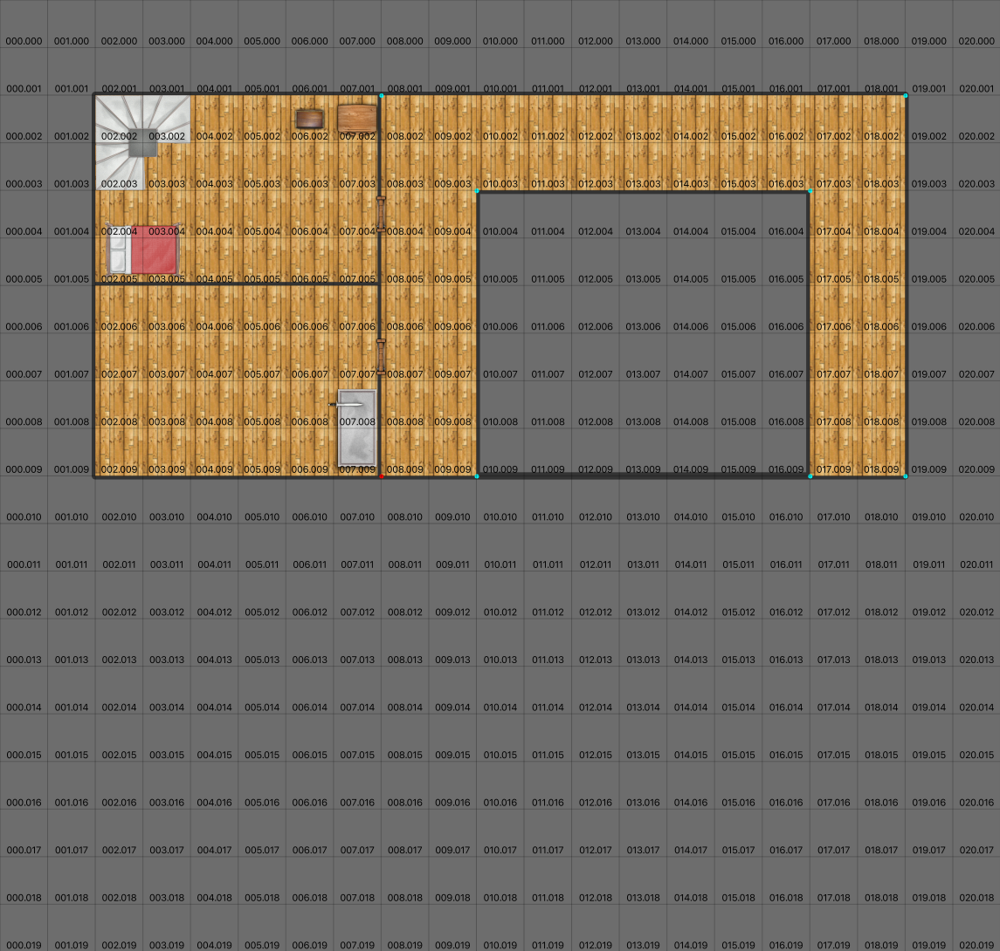

    Central Tower, Fourth Level

    Scale: Square = 2m (6').

#.  `Xorn`_'s bedroom

#.  Xorn's human sacrifice area

    The captured Squire Starter is here

Central Tower Fifth Level
-------------------------

    Central Tower, Fifth Level

    Scale: Square = 2m (6').

#.  `Xorn`_'s study.

    Books, scrolls, cups, pentacles, runes, potions, etc.
    The **Lightning Rod** is kept here!

    Also, An investigation roll (difficulty Moderate) is required to find the map to the Salamander's cave.
    There will be difficult to intepret books and pictures.
    They won't make sense until :ref:`chapter.flush_the_jackal`.

Central Tower First Sublevel
----------------------------

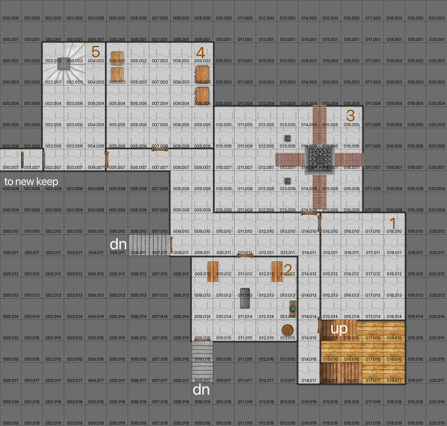

    Central Tower, First Sublevel

    Scale: Square = 2m (6').

#.  Empty

#.  To the catacombs.

    Tables etc. for resting the stretcher.  Modern carvings.

#.  Under the altar.

    Mechanism to shift the statue above to expose the pit of spears under the arches holding up the floor above.

#.  Catacombs tools (stretchers, shrouds, etc.)

#.  Spiral Stair.  Xorn's private path.

Central Tower Second Sublevel
-----------------------------

See `The UnderKeep`_.

..  _`location.keep.old_keep`:

Old Keep
========

This tower is older than the gatehouse and the walls.

Old Keep Ground Level
---------------------

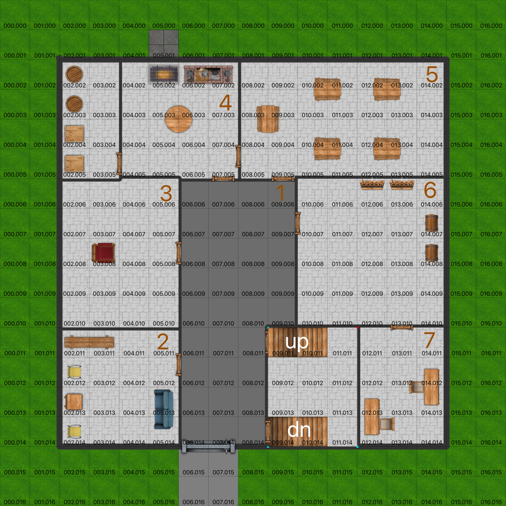

    Old Keep, Ground Level

    Scale: Square = 2m (6').

#.  Great Hall.
    1D priests here.   When court in progress will be 3D priests, plus 1D pilgrims, plus 1D guards.

    When court not in progress (roll anything other than 2 on **Activity Details** table in `General`_), 1D priests. All with "Priest" title.

    "When court in progress (roll 2 on **Activity Details** table in `General`_)  will be 3D priests, plus 1D pilgrims, plus 1D guards"

    See `Characters`_.

#.  Waiting Chamber.   Desks, chairs, couches, etc.

#.  Xorn's Court Chamber.
    Xorn's throne.  Xorn, his general, several MU's.  2D guards.

#.  Kitchen (pantry to side)
    One Cook, two assistants.  For priests who live here only.

#.  Dining.  Seating for 36.

#.  Guard room.
    Extra equipment (4 helms, 4 shields, 1 x-bow, 2 spears.)

#.  Officers.
    Two higher magic users, armed with wands:

    - Wand of Intention to detect enemies.

    - Wand of Submission to foil enemies.

..  _`location.keep.old_keep.second_level`:

Old Keep Second Level
---------------------

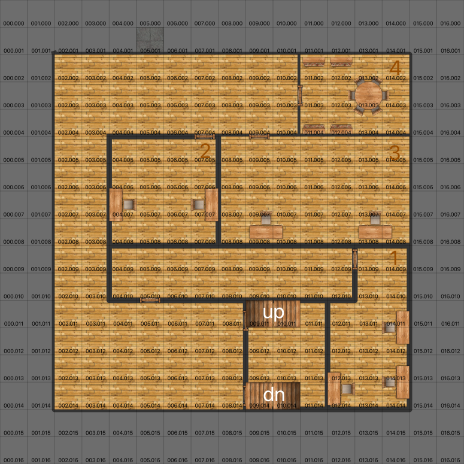

    Old Keep, Second Level

    Scale: Square = 2m (6').

#.  Novice Oversight.  Three level 1 priests here.
#.  Priest Care, Internal Security.  Two level 2-3 priests here.
#.  High Priest Convocation.  Two level 4 priests may be here. Often, they're elsewhere, either using the scrying devices or torturing prisoners.
#.  Old Library. Most of the useful volumes are in the New Keep.

See `Characters`_.

A large hall wraps around the S, W, and N side of the tower.
This has numerous arrow slits, but, the weapons are all in the Gate House.

Old Keep Third Level
---------------------

..  Figure:: ../figures/OldKeepUp2.png

    Old Keep, Third Level

    Scale: Square = 2m (6').

#.  Xorn's Official Bedroom.
    Richly appointed, but never used.

#.  Senior Priest South. Responsible for Internal Security (Scrying and Torture). Only here at night.

#.  Xorn's Official Living Room.
    Richly appointed, but only used for state occasions.

#.  Senior Priest North. Responsible for External Intelligence (Communications, Spies and Disinformation). Only here at night.

#.  High Priest West residence.   Responsible for Temple operations.

#.  High Priest Center residence.

#.  High Priest East residence.

Old Keep First Sublevel
-----------------------

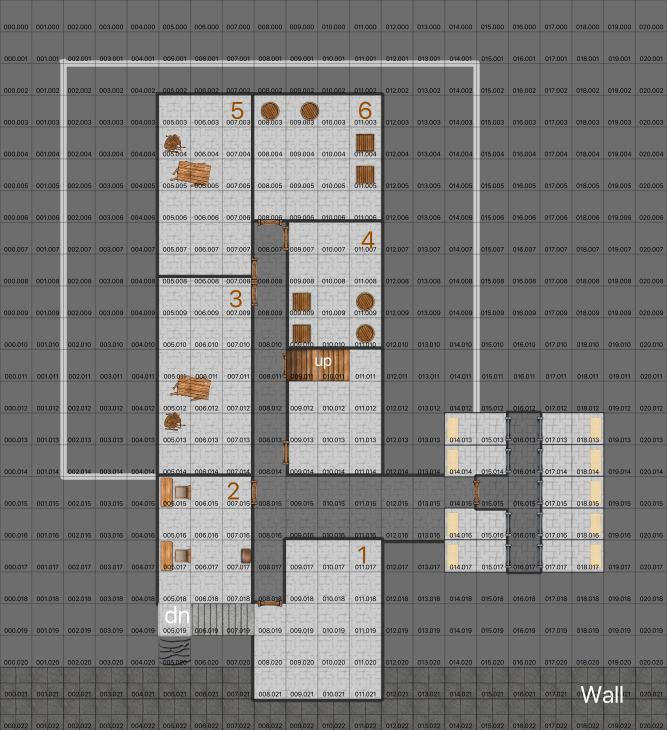

    Old Keep, First Sublevel

    Scale: Square = 2m (6').

#.  Empty. Essentially a wide hall.

#.  Officers.  Four guard officers.  Level 1-3

#.  Old Barracks 1.  Room for 12 guards

#.  Food Stores.  Meats

#.  Old Barracks 2.  Room for 12 guards

#.  Food Stores.  Vegetables and wines

The hall connects to the Old Jail under the Gate House with an array of cells.
See `Gate House`_.

Old Keep Second Sublevel
------------------------

See `The UnderKeep`_.

Old Keep Items
--------------

..  include:: ../../items/old_keep_items.txt

Barn and Stable
===============

Barn is to the west.
This has a number of tools and silage for the animals.
There are chickens in the yard, and the coops are in the barn.
Horses can be crammed in here when a caravan arrives.

Stable is to the east, there are three horses for Xorn and Senior officers.
Caravan horses are put in here when there's a caravan.

E Lodge and W Lodge
===================

When facing the front gate from the south, there are two lodges to the west of the gate.
These lodges are *outside* the wall, leaving them essentially undefended.

Both of the lodges have the same floor plan.
They both have room for 14 pilgrims and two servants.

The West Lodge is generally for more senior pilgrims.
It may house some secret.

The East Lodge is for merchants and new pilgrims.

..  admonition:: GM Note

    The basements of the two lodges differ slightly.

Lodge Ground Level
-------------------

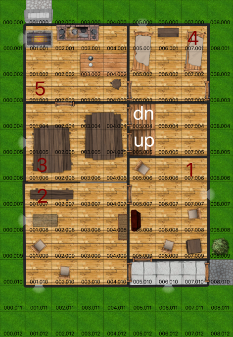

    E and W Lodges, Ground Level

    Scale: Square = 2m (6').

#. Study/Drawing Room.  Several books and pilgrims.
#. Living Room.  Couches, chairs, tables, etc.
#. Dining Room.  Seats 14
#. Servant's Quarters.  Cook and maid
#. Kitchen

Lodge Second Level
-------------------

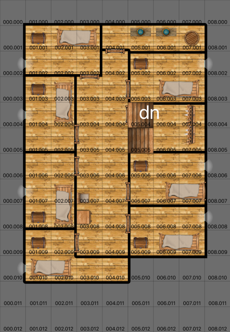

    E and W Lodges, Second Level

    Scale: Square = 2m (6').

Top Right (4.1 to 7.1) is a lavatory -- some wash basins and a cask of water

The remaining rooms are Bedrooms with two Pilgrims each.

The landing in the staircase (7.4 and 7.5) have weapons racks.

Lodge First Sublevel
----------------------

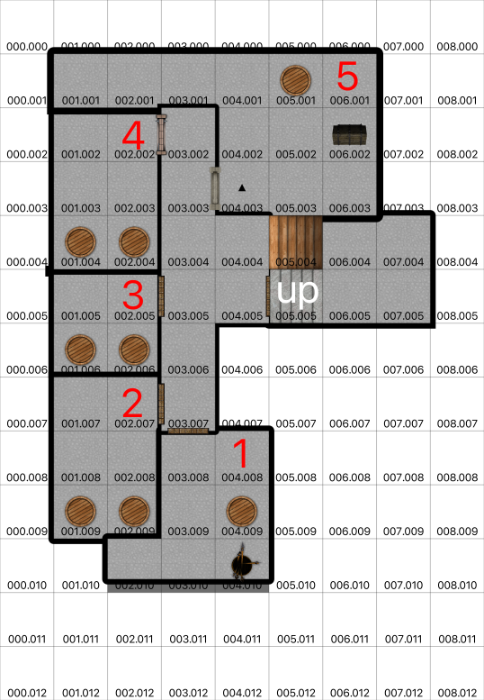

    E and W Lodges, Cellar

    Scale: Square = 2m (6').

#. Abandoned Store Room

    Barrel of something rotten.

    Barrel with old spears. Still useful, but a bit too long for indoor use.

#. Meats in casks

#. Vegetables

#. Wines

#. Hidden Store Room (West Lodge only, this room isn't present under the East Lodge.)

    There's a hidden door is between 3.3 and 4.3.
    There's a trap behind the door, in 3.3, annotated with ▲.
    This trap is not concealed, difficulty Easy 10 to make sure most folks will find it and trigger it.
    This is a knife that will be thrust out when one of the stones covering the door is moved.
    It does 1D damage, difficulty Difficult 16 to disable it.
    This was designed to stop the curious from poking around; it's particularly bad for those who listen at the wall without checking and get stabbed in the head.

    (Note that wheels and springs aren't part of this world.
    This is moved by a falling weight and clever wire rope to apply leverage to force the knife out.)

    The actual release for the concealed door is over the lintel. Difficulty Moderate 15 to find this.

    In the room there's a large chest has a rusty lock difficulty Moderate 13 to open.
    The chest is built of heavy wood, wrapped in metal bands, and will withstand 3D of damage.
    Contents:

    -   250 gold coins,
    -   Two rusty swords,
    -   Some rotten old clothes that have seen better days,
    -   A surprisingly new-looking shield, likely magical (see `West Lodge Items`_),
    -   A short sword that seems like it's eager to be picked up (see `West Lodge Items`_).

    Plus, the bottom is false.
    There's a 5cm gap under the thin layer of wood.
    In this gap are the following:

    -   Four pieces of well-made jewelry, each worth 4D gold. These have no magical features.
    -   A ring that pulses with energy (see `West Lodge Items`_).

West Lodge Items
----------------

..  include:: ../../items/keep_lodge_items.txt
..  include:: ../../items/keep_lodge_swords.txt

..  source notes: Ring vs. Fire Magic

    Protect From Fire: 10 Force Field Resistant Defense (10), 1 per Phase END, 1 IIF (-.5).  AP=10; CP=7

    Keep Cool: 1 Hex Change Environment (5), 1 per Phase END, 1 IIF (-.5).  AP=10; CP=7

    Breathe in Smoke: Breathe in unusual environment (5), 0.5 per Phase END, 1 IIF (-.5).  AP=5; CP= 3

The Underkeep
=============

Before the Gatehouse and Walls (which are old) there was the Old Keep.
Before the Old Keep, there was something else here, which was buried and forgotten, rebuilt, torn down, buried and forgotten a second time.

There are two distinct parts to the Underkeep, the Old portion is mostly under the the current locations of the Old Keep and Gate House.
The New portion is mostly under the Central Tower.
The terms old and new are relative to each other, of course; all of the surface construction is newer than the new portion of the Underkeep.

Careful study (difficulty Moderate 15, with access to the Old portion of the underkeep) can reveal the Old Keep was built from rubble of an even older construction that once stood here.
Further, the part underlying the Old Keep is relatively small, with only 5 distinct rooms.

To the west, under the Central Tower is a distinct Underkeep.
This is newer, and far more confusing.

There's a connection between them: a hidden door between 40.2 and 40.3.
The design of the catch that holds the door closed is awkwardly high, and requires a great deal of leverage to operate.
The difficulty Moderate 14 to find the hidden recess.
Operating the catch is a difficulty Difficult 16. Taking time to study it, and improvising some tools will reduce this to a more a 12.

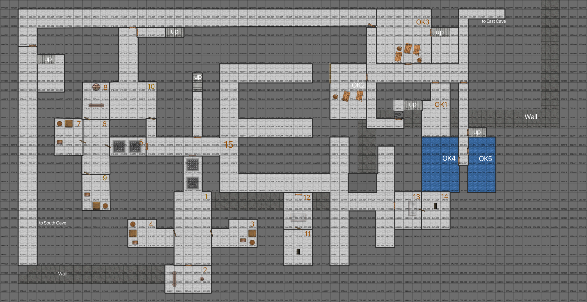

    Underkeep, two levels below ground.

    Scale: Square = 2m (6').

The Old Underkeep
-----------------

The oldest portion of the Underkeep lies under the Old Keep and the Gate House.

The Old Underkeep connects the East Cave to the Old Keep and the Gate House.
Going back and forth to the cave is done by following this hall.
Someone makes the trip every few days, so the hall is clearly used.
Bits of useless junk, like broken belts or weapons hafts can be found, kicked into corners and forgotten.
Many feet pass here, but no one cleans up.

The tumble of rocks at 43.12 leads up to the Old Keep.
From 54.1, it's still 90m to the cave. (10m to a spot under the wall, 80m to the cave level 3.)

The "T" intersection at 40.7 and 40.8 is marked by chalk arrows on the wall at 40.7
pointing S.

No one in their right mind uses the stairs under the Gate House.
The area around the cisterns in OK4 and OK5 is death.

:OK1:
    Used to be part of path to catacombs.
    Ancient carvings, perhaps not even human.
    There is no Anubis image here.

    It may show priests preparing themselves, but, the deity has been chiseled off the wall.
    The priests don't have quite the right size ratios to be human.
    Either the carvings have provided animal features on people, or these aren't human.

:OK2:
    Perhaps part of the path to the catacombs.
    The reinforced brick wall in the NW corner was added, but it's solid, and predates the Old Keep.
    Careful study (difficulty Moderate 15) can show the style of masonry matches some features of the New Underkeep.

:OK3:
    Used to have funerary supplies.
    Mostly rotted dusty junk. Some is very old, and crumbles when touched.
    Other bits are newer.
    Searching will uncover a dagger which has withstood the ravages of time.
    This is the *Knife of Slaughter*. See `Old Keep Items`_.

    There's a carving of something that might be a dragon or a giant fire-related salamander.

:OK4:
    Old Cistern. Still has water 3-5m deep. Murky from a surface feed that's still weeping ground water and insect life into cistern.

:OK5:
    Other Old Cistern. Water 2-3m deep.
    Inhabited by hideous white cave snakes with bulbous non-functional eye bulges.
    Numerous weeping cracks in the walls allow water to flow into and out of this sump.

    ..  only:: hero

        OCV=6, DCV=6, SPD=3, BODY=5, STUN=20, rDEF=3, DEF=5, 1/2d6 K, sleep venom (Drain 3d6 STUN).

    ..  include:: ../../characters/old_keep_creatures.txt

The New Underkeep
------------------

The newer portion of the Underkeep lies under the Central Tower and the West Lodge.
This has some frescoes and bas-relief carvings that show two variants on Anubis.
One Anubis appears male, the other has multiple teats suckling young.

#.  King's Crypt Hall.

    1st T is a pit with spears under a sketchy floor plate.
    (Difficulty Moderate 11 to discover the plate. Difficulty Moderate 14 to wedge so people can cross it.)

    2nd T is a surprisingly noxious gas, 3*D damage, ignores all armor.
    (Difficulty Moderate 13 to discover this is a binary chemical potion.
    Difficulty Easy 10 to shatter the concealed jug with the liquid component.
    Difficulty Moderate 12 to retrieve the basket with the solid component.)

#.  King's Crypt, Shrine

#.  King's Crypt, Treasure

    Ancient, crumbling goods.  Much jade and scrimshaw in bad condition.

#.  King's Crypt, Funerary goods

#.  Queen's crypt entrance.

    1st T is Axe-on-a-spring, swiping horizontally.
    (Difficulty Moderate 11 to discover the plate. Difficulty Moderate 14 to deduce what's going to happen and avoid it when setting it off the first time.)

    2nd T is a pit with spears under a sketchy floor plate.
    (Difficulty Moderate 11 to discover the plate. Difficulty Moderate 14 to wedge so people can cross it.)

#.  Queen's Crypt Hall

#.  Queen's Crypt, Funerary goods

#.  Queen's Crypt, Shrine

#.  Queen's Crypt, Treasure

    Ancient, crumbling goods.  Much jade and some scrimshaw in bad condition.

#.  Old entrance to catacombs

    New stairs up to Central Tower have been added.
    The long hall to the North is new.
    Following the North hall to the West and then South, there are stairs up the the New Keep. Rarely used.

#.  Crypt 2, treasure

    Ancient, crumbling goods.  Much jade and scrimshaw in bad condition.

#.  Crypt 2, shrine

#.  Crypt 3, shrine

#.  Crypt 3, treasure

    Ancient, crumbling goods.  Much jade and scrimshaw in bad condition.

#.  Niches, newly filled at the northern-most branch, oldest at south, near 9, 10, 11, 12.

..  _`location.keep.caves.east`:

East Cave
=========

About 100m east of the tower in the Northeast corner of the keep, and about 40m north of the tower, there's a boulder-strewn gulley.
This conceals the East Cave.
The spoor of raiding Goblins is often cleaned away; it's difficulty of Moderate 15 to notice the traces.

About 40S of the cave is a pile of rocks that sometimes emits smoke (difficulty Difficult 16) to see this.
The big meal is shortly after dawn, where there's a faint whiff of burned meat (difficulty Difficult 16).

Level -1
--------

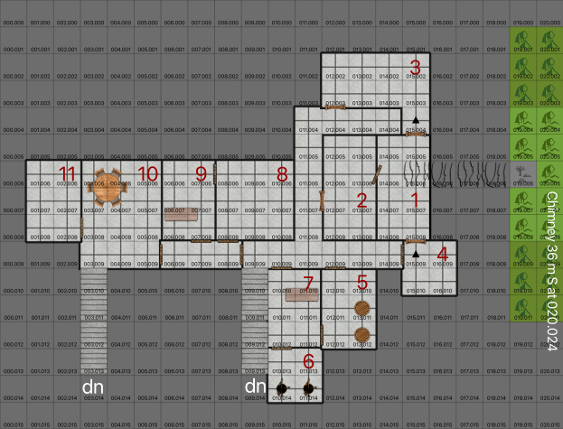

    East Cave, First Sublevel

    Scale: Square = 2m (6').

Large pile of rocks conceals the entrance to the caves. Difficulty Moderate 15 to track Goblin spoor to the proper boulder.
The pile of rocks descends about 10m into a finished room carved from the underlying rock.

#.  Entrance Room.

    North ▲ between 15.5 and 15.4 is spear release.
    3D damage if you mess with the fake door.
    Difficulty Moderate 14 to discover and prevent it from stabbing you.

    South ▲ in 15.8 and 15.9 is section of wall which collapses.
    3D damage if you mess with the fake door.
    Difficulty Moderate 14 to discover and prevent it from crushing you.

    Real door is "hidden", barely 2m from where the steps to the surface end.
    Difficulty Moderate 12 to find it.

#.  Guard area.  2D goblins at most. May be empty during a night raid.

#.  Spear trap gizmo for the trap between 15.5 and 15.4.  Spare parts, extra spears, grease for the weights and pivots.

    (Note that wheels and springs aren't part of this world.
    The spears are pushed out by a goblin mechanism from another realm that involves incomprehensible springs and gears.)

#.  Collapsing wall trap gizmo for trap between 15.8 and 15.9, mashed in behind the door.
    Fasteners which support the delicately balanced wall, plus tools for reassembling the wall.

#.  Storage of goblin shields and helmets.

#.  Storage of goblin darts and swords.

#.  Supply officer making sure every stays away from the weapons and armor.
    Two goblins here.

#.  Conference room.
    3D goblins here prior to and after the nightly raids.
    Conference lasts 1/2 hour, and involves much shouting and beating.

#.  Raid officer.
    This is where orders are stored for each raid.  Two goblins here.

#.  Two goblin guards stuck here until their shift ends. Arguing or gambling.

#.  Jail cell for anyone captured. Weak bar on the door, and an inattentive guard.

Level -2
--------

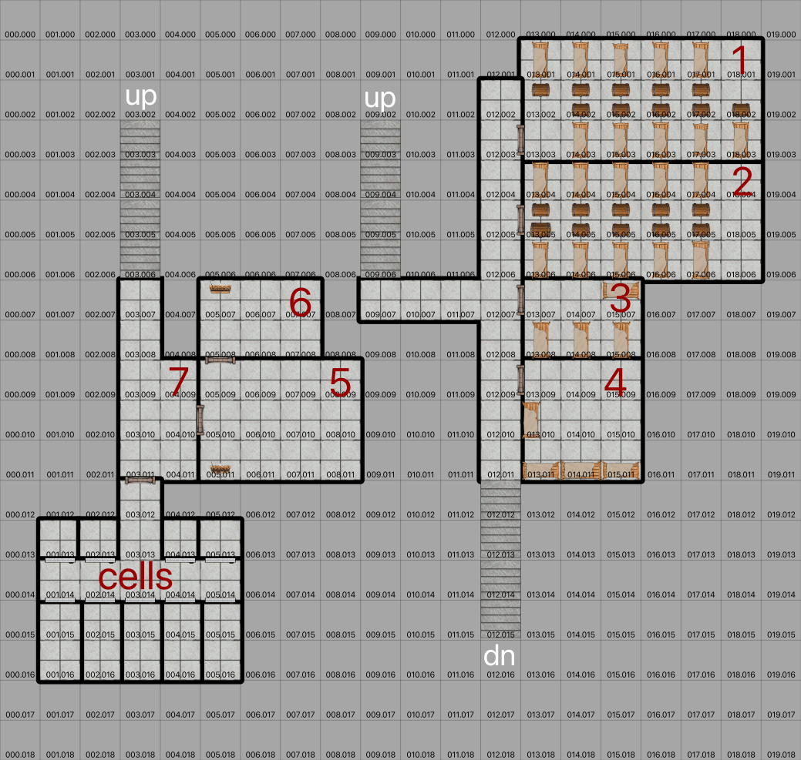

    East Cave, Second Sublevel

    Scale: Square = 2m (6').

#. Twenty 3rd-4th watch goblins sleep here when not on raids. Chests are clothes and armor. There are 5D gold and 10D silver coins hidden in various places.

#. Twenty 5th-6th watch goblins sleep here when not on raids. Chests are clothes and armor. There are 5D gold and 10D silver coins hidden in various places.

#. Four junior officers sleep here. Chests are clothes and armor. There are 2 × 5D gold and 4 × 5D silver coins hidden in various places.

#. Four senior officers sleep here. Chests are clothes and armor. There are 3 × 5D gold and 5 × 5D silver coins hidden in various places.
   These offices know the truth: they're unable to return to their realm.

#. Torture area. Disgusting torture instruments.

#. Another torture area. More disgusting torture instruments.

#. Two guards who don't seem to care. The cells aren't well made.

Level -3
--------

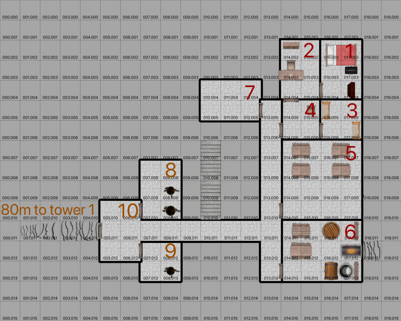

    East Cave, Third Sublevel

    Scale: Square = 2m (6').

#. Goblin Great Leader's bedroom.  1D females here.  200 GS.  Three weird goblin jewelry per female.
   Sometimes called a Duke or a King. No one really knows how social ranking works for them.

#. Goblin Leader's Study. The open book is incomprehensible goblin scratching.
   One of the other books is a kind of dictionary from the older language spoken by the Outlanders and Goblin.

   With appropriate language skills (difficulty Moderate 12) one can find what appears to be an enchantment to close the veil.

   With deeper language skills (difficulty Moderate 15) one can find the enchantment to open the veil, but it appears oddly incomplete.

#. Goblin Leader's Servants/Guards. Four goblins.

#. Goblin Leader's court and throne.

#. Rec area 1.  1D goblins here, gaming.

#. Mess area.  2D goblins here, eating.  Kitchen against E wall.

#. Rec area 2.  1D goblins here, drinking.

#. Junk.  Shovels, picks, brooms, buckets, torches, chain, rope, etc.

#. More Junk.  Shelves, cabinets, bed frames, etc.

#. Two goblin guards here to act as messengers.

..  _`location.keep.caves.south`:

South Cave
============

About 80m from the tower in the Southwest corner of the keep, on the sloping side of a boulder-strewn hillside,
there's the carefully hidden South Cave.

The spoor of raiding Goblins is often cleaned away; it's difficulty Moderate 15 to notice the traces.

Level -1
--------

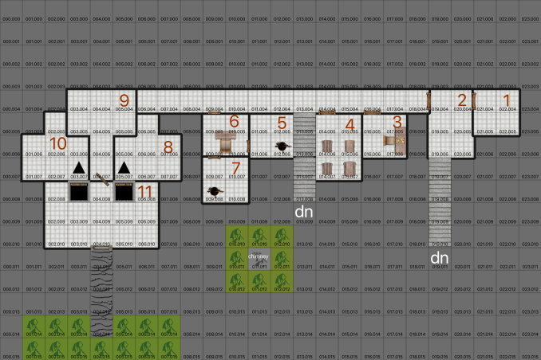

    South Cave, First Sublevel

    Scale: Square = 2m (6').

Large pile of rocks conceals entrance to caves

#.  Temporary cell for captured. It's poorly made and there's no guard.

#.  Two Guards who don't much care what's going on. They gamble and fight among themselves.

#.  Raid Senior Officer.  Orders and maps.  Two goblins.

#.  Conference room.
    3D goblins here 1/2 hr. prior to and 1/2 after a raid.

#.  Goblin shields and helmets

#.  Supply Junior Officer

#.  Goblin spears and darts

#.  Falling wall gizmo.  Wall support parts and tools.

#.  Two guards

#.  Spear gizmo.  Spare spears.

#.  Entrance Room.

    - East Pit at 3.8 has snakes. There are 1D snakes, each does 1D bite with a difficulty Moderate 12 to poison.
      Difficulty Moderate 13 to find and avoid falling into it.

    - East ▲ between 3.8 and 3.7 is spear release. 3D damage if you mess with the fake door.
      Difficulty Moderate 14 to discover and prevent it from stabbing you.

    - West Pit at 5.8 has spikes in the bottom, doing 2D ignoring all armor.
      Difficulty Moderate 13 to find and avoid falling into it.

    - West ▲ between 5.7 and 5.7 is section of wall which collapses.
      3D damage if you mess with the fake door.
      Difficulty Moderate 14 to discover and prevent it from crushing you.

Level -2
--------

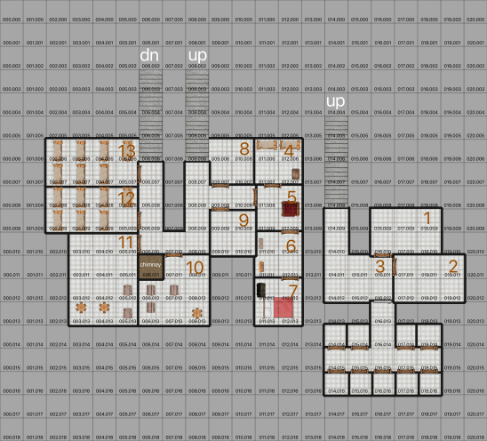

    South Cave, Second Sublevel

    Scale: Square = 2m (6').

#.  Torture area 2

#.  Torture area 1

#.  Two guards with nothing to do,

#.  Great Leader's guards and servants

#.  Great Leader's throne room

#.  Great Leader's study

#.  Great Leader's bed room.
    1D females here.  200 GS.  Three pieces of weird goblin Jewelry.

#.  Four officers.  3-4 watch

#.  Four officers.  5-6 watch

#.  Rec area 1.  2D goblins gaming

#.  Rec area 2.  2D goblins gaming

#.  Sleeping area.  20 3-4 watch goblins

#.  Sleeping area.  20 5-6 watch goblins

Level -3
--------

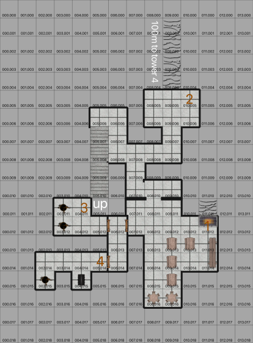

    South Cave, Third Sublevel

    Scale: Square = 2m (6').

#.  Mess area.  Kitchen against N wall

#.  Two messengers.

#.  Tools.
    Shovels, picks, brooms, buckets, torches, chain, rope, etc.

#.  Junk.    Shelves, cabinets, bed frames, etc.
