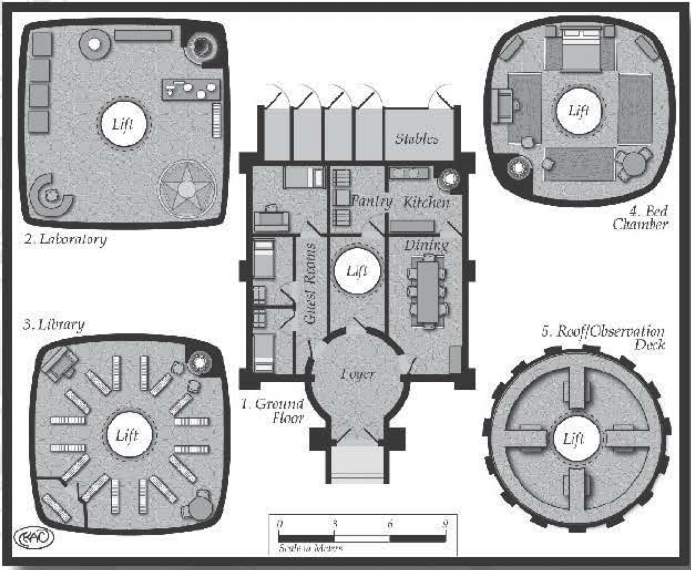

###############
Wizard's Tower
###############

The design of the wizard's tower
is limited only by the abilities of
the wizard and the spells cast. This
section describes a few spells that
allow for casters to build a tower
of their liking.

The volume of the spell dictates
the size of the castle. Advanced
wizards can modify the spell to
build larger castles.

..  include:: spells/wizard_tower.src

AAROTH THE WIZARD
=================

Aaroth the Wizard travels the
world to meet people and observe
their cultures. He has seen most
major cities in the known world and
a few in the uncharted territories.
His desire for mater ial possessions
is rather small. He takes a trinket
or rock from each location of his
travels and has a room in his tower
just for storing them. His abilities
in conjuration are almost unparalleled, which accounts for his Spartan lifestyle. If there's anything, he
needs he simply makes it and when
he's done with it, it disappears.

Aaroth is also a wanted man. He was the most
powerful and outspoken member of his group, but
the group went rogue on him. They were tired of
using their abilities for the betterment of society at
financial cost to themselves. They wanted to make
some coin the old-fashioned way: taking it by force.
Aaroth tried to dissuade his friends, but they would
have none of it and he was privately cast out. The
group still uses his name to gain access to places
they wouldn't normally be allowed into. Then they
sack the location for anything they think is of any
value. Aaroth knows that without some outside
help he can never stop the group, who together
are more powerful than he is alone.

He built his tower using his magic. Inside it is
a little bit of everything. It's starts out roughly
square at the bottom, about 10 meters on a side,
and twists to circular toward the top. There's a
cent ral shaft that runs the height of the tower.
It has a metal platform that's moved via an air
elemental up and down. The en trance is hidden and
can only be made visible by a person uttering the
magical phrase "Open in the name of Aaroth." The
top chamber houses an observation deck (where
the wizard takes his meals and likes to watch the
sun set). The rooms below the observation deck
(in order of level) include his bed chamber, pondering
room, library, laboratory, guest quarters, kitchen, and,
finally, stable. Each room takes up its own level. Air
elementals cool the place, while fire elementals heat it.
The kitchen has been ensorcelled to provide any food
upon request. Elementals also guard the tower against
invaders and the elements.

His travels have left him with an eclectic pile that
it would take dozens of people years to catalog. His
"pondering room," where he keeps what he's acquired
in traveling, contains a chair in its middle and floor-to-ceiling shelves and piles full of things around the
rest of the room. In some places, the piles are as high
as the shelves, but Aaroth knows what every item is
and can find anything at almost any time.

Aaroth also has created his own version of the keep
in the air spell, which moves at a brisk 12 meters per
round. He's used it to travel around in after accidentally
dropping in on a fellow caster in a most precarious
position that caused a great deal of tension among the
casters in his social circle.

..  include:: ../characters/aaroth.txt

