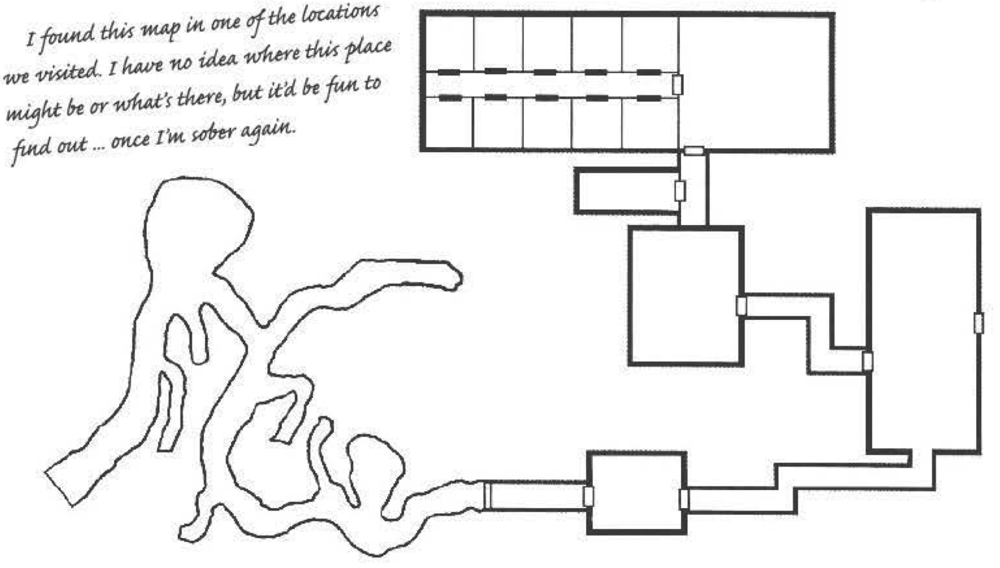

#################
Designing a Maze
#################

Now, I was supposed to write about how to make
dungeons and mazes and the like. Unfortunately, I
wouldn’t know how to do that if my life depended on it;
really, the most complicated thing I know how to make
is a mead blinder. (One-half mug of mead mixed with
one-half mug of rum; shake vigorously; drink; shake
vigorously.) So I’ve farmed out this duty to an earnest
monk who owes me a favor. It looks right and has lots
of pretty maps, but beyond that I haven’t read a lick of
it. If you want to read more about my exploits, you’ll
need to skip ahead a bit.

Types of Mazes
==============

Whether it’s the hedge maze of a dryad, the cata-
combs of a sinister cult, or the mines of a Dwarvish
king, the thought of roaming through twisty corridors
is a staple of Fantasy games.
Th  ere are three broad categories of maze-like struc-
ture: planned, constructed, and natural.

Planned maze-like structures have their entire
purpose defi  ned from the beginning, and its entire
layout and design is carefully considered. A labyrinth
is probably the most common example; the builders
of a maze must know both the entrance and exit, as
well as any desired stops along the way.

Constructed maze-like structures are constructed
by their fi  nal form was not envisioned by anyone. How-
ever, its structure is still manufactured by intelligent
minds, or else intelligent minds had an active hand in
its development at some point. Mine systems are the
classic example; those who burrow into the earth sel-
dom know the exact shape of their fi  nal construct, but
instead build new shafts as they discover new resources
or encounter difficulties. A confusing mansion would
be another instance, if the basic house had extension
after confounding extension added on, resulting in
disoriented explorers.

Natural maze-like structures are entirely unplanned;
their confusion stems not from any active desire, but
the random formations of natural processes. Ancient
underground caverns caused by water fl  ow and erosion
are the most classic and obvious examples, but treacherous
mountain passes or paths carved by roaming animals
through overgrown forests would be other cases.

A maze-like structure can consist of more than one
type. For example, a planned dungeon beneath a castle
might have a branch that leads off   to a series of constructed
mine shafts; during the construction of that
shaft, the miners may have stumbled onto a natural
cavern system. As another case, a planned labyrinth
built long ago might have collapsed into confusing
ruins, resulting in a dungeon where parts retain their
original planned organization while others are merely
constructed; some parts might even have collapsed or
overgrown so fully that they are indistinguishable from
a natural formation. Finally, a natural cavern might
become inhabited by demihumans, who transform it
into a constructed habitation.

The Maze’s Purpose
==================

Although some gamemasters have the urge to pick
up a pencil and graph paper and start plotting a maze
or dungeon immediately, more satisfying results can
occur if some simple preparations are made.
First, the most important idea to keep in mind when
conceiving of or designing a maze-like structure is: Why
does it exist? Most such locations are wildly expensive
and diffi   cult to construct, and would almost never be
undertaken lightly or randomly. (Of course, natural
locations have the advantage that they can just exist;
no further justification is necessary ... although then
the gamemaster should carefully consider why players’
characters would want to explore them.)
Th  ere are many reasons a maze-like structure could
come into being:

-   To keep something safe (for instance, valued prisoners or a paranoid noble)

-   To hide something (for example, a powerful magic item or weapon)

-   To honor something (usually a ruler or somebody of incredible wealth and power, or else a loved one of such a person)

-   To provide amusement (such as a hedge maze, or coliseum puzzle)

-   To keep something from escaping (such as a monster or cosmic entity)

-   To provide housing (especially subterranean dwellers)

-   To access valuable resources, usually through mining (generally precious metals or jewels, although Fantasy games can have other types of resources)

-   To provide a challenge (for example, amaze used as a culture's Rite of Adulthood,or a Trial of Champions used to judge one's guilt or innocence)

Of course, multiple techniques can be used
for a single place. For example, a group of
goblins might live in a cavern system. When
a respected warrior died, they dug a multi-roomed tomb for her body as an adjunct to
the main caves. When their shamans captured
a wicked Djinn that slew many of their kind,
they sealed it in another addition to their
caverns, hoping to ensure its evil could never
escape.

..  admonition:: LEFT ISN'T ALWAYS RIGHT

    Everyone knows that if you just keep hugging the left (or right)
    wall, you'll eventually find your way out of a maze, right?

    Not necessarily. Although it's a good general strategy, it's
    by no means foolproof. In particular, it's possible for a maze-maker to make one or more "islands" within a maze. If the
    object is to get to a central area, then following one wall will
    entirely miss it.

    For example, an adventurer who enters the simp le sample
    maze below and follows the left wall will do a dock wise circuit of
    the dungeon, completely missing the treasure in the center.

    ..  image:: maze_fig_1.png

Or a maze-like construct might have had its
purpose changed or modified. For instance, a
temple might originally have been designed
to honor a fallen hero, but an evil priest who
worships an opposed god might have taken
it over and turned it into a twisted mockery
of the tomb.

Finally, it is possible for a maze to have
no purpose at all; fantasy tales are filled with
stories of those who have succumbed to madness and built strange, inexplicable structures.
However, even in this case, the gamemaster
should probably know the source of both
the builder's resources and bis madness.
(Fortunately, the same powerful beings that
can inspire such madness are often eager to
supply their new minions with the resources
necessary to further their insane goals.)

ORGANIZING THE MAZE
===================

Once the gamemaster knows the reason for a maze's
existence, he can begin building and populating it. The
most obvious place to start is the "central" chamber or
purpose of the construct. For example, a dungeon primarily intended as a prison will need cells for captives,
interrogation facilities, and so on. An under-earth vault
designed to guard a precious jewel would probably be
best created with the treasure chamber first, adding
additional rooms outward from there.

From there, the next logical addition is any support
rooms or structures necessary for the central room (or
rooms) to fulfill its purpose. For instance, both the prison
and the treasure vault will require guards. However, if
the prison only leads to one central exit point, then
these guards probably don't reside under the earth,
instead posting watch at that exit point. However, the
vault will probably have full-time guards, and they will
thus need to be supported.

Continuing these cases, both the prison and vault
would have supply areas for guards (although the
prison's supply closet would probably be more heavily
secured,tokeepescapedprisonersawayfromweapo ns).
The vault would also have living quarters and feeding
facilities for its guards.

ADDING ENCOUNTERS
=================

At this point, the gamemaster should have a fully
functional underground setting, fulfilling its primary
duty. However, it's pretty bland. To mitigate this, add
anything that would be interesting to the map which
would serve as additional encounters for the players'
characters. In a fantasy setting, these can break down
into two broad categories: realistic and fantastic.

Realistic encounters are those that would be plausible in the "real" world For example, perhaps the prison
is owned by a noble who likes interrogating captives
himself; if so, it stands to reason that the noble might
have a private room to question prisoners. This room
might have a secret exit to an area belonging to the
noble (such as his private chamber or office); this could
present players' characters an alternate way into - or
out of - the prison. Likewise, the vault might contain
an enormous pit in front of it, calling for a drawbridge
or other device to access it. This could require either
figuring out how to operate the mechanism (requiring a devices roll) or a jumping or acrobatics roll to get
across.

Fantastic encounters are those relying on elements
of a fantasy world - usually magic, miracles, arcane
lore, or resources that just aren't practical in a realistic
setting. For example, the dungeon might employ a pair
of Oni to serve as supplemental guards; these invisible
one-eyed giants would prove quite a surprise to those
who assume an empty corridor to be unguarded. Or
the vault might be guarded by a Djinni, who uses her
magic and shape -changing abilities to confound those
who would steal the treasure. ( Oni and Djinn are both
detailed in D6 Fantasy Creatures.)

Magic can also augment otherwise mundane locations. One room of the dungeon might be enchanted
so that anyone who touches the floor without special
runes on their boots will set off an alarm (either
silently alerting guards or sounding piercingly loud
to disorient those breaking in or out). Or the treasure
vault might have a trap room that activates against
anyone of Human size who enters without saying the
password, shrinking them to the size of mice; then
dozens of cats are released into the room!

Within the context of the game, these constructs
should be large enough to provide appropriate challenges for however many adventures the gamemaster
deems appropriate; a prison escape is probably only
worth an evening's worth of fun, while recovering a
valuable treasure might take several sessions.

Within the context of the game universe, the size
of the construct should depend on the purpose of the
project as well as the resources of the builders. For
instance, a prison that's designed to hold an enemy
princess for decades would be much more elaborate
than one designed to hold the noble's hooligans for
a couple days.

All of these techniques also apply to natural mazes
and dungeons. Instead of starting with the "reason" for
the dungeon's existence, start with the most prevalent
natural phenomenon.As one case, a large underground
river would probably form a central area, with additional
caverns branching off from either side. This might lead
to aquatic beings constructing chambers within those
caverns for their dry land needs on one side of the river,
and an underground humanoid race taking up residency
on the other side of the river. Other parts of the cavern system might contain traps that the two peoples
have placed to ensure the other doesn't encroach on
their territory; these could be mundane and magical
traps and encounters. All that would be necessary for
an adventure is, for example, an important person
to become lost in the caverns, requiring the players'
characters to find him; soon the rescuers are trying to
survive two different tribes as well as various natural
and artificial threats within this cavern system.

CREATING THE MAZE LAYOUT
========================

Although most constructs can be abstracted, mazes are
one of the few where having a ready map is helpful.

First, decide how big you want the maze to be. Graph
paper is very useful, and a pencil is a must. Draw the
entrance and the exit (if they are different places). Then
draw any areas where explorers will want or need to
visit. (See "Choosing the Size.")

..  admonition:: CHOOSING THE SIZE

    ..  image:: maze_fig_2.png

..  admonition:: DESIGNING THE CORRECT PATH

    ..  image:: maze_fig_3.png

..  admonition:: FINISHING THE MAZE LAYOUT

    ..  image:: maze_fig_4.png

From there, draw the "correct" route through the
maze, being sure to connect all the ancillary locations
along this path. (See "Designing the Correct Path.")

Finally, draw off-shoot paths from the correct
route, making sure to close up any of these side
treks so they don't present an alternate means
of thwarting the maze. It's also possible to place
alternate rooms within these dead-end routes,
giving additional encounters for those who are
off the beaten path. (See "Finishing the Maze
Layout.")

RANDOM DUNGEONS
===============

This is a system for designing a maze with little
advance notice. Of course, the gamemaster can
also choose what seems interesting, and is free
to ignore any result that doesn't make sense.
First, figure out the purpose of the construct.
Roll one regular die and consult the "Dungeon
Goal" table.

Next, decide where the construct by rolling one
regular die on the "Dungeon Location" table.

Then, decide how many "rooms" the dungeon
should be, and draw a grid of that size. At this
point, figure out the number of "active" encounters and the number of "empty" (or nonencounter) rooms. Both of these will determine how
long the adventure takes, although the number
of active encounters is much more important.
Depending on the gaming group's style of play
and the number of players, a good rule of thumb
is that every three encounters will take about
one hour, assuming a ratio of one combat, one
skill resolution situation, and one roleplaying
encounter. Combats take the longest, especially
with more players. Roleplaying encounters are
shorter, and skill resolution situations are usually the shortest.

Connect the rooms in the maze using the
"Creating the Maze Layout" tips. In general, these
"mazes" will be much simpler than traditional
mazes, consisting of several dozen squares. However, the technique is the same: Determine the
entrance and exit, craft the one true path through
the maze, and build other "dead ends" around it.
(In a typical dungeon, it's common for there to
be more than one true path. However, make sure
there's at least one! In addition, check for and
eliminate any"shortcuts" that can let players skip
large portions of the scenario.) In this system, the
'1ast" room is the one that fulfills the function of the
construct or the adventure. For example, if it's designed
to keep a powerful monster locked in, then the last
room would contain the monster; if it's an underground
community, then the last room would contain the city
ruler who must be defeated or the goal that the city
ruler has commanded them to complete.

..  admonition:: DUNGEON GOAL

    ..  csv-table::

        Roll, Result
        1, "To keep something in (such as a prison or a powerful monster)"
        2, "To keep something out (such as guarding a treasure or great artifact)"
        3, "A natural construct or a living environment (such as an underground community or city of undead)"
        4, "To provide a test or amusement (such as a god's ""Test of Honor"" or an emperor's torture chamber"
        5, "Completely random (such as one designed by a madman)"
        6, "A combination of the above; roll twice (ignoring duplicates) or choose two"

..  admonition:: DUNGEON LOCATION

    ..  csv-table::

        Roll, Result
        1-2, "Underground (such as a ""classic"" dungeon or subterranean cavern system)"
        3-4, "Above ground (such as a mansion, pyramid, or hedge maze)"
        5, "In some other dimension or some other strange environment (such as underwater or floating in the air)"
        6, "A combination of the above; roll twice (ignor-ing duplicates) or choose two"

As an option, generating the maze can be skipped
until after determining the encounters if it would be
easier to build the maze around them.

EXAMPLE
=======

A game master has been coerced by her players to run
a three-hour adventure with no notice. She decides on
a25-square dungeon (a five-by-five grid), with
nine encounters. Upon rolling for the purpose
of the construct, she rolls a 6; she rolls again,
and gets a 2 and a 4: It's designed to keep something in, as well as a test or amusement.
Next she rolls to determine where the construct is.

She gets a 3: It's above ground.
She decides on a simple spiral pattern,
beginning in the lower left-hand comer and
progressing to the center (see "Example Maze,
Figure 1").

She then decides where the encounters are
and numbers them accordingly (see "Example
Maze, Figure 2").

Next, she formulates the back story of the
adventure. Centuries ago, a wise priest came
into possession of a powerful weapon. Realizing it would be wrong to destroy it, or even
keep it hidden away forever, he instead ordered
a temple constructed that would serve as a
means of protecting the weapon and determining who should be worthy to receive it.

Note that the mazes generated in this
method are not "to scale"; they are merely
meant to represent the layout of the construct.
Thustheexampletemplecouldbeasquare,but
it could also be long and rectangular, circular,
rising and falling over many heights, and so
on. All that's really important is to determine
that encounter 1 leads to 2, 2 leads to 3, and
so on. (In fact, it's possible to construct a
dungeon of this sort without needing to draw
anything; the gamemaster merely needs to
keep track of information as words on paper
or in her head.)

ENCOUNTERS
==========

For each encounter, the game master should
decide what type of encounter will be generated,
or roll one die (not a Wild Die) and consult the
"Dungeon Encounters" table on page 106.
The most common combination is "combat"
and "roleplaying." This represents a creature
that can be fought but might also be reasoned with.
However, it's possible for all of them to
be combined in various ways. Combining combat and
skill resolution might mean a combat in an unusual
environment requiring skill rolls; alternatively, it might
represent a skill resolution that, if failed, will lead to
combat (such as needing to sneak past a pack of
sleeping wolves).

..  admonition:: Example Maze

    ..  figure:: maze_example_fig_1.png

        Figure 1

    ..  figure:: maze_example_fig_2.png

        Figure 2

Combat
======

Generating combat challenges is one of the
most challenging aspects of a gamemaster' s job,
and is not one that can be easily summed up here.
The gamemaster is encouraged to look through
D6 Fantasy Creatures to determine appropriate
encounters for her gaming group, adjusting
combat skills, damage dealt, and Body Points
or Wounds to make suitable encounters for
the players' characters. Generally, beings found
closer to the end of the maze should be tougher
than those at the beginning of adventure.

To get a randomly generated combat encounter,
use the "Combat Encounters" side bar on page
106. Any character or creature can be used in a
combat situation by simply altering the combat
skills, damage resistance, weapons, and Body
Points/Wounds. Additionally, a "more powerful
than players' character" result could indicate a
large number of weaker opponents rather than
a single character with higher skill scores than
the players' characters.

SKILL RESOLUTION
================

To generate an encounter requiring skill
resolution, first roll one regular die (not a Wild
Die) to decide on the number of skills necessary
to resolve the situation. Compare the result to
the "Number of Skills Needed" chart in the "Skill
Resolution Encounters" sidebar on page 107.

Next, referring to the "Skills Used" chart, roll
one die (again, not a Wild Die) to determine
which attribute is most appropriate to resolve
the encounter. Then, to figure out which skill is
most suitable, roll another regular die (or two
if Acumen is the indicated skill). When two or
more skills are listed, the gamemaster may pick
whichever one she wishes.

Finally, determine the challenge level to
resolve the situation for each skill by rolling 2D
(again, without a Wild Die) and comparing the
total to the "Challenge Level" chart.

Whether any detrimental effects are suffered
by the entire party or just the pers.on who failed
the skill result is up to the gamemaster.

Note that this challenge level can be adjusted
depending on the overall skill level of the players'
characters. For example, an experienced party with
many dice above normal starting characters might
have all of their final difficulties (not the
roll on the table) raised by S; thus a roll of
6 - indicating an Easy encounter - might
have a final difficulty of Moderate (which is,
coincidentally, Easy +S).

..  admonition:: Dungeon Encounters

    ..  csv-table::

        Roll, Result
        1-2, "Combat"
        3-4, "Skill resolution"
        5, "Roleplaying"
        6, "A combination of two or more of the above; roll again (ignoring duplicates) or choose two"

The effects of failing the skill challenge,
if anything, should depend on what kind of
encounter the gamemaster devises. Some
good common ones include:

-   Damage(roll 1 D to determine the number of dice of damage done)

-   A hindrance (for example, a wound that temporarily reduces Move; a knee injury that adds +2 to acrobatics, jumping, and running difficulties, and so on)

-   A curse (Bad Luck or Achilles' Heel is especially appropriate, although Infamy can also indicate characters "marked" in some way)

-   A loss or damaging of gear, weapons, or the like (such as acid splashing on armor, causing it to be degraded or destroyed)

Whether or not these are permanent should
be up to the gamemaster, although effects
that forever alter a character (such as a curse)
should be considered very carefully, generally restricting application to those whose
abilities need to be limited lest they become
too powerful.

Now the gamemaster needs to decide
what this collection of random skill resolution numbers means (again, feeling free to
discard any results that she can't make fit
or don't inspire anything). See the "Example
Skill Difficulties" chapter from the D6 Fantasy
Rulebook for ideas on what various difficulty
levels might rep resent.

**Example 1**: The gamemaster generating the
sample temple determines some skill resolution
options. On her first roll, she gets a 4 (indicating
two skills are required). For the first skill, she rolls
a 2 (Coordination), a 3 (lockpicking), anda 7 (Moderate). For the second skill, she gets a 6 (Charisma),
a 6 (mettle), and a 4 (Easy). She decides that this
encounter room has a mysterious locked door with
a well-constructed complex key lock (lockpicking
difficulty of 14, as per the D6 Fantasy Rulebook,
page 79). Opening the door causes a loud magical
scream that has to be shut off by destroying a magical crystal in the center of the room. Because of
the noise, approaching the crystal requires an Easy
mettle roll; the crystal, she decides, is as tough as a
thin wooden door, and thus has a Toughness
of 1D and requires 10 points of damage (see
page 69 of the D6 Fantasy Rulebook).

..  admonition:: COMBAT ENCOUNTERS

    ..  csv-table:: Strength of Opponents

        Roll, Result
        1-3, "Opponent(s) are less powerful than the players' characters"
        4-5, "Opponent(s) are as powerful than the players' characters"
        6, "Opponent(s) are more powerful than the players' characters"

    ..  csv-table:: Reason for Combat

        Roll, Result
        1, "Angry at getting lost and seeking revenge"
        2, "Defending / protecting (intentionally or unintentionally) a clue/treasure/person"
        3, "Defending territory/offspring (or what it mistakes as its territory)"
        4, "Gets into fights because they want to (makes the opponents feel good or gives them energy)"
        S, "Gets into fights because they have to (ordered by someone else)"
        6, "Characters have something the opponents want"

..  admonition:: SKILL RESOLUTION ENCOUNTERS

    ..  csv-table:: Number of Skills Needed

        Roll 1D, Result
        1-3, One
        4-5, Two
        6, Three

    ..  csv-table:: Skill

        Roll` 1D, Result
        1,  Agility
        2,  Coordination
        3,  Physique
        4,  Intellect
        5,  Acumen
        6,  Charisma

    ..  csv-table:: 1 Agility

        Roll 1D, Result
        1, acrobatics
        2, climbing
        3, contortion
        4, jumping
        5, riding or flying
        6, stealth

    ..  csv-table::     2 Coordination

        Roll 1D, Result
        1, charioteering or pilotry
        2-3, lockpicking
        4, marksmanship
        5, sleight of hand
        6, throwing

    ..  csv-table::     3 Physique

        Roll 1D, Result
        1-2, lifting
        3, running
        4-5, stamina
        6, swimming

    ..  csv-table:: 4 Intellect

        Roll 1D, Result
        1, "devices"
        2, "navigation"
        3, "reading/writing, speaking, or trading"
        4, "cultures or scholar"
        5-6, "traps"

    ..  csv-table:: 5 Acumen

        Roll 2D, Result
         2, artist
         3, gambling
         4, crafting
         5, hide
         6, tracking
         7, search
         8, investigation
         9, know -how
         10, survival
         11, streetwise
         12, disguise

    ..  csv-table:: 6 Charisma

        Roll 1D, Result
         1, animal handling
         2, bluff
         3, charm or persuasion
         4, command
         5, intimidation
         6, mettle

    ..  csv-table:: Challenge Level

        Roll 2D, Result
         2-3, Very Easy (1-5)
         4-6, Easy(6-10)
         7, Moderate (11-15)
         8-10, Difficult (16-20)
         11, Very Difficult (21-25)
         12, Heroic (26-30)

**Example 2**: The gamemaster's dice are
feeling frisky and generate some odd results.
On her first roll she gets a 6 (indicating three
skills). For the first skill she rolls 3, 1, 11:
a Very Difficult lifting task. For the second
she gets a 2, 1, 7: a Moderate charioteering
or pilotry roll. For the last roll she gets a 1, 3,
4: an Easy contortion roll. Putting her thinking cap on, the gamemaster decides that the
chamber opens into an unusual challenge: a
wheeled vehicle at the top of a steep incline,
which leads down to a ramp that leaps over
an impossibly wide and deep chasm. Those
who investigate this vehicle will note that it
seems to be the only way to cross the chasm.
The vehicle has a very sticky, stubborn brake
that needs to be released before the chariot
will move; this is a Very Difficult lifting task.
Once the vehicle is moving, it will take a charioteering roll to maneuver it into place so it will
optimally jump the chasm. Finally, the vehicle
needs to be stopped on the other side before it
crashes in to a wall, but the brake engagement
mechanism is buried deep within the vehicle!
It requires an Easy contortion roll to squirm
one's hand to engage the brake.

Of course, once the gamemaster devises
a "skill resolution" encounter, it's entirely
possible for there to be other solutions to the
problem. For example, the runaway chariot
might be controlled in midair by a player's
character with flying, and the players' characters might use devices to fix the brake or
jumping to get to safety. Nevertheless, this
system is designed to give a basic idea for
thinking up a skill-resolution situation.

ROLEPLAYING
============

Generating an encounter that calls for
roleplaying is challenging and requires more
ingenuity to make it satisfying for the players. Nevertheless, here is a quick system to
get ideas.
First, roll one die to determine which of the
two tables "Most Appropriate Skill" charts in
the "Roleplaying Encounters" sidebar to roll on.
Then roll a second die to determine which of the
six skills below each table is most appropriate
to resolve the encounter.

..  admonition:: ROLEPLAYING ENCOUNTERS

    Most Appropriate Skill

    If the first die roll is 1-4:

    ..  csv-table::

        Roll, Result
        1, bluff
        2, charm
        3, command
        4, intimidation
        5, persuasion
        6, speaking

    If the first die roll is 5-6:

    ..  csv-table::

        Roll, Result
        1, cultures or scholar
        2, disguise
        3, gambling
        4, streetwise
        5, trading
        6, reading/writing

    Strength of Those Encountered

    ..  csv-table::

        Roll, Result
        1, Weaker than the players' characters
        2-4, About as strong as the players' characters
        5-6, Stronger than the players' characters

    Attitude of1hose Encountered

    ..  csv-table::

        Roll, Result
        1, Friendly
        2-4, Neutral
        5-6, Hostile

Next, determine the strength of those being inter-
acted with by rolling one die and checking the result
against the “Strength of Th  ose Encountered” chart.
Th  is roll can also represent the number of individuals
encountered. For example, a roll of 1 might indicate a
lone puny goblin who’s eager to talk, while a 6 might
indicate a well-trained party of goblins, led by a power-
ful shaman who’s willing to negotiate.

Finally, determine the base mindset of the encountered
person (or persons) by rolling one die and comparing
the result to the “Attitude of Th  ose Encountered”
chart.

“Friendly” doesn’t necessarily mean “willing to help
a character,” but is generally a person prone to seeing
things the players’ characters’ way. Likewise “Hostile”
doesn’t necessarily mean “will attack any moment,” but
indicates an individual who likely views the players’
characters as a threat, a nuisance, or lunch.

Again, discard any results that don’t make sense or
are too diffi   cult to work into the encounter. For example,
a dungeon that’s populated entirely by undead might
make it diffi   cult to justify a Friendly encounter. On the
other hand, maybe the this result can be interpreted as
a lost Human child within the dungeon. (Or maybe the
gamemaster is inspired by the thought of the players’
characters encountering Ted the Happy Zombie ...)

Use all this information to generate a skeleton of a
roleplaying encounter, then add whatever feels interest-
ing. Note that the “appropriate skill” is not intended
to be used as a skill roll to resolve the scene (unlike the
Skill Resolution Encounter system earlier); rather, it’s
designed to suggest a starting point where that skill
would be appropriate. Of course, the skill could be used
to replace the roleplaying encounter if the players aren’t
interested in roleplaying.

Example 1: Th  e gamemaster rolls a 1 (indicating the
skill will be chosen from the fi  rst table), a 4 (indicating
that intimidation is the most appropriate skill), a 5
(indicating the encounter is stronger than the players’
characters), and a 3 (indicating the encounter is Neutral
to begin with). Th  e gamemaster decides that a Sphinx
is in one of the chambers of the temple, giving a test of
courage. He will be increasingly more belligerent and
will eventually attack. However, he will back down if
treated in an antagonistic nature; if the players’ characters
forcefully indicate they deserve the treasure,
and they won’t be stopped by the likes of the Sphinx,
he will smile and commend their spirit.

Example 2: Th  e gamemaster gets a 5, 4, 2, 5: a hostile
encounter with someone who’s the same strength as
the players’ characters where streetwise is the best skill
to use. Th  e gamemaster decides that an assassin has
gotten trapped within the temple, unable to progress
further or escape. Th  e assassin will try to trick the play-
ers’ characters into thinking that he’s a noble fighter
and would be a good asset to the group. Th  e assassin
will ride the group’s coattails in hopes of passing the
test and getting the powerful weapon; regardless, at
some point he will betray the party when it best suits
his purposes. If the players’ characters are streetwise
(although not necessarily using the skill), they will
note that the stranger is not what he seems, and can
deal with him accordingly.

Example 3: Earlier, the gamemaster rolled a 6 when
determining the encounter type, indicating more than
one. She then rolls a 5 and a 4: both a roleplaying and
skill resolution will be necessary to resolve the situation.
For the skill resolution part, she rolls a 2, 4, and 7: a
Moderate marksmanship task. For the roleplaying part,
she rolls a 5, 5, 1, 1: A friendly, weak encounter where
trading is the best tactic to take. Th  e gamemaster decides
that a Flying Cat lurks in the temple; she possesses the
password necessary to bypass a future encounter safely.
Th  e Cat is bound by oath to protect one particular room
of the temple, but she wants a mouse from another
part; she’s willing to trade the password for a plump,
tasty mouse. Th  e mice like to hide in the high parts of
the temple, and the easiest way to get them is by using
marksmanship to shoot them with a ranged weapon. Once
they get the mouse, the Cat will reveal what she knows
and the players’ characters can move on. (Of course, they
could also think of a better way to get mice, or even tell
the Flying Cat to take a walking leap, hoping to resolve
the future encounter on their own.)

Encounter Tips
==============

If using this system, the constructed place should
be building toward the “fi  nal” room, which fulfills the
purpose as defi  ned in the fi  rst roll. In general, the fi  nal
encounter should be of a type that’s most satisfying for
the players. (For example, those who like roleplaying
may need to trick or persuade someone in the fi  nal
room to resolve the adventure; those who like skill
resolution may need to do impossibly diffi   cult things
to succeed, and so on.)

Additionally, the last room should be the most diffi   cult
challenge within the dungeon, and it’s appropriate to
require many rolls; extensive roleplaying, problem-solv-
ing, or negotiation; or a lengthy combat to win the day.
It’s a good idea to design this fi  nal encounter to require at
least one Fate Point to be spent by the players’ characters,
and possibly more depending on their skill level.
Th  e gamemaster should make sure that treasure,
clues, and other rewards are sprinkled throughout
these randomly generated dungeons, ensuring that the
players get incentives to continue investigating.

PREMADE ROOMS
=============

Gamemasters looking for other ideas can roll on the
following table. This roll can either be used to supplement or replace one of the earlier rolls, as desired. To
use this table, roll two dice: a regular die and a Wild Die.
(The Wild Die is n ot interpreted as a Critical Success or
Critical Failure, but is instead just used to differentiate
between the two dice.) The Wild Die is read as the first
die and the regular is the second. Thus, rolling a 3 on
the Wild Die and a 2 on the regular die would mean
looking up the "Regular Die = 2" paragraph under the
"Wild Die = 3" section.

Each selection provides a broad outline for an encounter or challenge. The specifics (such as difficulty, an
explanation for the area's existence, or limits on use)
are left up to the gamemaster.

WILD DIE= 1

Regular Die = 1: The players' characters get some
kind of tangible insight to a future encounter within
the construct, such as a scroll or riddle.

Regular Die = 2: Movement is restricted in some
way. Perhaps there is molasses or oil on the floor, or
maybe a spell forces the players' characters to move
more sluggishly.

Regular Die = 3: There is a secret door in this room,
which requires a search roll to find.

Regular Die= 4: The way the players' characters came
from is suddenly blocked off (although the way forward
is still open); this requires them to force that way open
again or find another exit out of the construct.

Regular Die = 5: A fountain, pool of water, or other
source of liquid enhances the skill of the first player's
character to drink from it. Figure out which skill by using
the "Skill Resolution" system herein. This bestows a
+ 10 bonus for the 10 hours or the duration of the time
within the construct, whichever
comes first.

Regular Die = 6: A fountain,
pool of water, or other source of
liquid decreases the skill of the first
player's character to drink from it.
Figure out which skill by using the
"Skill Resolution" system herein .
This bestows a -1D penalty for the
10 hours or the duration of the time
within the construct, whichever
comes first.

WILD DIE= 2

Regular Die = 1: This room or
section of the construct contains
a personal tie for one the players'
characters. For example, maybe a
Patron or Contact is tied up in a
cell and must be escorted to safety,
or maybe the a player's priest
character finds a scroll containing information of value to his
religious order.

Regular Die = 2: Circumstances within this room force
the players' characters to establish
camp for the night. Maybe they are
overcome by a spell that induces
sleep, or maybe the dungeon they
are exploring is so big that they
need to rest. Regardless, anyone who travels without
food or other essential supplies might fi  nd themselves
unhappy.

Regular Die = 3: Th  is room contains an exit to
another construct (such as a portal to a maze, a stairway
down to another dungeon level, and so on). Whether or
not to follow it will be up to the players’ characters.

Regular Die = 4: Circumstances aff  ect the players’
characters weapons, such as a room with a ceiling
too low to use normal hand-to-hand weapons, or a
room with explosive kegs where missed shots with an
arrow could prove disastrous. Th  is forces the players’
characters to be inventive, fi  nd alternate weapons, or
do without weaponry.

Regular Die = 5: Circumstances aff  ect the players’
characters armor, such as a room with a deep pool that
would make it dangerous to wear heavy armor, or a
hallway that’s too narrow to use a normal shield. Th  is
encourages the players’ characters think creatively, fi  nd
alternate armor, or do without protection.

Regular Die = 6: Circumstances aff  ect the players’
character other gear, such as needing to walk through
a waterfall to progress onward (which could aff  ect
water-permeable spellbooks or scrolls). Th  is forces the
players’ characters to fi  nd a means of protecting their
gear or do without those items.

Wild Die = 3

Regular Die = 1: A treasure of indeterminate value
that’s much too big to be easily carried is located here
(such as a giant golden statue). Th  is could test the
players’ characters ingenuity and determination. Th  e
item might be as valuable as it appears or it might be
worthless.

Regular Die = 2: A section of wall with valuable
information is here, such as hieroglyphics or magical
lore. It may not be immediately useful to the players’
characters, but it should be of interest to someone.
Figuring out how to acquire and transport this infor-
mation is up to the players’ characters.

Regular Die = 3: One of the characters’ Disadvantages
is triggered by this room, such as any Allergies,
Environmental Incompatibilities, or Quirks.

Regular Die = 4: One of the characters’ unusual
Special Abilities proves useful here, such as Elasticity,
Glider Wings, or Omnivorous.

Regular Die =5 A creature or object that is obviously
too big for the construct is within this area (such
as a huge Dragon within a large room where the exits
are a meter wide).

Regular Die =6 A supernatural means of healing is
in this chamber, such as a fountain, a compassionate
druid, or the like.

Wild Die = 4

Regular Die = 1: Th  e characters’ sight is hampered
in some way. For example, the room might be filled
with smoke or unnatural darkness. Penalties can be
assessed for any rolls requiring vision.

Regular Die = 2: Th  e characters’ hearing is hampered
in some way. For example, a continuous ringing gong
may make normal conversation impossible. Penalties
can be assessed for any rolls requiring hearing.

Regular Die = 3: Th  e characters’ smell, taste, or
touch is hampered in some way. For example, decaying
corpses might make scents impossible to distinguish,
or an aerial poison might make touch less sensitive
(which, among other things, would make lockpicking
diffi   cult). Penalties can be assessed for any rolls requiring the sense.

Regular Die = 4: Something affects the characters’
scale, making them larger. This can affect the characters’
ability to get through doorways, pick up objects, or get
to certain places.

Regular Die = 5: Something affects the characters’
scale, making them smaller. Th  is can affect the characters
ability to pick up items, get to certain locations,
or make themselves noticed.

Regular Die = 6: Th  is room contains some or all of
the supplies for the construct, such as the food and
water of a dungeon’s guards. Th  e players’ characters
could restock their own supplies or be creative and
turn this discovery to their advantage.

Wild Die = 5

Regular Die = 1: A device, person, or mental eff  ect
espouses divinations that prove to be true (although
they may be vague).

Regular Die = 2: A device, person, or mental eff  ect
espouses divinations that prove to be utterly false
(although they may be made true by the superstitious).

Regular Die = 3: Th  is room contains a map or depiction
of the construct that is entirely accurate (such as
the designer’s blueprints), although not all encounters
may be listed if they were changed after the map was
constructed.

Regular Die = 4: Th  is room contains a map or
depiction of the construct that is somewhat accurate
but has been purposefully designed to be misleading
and inaccurate. ("The Dragon in this chamber likes to
be poked with sticks!")

Regular Die = 5: This room contains what seems
to be the exact same encounter as an earlier room, but
something significant has been changed about it. For
example, an earlier room might have featured combat
with a Harpy, while this room contains a Harpy that
is actually a princess cursed into the form of a Harpy.
Players' characters who rush in may find themselves
surprised or disappointed at their haste.

Regular Die = 6: The room is covered with an illusion such that the immediate situation isn't obvious.
This could be as simple as an illusion of solid floor over
a pit trap, or as complicated as the players' character
believing they have exited the dungeon and are returning to their village, when in fact they're entrapped by
a hallucinogenic ooze.

WILD DIE= 6

Regular Die = 1: This room contains information
that, if deciphered or figured out, will prove useful in a
futu re combat encounter (such as a creature's weakness
or details about how many to expect). If the benefits
of this are not obviously portable (such as a potion
or weapon), then this information should count as at
least a +5 bonus to the attack or defense rolls made
against the encounter.

Regular Die = 2: This room contains information
that, if deciphered or figured out, will turn out to be
useful in a future skill resolution encounter (such as
information as to how to overcome a trap or how one
can best clear a chasm). This should count as at least a
+5 bonus to the skill resolution situation.

Regular Die = 3: This room contains information
that, if deciphered or figured out, will provide a benefit
in a future roleplaying encounter (such as information
as to what a creature wants or how a person needs to
be treated).

Regular Die = 4: Those players' characters with
one of the Extranormal abilities may find themselves
denied access to those abilities for some reason. For
example, maybe the laws of magic within a dungeon are
such that failing a Magic roll will deny him access for
the remainder of the time within, or perhaps a player's
character's Miracles are suppressed within a temple as
long as three relics to an opposing deity are present.

Regular Die = 5: An otherwise ordinary encounter
is made much more challenging because the "normal"
rules don't apply. For example, the room might be devoid
of gravity, time might flow differently, or perhaps the
only way to harm a creature is to try to heal it.

Regular Die = 6: Somehow, one or more of the
players' characters are given access to an Extranormal
attributes, if they don't already have them. For example,
they might meet a deity's Celestial who offers them
access to Miracles, or they might meet the familiar
of a deceased wizard who offers to teach Magic. This
does not actually grant the attribute, but rather gives
the option of purchasing it after character creation;
if the offer is accepted, all of that player's character's
forthcoming Character Points go toward paying for
that new attribute until lD is purchased.

    I found this map in one of the locations
    we visited. I have no idea where this place
    might be or what's there, but it'd be fun to
    find out ... once I'm sober again.

