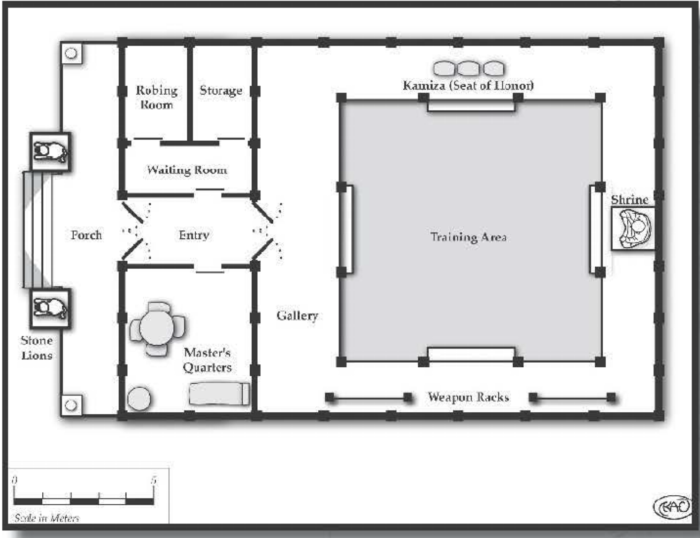

####
Dojo
####

Although he believes in furthering the causes of good,
Okent isn't prone to displays of
spirituality. So when, without
provocation, he said, "I have to
go this way," and darted off in
an apparently random direction within the bustling seaside
town of Inachon's Point, we
followed.

We arrived outside a boxlike
building. It stood out against its
surroundings by its contradictions: It was, simultaneously,
less ornate yet more refined
than the neighboring buildings.
Lacking the elaborate statues,
lanterns, or bright paints of the
other shops and homes around it, it should have been
completely invisible. But it wasn't. The building itself
was the most refined place of its type I'd ever seen. While
the other shops and houses seemed content with serving their functions adequately, this place wanted to be
the best ... whatever it was. The rich planks of its walls
and doors were thin but strong cherrywood, precise and
beautifully interlocked. The front entrance had three
graceful characters above it, which I transcribed into
my notes. We entered and immediately felt at ease as
the faint smell of incense infused us.

The entry chamber continued the simple beauty of
the exterior, and I realized now that this must be a school
of some sort. It had an aura of education; individual
mats pointed toward a slate, which had pictographs
obviously depicting a small man throwing a bear over
his shoulder.

After several minutes, our tranquil study of this place
was startled back to reality by the sound of Raichael
gasping; we turned to see what caught her attention,
and noted a man standing there. He introduced himself
as Master Quyen Ota. Seemingly young and vibrant
yet with an atmosphere of power and experience, he
asked why we had come. Okent explained that he felt
compelled to come here.

Quyen nodded, as if this was not in the least bit
unusual, and said, "Do you wish training?" Okent
paused, struggling to answer. Quyen continued. "I
should warn you, however, that the Path of Stone is
difficult, and it must only be used for good. You must
defend the weak, protect the innocent, and uphold
virtue. Are you prepared to do this?"

I guffawed, and others in our party snickered as
well. Master Ota might have well asked if the sun had
plans on rising in the morning. I caught the teacher's
eye and noted the gleam signifying he understood the
rhetorical nature of his own question. Okent himself
was smirking, and he nodded in the affirmative.

I asked Master Ota what the markings above the
entrance into the building meant. He smiled and said,
"Step through this doorway and learn." I nodded.

Okent's training mirrored the structure of the dojo
itself. He began in the robing room, which was bare
save for places to hang normal clothing and two sets
of robes. One set of white cotton robes were worn for
functional instruction while the other silk set was more
ceremonial, although still not overly gaudy. The color of
the silk robes denoted the level of training. The red robes
indicated a novice, followed by orange, yellow, green,
blue, and purple, which
signified the highest
rank. A sign on the door
indicates whether the
room is in use. (When
asked if women were
permitted training from
his school, Master Ota
replied, "Only hubris
would allow an architect
to build a house while
excluding its walls." This
drew an appreciative
nod from Raichael.) We
were also introduced to
the washroom, which
provided private facilities, including a bath.

After Okent changed,
Master Ota took him
to the *nafudakake* -- a
board showing the rankings of all the students, with each name engraved on a
thin vertical plank. This board ensured that pupils of
roughly equal levels trained against each other, and it
gave students something to strive for. Quyen explained
that, although there were seven other students listed
(three red robes, two oranges, a yellow, and a blue),
this was the beginning of a month -long event for his
students at a martial arts competition in another place.
He frowned as he said it - the first betrayal of his inner
calm - but informed us that Okent would be his only
student during this period.

A small shelf containing small ceremonial items
and an actual bound book was also along the wall. The
book, Master Ota told me, was called the Precepts of
Stone, and it contained most of his martial teachings.
"If such a book were to fall into the wrong hands, " he
said gravely, "the results could be dire." Grubba asked,
"If that's true, then why isn't it kept in a vault?" Quyen
explained that, to lock away knowledge is to entrap it,
which is a dishonor. "Besides," he said, "As long as I live
here, it has a guardian." While I had little doubt as to
the Master's efficacy, I nevertheless worried: Couldn't
the book be used to train an army with the might of
Master Ota, but without his discipline and honor?

And then we were led to the training room. This
served as our primary residence for the next few weeks,
becoming our domicile and Okent's chamber of beatings. (At least, that's how it seemed to me.) This room
consisted of a huge padded area, a storage closet containing additional training supplies, and a small shrine
along one wall devoted to the spirit of stone. Lighting
usually came in from overhead through a translucent
paper ceiling, although in times of inclement weather,
the roof was covered and we used lanterns inside.

..  admonition:: MASTER OTA

    ..  include:: ../characters/master_ota.txt

Once Okent's training began, I was surprised to see
that Master Ota wore the same red robes as an initiate.
When I asked him why this was, he answered, "The true
master knows that he is but a novice. The more he learns,
the more he knows that he knows nothing."

The mat, I discovered, consisted of modular segments
that could be changed to simulate different conditions
or situations. The standard flooring was tightly woven
straw, which provided ample padding. During the course
of the month, however, we watched Okent train on
many types of mats and surfaces:

-   A gigantic silk sheet covering the entire floor, making it treacherous and slippery.

-   A grid of crisscrossing bamboo, about a half meter
    off the ground. The gaps in the bamboo force the
    combatants to stay focused, lest their feet fall into the
    empty squares and put their ankles at risk.

-   A large valley formed by wooden segments
    and spanning the entire area. Extending two
    meters off the ground at each side, this training
    method forces students to be aware of slanted
    surfaces and height differences.

-   A balance beam positioned three meters
    off the ground, with the usual objective being
    to knock the opponent to the padded floor. At
    first, Okent believed this was solely to train
    him in balance and to fight along a line. But late
    in his training - and in a moment of clarity
    - he swung underneath the beam, using his
    momentum to carry him under and over the
    beam, knocking Master Ota off. The Master was
    impressed and greatly pleased, noting that a true
    master of the martial arts does not limit himself
    to preconceived notions or self-imposed limits,
    outside of those dictated by honor.

In addition to simulating different environments with the mats, Master Ota trained
Okent in various conditions, including being
blindfolded , having the arms or legs restrained,
and fighting while both combatants hold the
same pole - the goal is to get your opponent
to let go.

After several weeks, I was surprised to learn
that the paper ceiling was not entirely for light,
as Okent and Quyen sparred on the roof. The
object was to not get knocked through the ceiling ... or, if you were, to avoid bruising one's
posterior as much as one's pride . Okent's final
match, to determine his level of mastery, involved
a dizzying three-tier battle: The balance beam was
hoisted to the roof, and Okent and Quyen started atop
it, battling to the rooftop, through the ceiling, to the
mat below, and eventually sparring into the entrance
antechamber before Master Ota, appearing pleased,
called the match over.

Finally, after a month, Okent was presented with a
yellow robe in a formal ceremony. "You are permitted to
resume your journey whenever you like;" Master Ota said,
"and your name shall remain on the nafudakake."

As we left that noble school, I noticed - for the
first time - the characters above the doorway leading
outside. I smiled, realizing they were the same as those
leading in: "Step through this doorway and learn."

Martial Arts in D6 Fantasy
==========================

Training in any martial arts is represented by the
fighting or melee weapons skill, depending on whether
the martial art is armed or unarmed. The specific martial art is not a specialization of the skill; rather, that is
simply how the combat skill manifests in the character.
However, specific maneuvers are permissible as specializations, such as fighting grab. These should generally
represent particular aspect of a martial art in which the
character is particularly skilled, and they cannot thus be
purchased without having the base skill; it's difficult to
justify how a character knows how to do a Judo tackle
without knowing any other aspects of the style.

Supplemental aspects of martial arts are represented
by other skills, usually acrobatics or dodge, although
some skills - such as climbing or stamina - can be
gained because of martial arts training. In addition,
many noncombat features of a style can justify other
skills, such as healing or stealth.

For moderately cinematic games, many Special Abilities are appropriate.
These include: Ambidextrous, Combat Sense, Fast Reactions, Hardiness, Iron Will, Pain
Tolerance (see the related sidebar), and Skill Bonus.

For wildly cinematic games, other Special Abilities
can be purchased to represent truly super -skilled
aspects of the character's training. These include:
Armor-Defeating Attack, Hypermovement, Invisibility,
Natural Hand-to-Hand Weapon, Paralyzing Touch,
Silence, and Skill Minimum. Most -- if not all -- of
these abilities are onJy available at low levels; the character isn't truly becoming invisible, but rather using
his incredible steal th abilities to be unseen by even the
most skilled eyes.

..  _pain_tolerance:

..  admonition:: New Special Ability: Pain Tolerance

    The character is, for whatever reason, resistant to the effects
    of pain. This doesn't keep her from becoming damaged, but it
    does prevent some of the supplemental effects of injury. For
    each level, the character ignores the effects of one level of injury.
    Thus, a character with this at Rank 3 would ignore the effects
    of Stunned, Wounded, and Severely Wounded. At Rank 5, the
    highest level available, the character ignores all penalties up to
    and including Mortally Wounded; she can continue acting at
    full capacity until she is dead. Character creation cost 2.

Players and gamemasters are encouraged to be creative for these kind of powers. For example, a character
might purchase Plight (R1) with Restricted (R2), to
require physical contact with roughly horizontal
surfaces (for a combined cost of 4). This would
represent the ninja-like ability to run on water
or other surfaces that wouldn't seem to support
a Human's weight.

Although cinematic martial arts abilities can
confer Special Abilities, they are usually balanced
by Disadvantages. Many martial artists take on
vows forsaking monetary attachments (Debt
and/or Poverty), find themselves under attack
by their school's foes (Enemy). and usually take
on the code of honor and conduct taught by the
school (Devotion). Those who do not have any
such restrictions are often called "ronin; which
marks themas those with the martial knowledge
but not the responsibility (usually resulting in
Infamy among the school's other members).

Note that this is the most basic method of
including martial arts in games. Gamemasters
may devise their own, including creating packages of
skills and Special Abilities; designing special maneuvers
with their own difficulties and effects; and so on.
