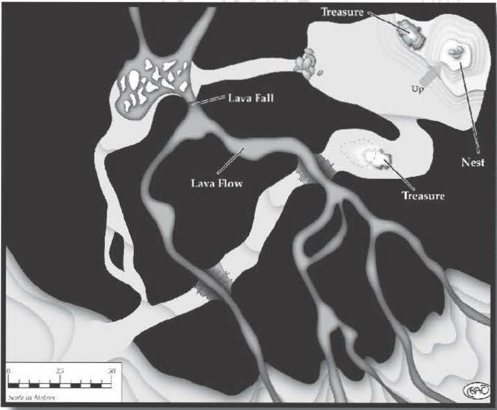

###############
Dragon's Cave
###############

Most adventuring parties, when presented
with a gargantuan winged shadow
that engulfs them all, would take this as
a cue to hide. Or perhaps flee.

It was Okent's idea to follow the
Dragon. My idea -- which involved
informing distant taverns of this potential threat -- was discarded.

In the sketches and ballads, they
often depict the Dragon's lair as being
at ground level, with a sylvan glen
leading to a nice straightforward cave.
I know now how foolish a concept this
is. Most Dragons can fly, and most flying
creatures make their homes in places
that can only be reached by flight. Now,
while Dragons don't reside in trees (at
least, I hope not), they do prefer caves that can be only
be easily reached from the air. I would assume that
flightless Dragons would stay in mountainside caves
they could climb or slither up to, but it's possible they
could reside underground.

They can, however, also be reached by backbreaking
effort. In all, climbing the mountain was Very Difficult,
although it was made easier because we could take
our time.

The cave extended inwards a ways, then opened into
an entry area of some sort. It was large and almost
devoid of illumination. (Anyone who doesn't bring a
light source or alternate form of vision to a Dragon
cave should be prepared to face complete darkness.)
This was our first hint at the scope of what we were to
encounter. The light of day was far behind us, and the
echoes of our footsteps echoed loudly ahead of us.

The scope of that initial chamber took our breaths
away. We knew the rest of the mountainside extended
above and beyond us, but we hadn't fully considered
that it might be hollow ; it extended at least 30 meters
above. A Dragon capable of hovering could probably be
leisurely in destroying us. (Of course, the Dragon also
might have lucked out in finding such a great spot; in
remembering similar caves we've explored, I note that
most such chambers usually have at least a few ledges
where foolhardy fighters could scale to and engage a
flying creature directly. Regardless, in this situation,
archers or others capable of ranged attacks are worth
their weight in gold.)

We explored a couple of other tributaries. Like other
caves we've seen, these contained obstacles trivial for
a giant Dragon to overcome, but proved really challenging for us.
Some examples (drawn from both this
Dragon's cave and others I've researched):

-   **Changes in altitude and grade** -- dangerously
    steep slopes send unaware folks sliding to dam-
    age and disorientation
    if they aren't capable
    of Difficult acrobatics
    maneuvers. Also possible are utterly inaccessible places, such
    as the cave continuing
    up a 10-meter sheer
    "cliff" face (or down a
    10-meter drop).

-   **Damaging terrain** -- the floor of one chamber was littered with
    thousands of flawed,
    shattered gemstones
    broken up into the most
    costly caltrops imaginable.

-   **Other monsters** -- although they were
    not evident in this cave,
    intelligent and semi-intelligent creatures
    could make their home
    within a Dragon cave
    in a symbiotic relationship. They would know enough
    not to attack the gargantuan fire-spewing creature,
    and would serve as a first line of defense and warning
    to the dragon.

Two of the side caves were made of hard, nonporous
rock, and contained large pools that I recognized as
quicksilver; the fumes were unbearable, and it took a
quick prayer (and the resultant divine intervention) by
Raichael to keep us from succumbing. I'd never seen that
much of the liquid metal before; alchemists would have
a king's ransom, if they could survive to gather it.

Later on, we stumbled across another chamber;
unlike the rest of the cavern's tributaries, this one
was not designed by or for Dragons. In fact, it was
barely Human-sized, and we squeezed single-file. In
the small chamber beyond, there were magical glyphs
everywhere. We avoided them, but it seemed to be some
kind of protective chamber. A small pile of treasure
rested inside the central circle, resembling some kind
of golden "nest." We didn't investigate further, since
that would have entailed crossing the wards.

Finally, we emerged into one high-vaulted cavern
chamber. Our torches were guttering at this point as
we navigated the steeply ascending terrain ahead of
us. Midway up the incline, Okent commented about
feeling slight tremors. We glimpsed fl.ares of flame
ahead of us. As we got closer, we saw a smooth, curved
rock shift toward us. I think it was Grubba who first
realized it was an eye.

"Is this lunch crawling on my back?" we heard the
booming voice beneath us say.

"Uhh ... no?" I stammered.

The dragon hmmed. "What is the weather like
outside?"

"It's ... damp?" Raichael offered.

"I see." There was a long pause. "Before being awakened, I had the oddest dream that I roasted some
Humans alive who were crawling on my back. Strangely
enough, my dreams often come true. Do you take my
meaning?"

"Was there a Dwarf in your dream?" I asked shortly
before Okent cuffed me across the head.

"There was. I swallowed him whole."

"Right. Umm ... we were just leaving."

"I know you were."

And with that, we beata hasty retreat; only then did
we notice the bodies, skeletons, and piles of treasure and
coins littered around and under the Dragon. I was so
stunned on the way out, I was only able to find several
handfuls of gold. Oh, and a sparkling wand.

To make a long story short, we somehow went from
moving quickly out of the cave to running for our lives.
Several days later, we concluded that we had evaded
the pursuing Dragon. However, I am deeply concerned
about the untrusting nature of Dragons; this
creature failed to believe me any of the times
I threw my newfound gold behind us and said
I didn't have any more of its treasure.
It is a beautiful wand, though.

..  _caltrops:

..  admonition:: Caltrops

    Maneuvering through caltrops requires an acrobatics roll,
    with a difficulty ranging from 10 to 20, depending on the
    quantity and quality of caltrops. (In theory, the difficulty could
    get up to 25, although at that point, there would be so many
    hideously expensive caltrops on the floor that it's indistinguishable from a bed of nails.)
    It normally takes twice as long to
    maneuver through a bed of caltrops than it does clear terrain;
    thus maneuvering through a 10-meter patch of caltrops would
    take two rounds for a person with a Move oflO. Taking extra
    time to "prepare" means wading through the caltrops longer
    but lessening injury, while rushing through the field increases
    the difficulty - and the damage. (See the "Preparing" and
    "Rushing" rules on page 52 of the D6 Fantasy Rulebook.)

    If the character doesn't make this acrobatics roll, the degree of
    failure is the damage done to the person traversing the caltrops.
    However, this damage cannot exceed the difficulty rating of the
    caltrops. Depending on the character's attire, the game master
    may decide that her armor doesn't protect her.

    Regardless of the acrobatics roll or any damage taken, the
    person moving across the caltrops gets past them (unless she
    is Stunned or otherwise slowed down by injury).

    **Example**: Okent is chasing a cutpurse who scatters caltrops
    behind him (covering a 10-meter patch). The caltrops are
    shoddy, having a difficulty rating of 10. Okent would normally
    need to take two rounds to get across that patch, but he needs
    to pass through it as quickly as possible, so he takes 50% less
    time, incurring a +10 difficulty penalty (raising the acrobatics
    difficulty to 20). Okent's player rolls abysmally, failing his
    acrobatics roll by 14. However, since the caltrops only have a
    difficulty rating of 10, Okent only needs to deal with 10 points
    of damage. If he had failed the roll by 6, he would only need
    to deal with six points of damage. Regardless, he traverses the
    patch and continues the chase.

    Caltrops have a price difficulty or number of gold per 10-
    meter square coverage equal to their difficulty rating, up to
    20. In use, a person can drop twice as many caltrops to get a
    +5 bonus. (Thus someone could buy two batches of difficulty
    10 caltrops, or one batch of difficulty 15, and get the same
    result.) Deploying caltrops requires a throwing total of 10 or
    greater to accurately cover a 10-meter area; this deployment
    range can be no greater than two meters.

Variana
=======

Even among the temperamental Earth
Dragons, Variana is known for her extreme
capriciousness. Within the course of a single
conversation, she can go from haughty to
conversational to murderous to reconciliatory.
Yet even these mood swings are not constant;
she has been known to exhibit the same personality for a month or more.

Scholars who have researched Variana have
differing opinions regarding her irrationality.
Some argue that, since her egg hatched in an
area prone to earthquakes, her spirit absorbed
the unstable nature of her birth land. Others
posit that she has spent most of her life around
natural deposits of the liquid metal mercury,
which has shaped her mind. Another theory
holds that her magical nature makes her as
unstable as the eldritch energies she seeks
to control. Still others argue that she was
merely born somewhat crazy; expansions of
this theory speculate that the land around
Variana may change in response to her moods.
Regardless, sages agree that anyone who
pierces the mystery of her psyche might gain
invaluable knowledge into the link between
Earth Dragons and the land itself.

Sadly, most seekers of lore have done little
first -hand investigation of this enigma; sage
guilds and religions alike take a dim view of
suicide.

Perhaps the only reason Variana's eccentricities are tolerated (outside of the fact that
there's no one powerful enough to do anything
about it) is that she is as much a force for good
as she is for ill. Afteryearswithoutincident, she
hovered over a nearby city to bestow treasure
and grain during a blight. Three years later,
well after the city had recovered, she went
on binging raids against farmers' livestock.
Yet another time, she drove off a pack of Fire
Dragons who threatened area villages.

The fact she possesses vast knowledge of
the arcane arts is not a secret. In fact, many
mag es and sages seek her out to request aid or
enlightenment, although a smaller subset of those
walk away from the encounter and an even smaller
subset have any kind of satisfaction. However, one
of her most closely guarded secrets is that she is
extensively proficient in shapeshifting, and often
walks among the two-legs in cities seeking adventure, treasure, and occasionally aid. Her vanity
means that she never chooses anything less than
a stunningly beautiful form (of either gender), and
her temperament ensures that trouble will follow
wherever she goes.

Beyond these excursions (and the occasional
lunch raid on wild or tamed animals), she keeps more
or less to herself, unless bothered. What happens
in those situations is entirely dependent on her
frame of mind. However, if her home is threatened,
she will fight with unbridled ferocity to resolve the
situation. She's spent an Elf's lifetime attuning
herself to her cave, and she knows her survival is
directly tied to its.
Within a campaign, Variana can exist as a catalyst
for any kind of "Dragon" story the gamemaster
would like to run. Her shapechanging abilities make
it possible to infiltrate Human (or other) society,
where she might seek adventurers to aid her. She
might be sought in her home as part of a larger
story; she possesses many rare treasures and arcane
knowledges. If provoked (or if she slips into a darker
mood swing), she can be a ferocious foe. Lately, she
has been harboring more maternal feelings, going
so far as to set up a protective chamber for a nest.
If a group were to do a service to make this possible
- such as finding her a mate or protect her offspring
- she would probably be grateful as long as she
was still sane. Of course, the nearby locals would
be worried as long as they were still alive ...

..  include:: ../characters/variana.txt

..  _the_home_cave_advantage:

..  admonition:: The Home Cave Advantage

    Dragons are fully described in D6 Fantasy Creatures (page
    23-27), and that volume should be consulted for general
    information about them. The Earth Dragon is the type
    most commonly found in caves, although other Dragons
    might be found here if some other aspect of the cave suits
    their environment. For example, a cave in a cloud-scraping mountain might attract a pack of Air Dragons, while
    a volcano's cavern system might lure a Fire Dragon.

    The specimens described in D6 Fantasy Creatures are
    "typical" versions; young dragons can be somewhat less
    powerful while elder dragons can be much, much deadlier.
    Even for experienced adventuring groups, an encounter
    with a Dragon should never be trivial ... especially for those
    who dare confront a Dragon within its own cave.

    Those Dragons who live in caves almost universally have
    Infravision or Ultravision (D6 Fantasy Rulebook, page 35),
    which enables them to navigate and defend their own cave
    fully. However, some Dragons are unable to see in the dark
    normally but instead develop a •sense" about their own
    caves; in other dark situations they maneuver no better
    than anything else, but within their caverns they hold
    absolute dominion. Such a Dragon's ·cave sense" might
    be represented by the Special Ability:

    Ultravision (R6), +12 to sight-based totals in darkness
    with Restricted (R3), to Dragon's own cave.

    In fact, "Restricted (R3), to Dragon's own cave" can be a
    useful addition to a Dragon's repertoire for many Special
    Abilities, representing the significant advantages a Dragon
    has in its own habitat. Combat Sense, Sense of Direction,
    Skill Bonus, or Skill Minimum a.re all reasonable Special
    Abilities for Dragons to have within their caves, and even
    more unusual ones such as Luck or Ventriloquism are
    not impossible . ("Yes, tiny pink ones, you hear my voice
    all around you, do you not? It is so rare I get to play with
    my food ... ")

    Of course, Dragons are also powerful and mysterious
    enough to have these abilities outside their caves as
    well.
