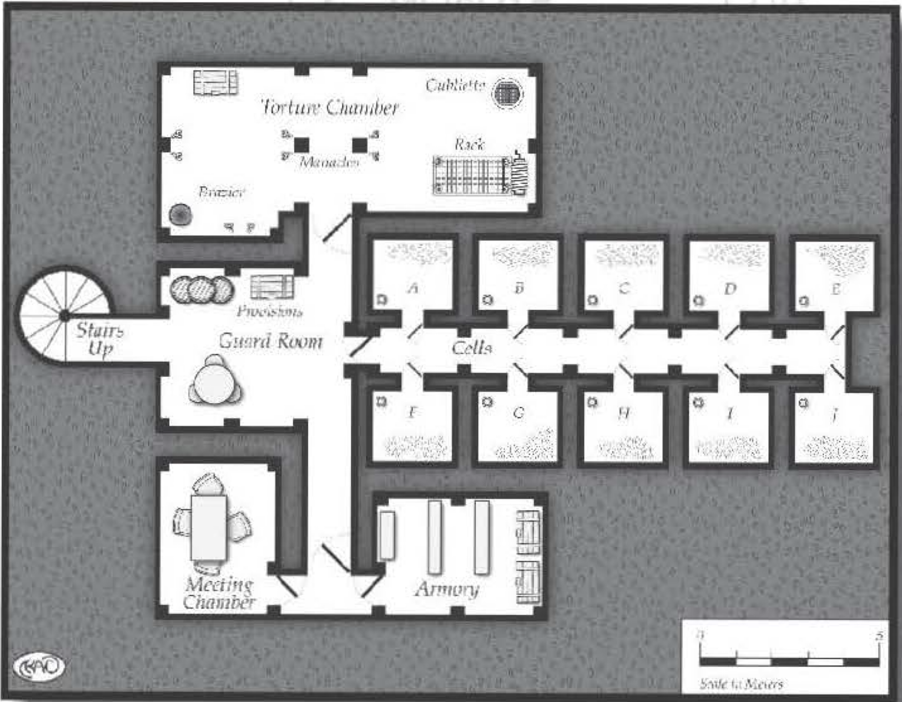

########################
Ruined Castle's Dungeon
########################

It was noon when we arrived at the rubble that
denoted a previously mighty fortification. How the
castle became ruined, and why it has remained such
without being replaced, I do not know. The large hilltop
it rests upon appears (to my admittedly untrained eye)
an exemplary location, overseeing the region below and
providing excellent visibility for kilometers in all directions, especially from the one seemingly sturdy tower
remaining in the valley-side corner. Raichael seemed to
sniff the air, looked up to the sun, and uttered a short
prayer to her deity. "Ill omens," was all she would say,
and I got the feeling this would prove, yet again, her
extreme capacity for understatement.

Looking for clues
within the ruins, we discovered a few points of
interest. Grubba stroked
his long beard and asked
if he could poke through
the ruins on bis own.
We assented, and the
dwarf wandered off in an
expression of absolute
glee (which is to say, he
was scowling less than
normal).

After searching
for a time, we found
what seemed to be the
remains of the throne
room. Any valuable trappings had long since
been destroyed by the
elements or looters, but
it still exuded the regal
style as typifies royalty.
After some more examination, we found a collapsed secret door which led to
the castle's dungeon.

There are some general misconceptions among
commoners about typical castle dungeons. The normal
vision is a sprawling, vast complex, replete with dozens
of chambers and corridors, containing prisons, supply
rooms, and so on. This is generally wrong for a number
of reasons. First, any kind of under-earth burrowing
is hideously expensive; unless there's a specific reason
for doing so, a castle's underground construct, if it
exists at all, is likely to be modest. (Of course, plenty
of castles are constructed by those with a less-than-full
grip on reality, which can be reason enough for making
a sprawling dungeon.) Second, sprawling underground
prisons are rare beneath a castle. Prisoners scarcely ever
warrant the expense of building a dungeon; in fact,
in most kingdoms they seldom warrant the expense
associated with fee ding them. Wrongdoers in most
kingdoms are punished by fines, banishment, or death.
Occasional short-term public humiliation (such as a
public cage or stockade) may serve for those who need
to be taught a lesson by brief imprisonment.

Regardless, the only folks you want to seal beneath
the earth in a full dungeon are those who are too dangerous to set free or too valuable to let go. Political
prisoners most commonly frequent dungeons, although
those who know valuable lore (especially of an arcane
nature) might also be found there.

The final reason there aren't more sprawling castle
dungeons is that it presents a security risk. A moment's
thought will reveal why: If you're building a thousand-ton castle on a spot of earth, digging beneath
the foundation is a good way to ensure your castle
becomes ruins. (In fact, if an enemy castle does have
such a dungeon, it's possible that an adventuring party
might be tapped to play the role of sappers against it,
sneaking into the dungeon and weakening the ceiling
to help invaders take or destroy the fortification.)

Because of all these reasons, most dungeons beneath
castles- if they exist at all- are small ... "hole-in-the-ground" tiny. The normal purpose of the dungeon is
the short-term holding of a small number of prisoners
(no more than four, kept in two rooms of two people
each, although only having enough space for two - or
even one - is common). Soldiers usually guard above
such tiny dungeons at the sole entrance.

However, this castle's ruined dungeon was an exception, being somewhat more elaborate than the typical underground hole. It seems this dungeon served
primarily to imprison and interrogate; the entryway
opened into an antechamber which led to 12 prisoner
cells, each sealed with a lock that would take Moderate lockpicking ability to thwart. The doors consisted
of stout wood, with grated openings to peer in and a
slot at the bottom to give food. We weren't interested
in exploring the chambers fully, but it stands to rea-
son that any number of secrets might be housed in
those cells, either in the form of gear the prisoners
managed to hide on them, or else in messages or lore
hidden within. I've heard of one prisoner who carved
an elaborate enciphered text on the inside of his cell
using a fork, over the course of his months of captivity;
the guards never new because they never bothered to
open the cell door.

The next room was a full-fledged torture chamber.
The smell of rusting iron and sound of creaking chains
filled the air as we moved quickly through here. There
was a door similar to those blocking the cells between
the torture chamber and the prison antechamber, and I
realized that this probably let the interrogators control
whether or not the other prisoners heard what they
were doing to their fellow inmates.

This chamber had a thick, sealed door that would be
Difficult to open for anyone lock.picking it. We weren't
able to penetrate the door's defenses, but peering
through the keyhole I realized it was a weapon closet
of some sort; apparently this dungeon also served as
a secondary defensive measure for the castle. The door
had to be nearly impenetrable in case the prisoners
escaped, so they couldn't arm themselves. (There might
also be untold treasures behind that door - or maybe
just an angry skeleton tapping its foot impatiently.)

Finally, the torture chamber opened up into a little
meeting room, with a small table and chairs. Upon
closer examination, I
realized the walls of
this room were lined
with cork - apparently
to keep prying ears
from hearing what's
going on amid those
who gather here. (It
wouldn't surprise me
to learn the walls were
ensorcelled to prevent
supernatural scrying,
as well.) Apparently
whoever owned the
castle above reveled in
secrets, both extracting
them from others and
keeping them himself;
given the phenomenal
cost in the cork lining
alone, I can only guess
that these secrets were
more than paying for
themselves.

As we were ruminating about the implications of
this dungeon - and what secrets might still be hidden within these chambers - we heard an armored
figure rapidly approaching. Drawing our weapons, we
turned around ... only to spot Grubba coming at us full
tilt, gasping. "Short of breath?" I asked our diminutive
friend, causing him to draw his axe and stagger tiredly
toward me. Okent interceded and Grubba, grumbling,
told his tale. "I found another underground cavern
system. In investigating, I learned there lurks some
kind of inhuman presence there. They have sensed our
presence here, and are clawing at the earth separating
their caves from this dungeon. We need to get out of
here now!"

Never needing incentive to run from a fight, I led the
way out of the castle's dungeon. I can only hope that
any secrets that might still remain buried weren't so
important that we should worry about them falling into
hostile hands ... or needing to wade into those enemies
in a future effort to retrieve this lost lore.
