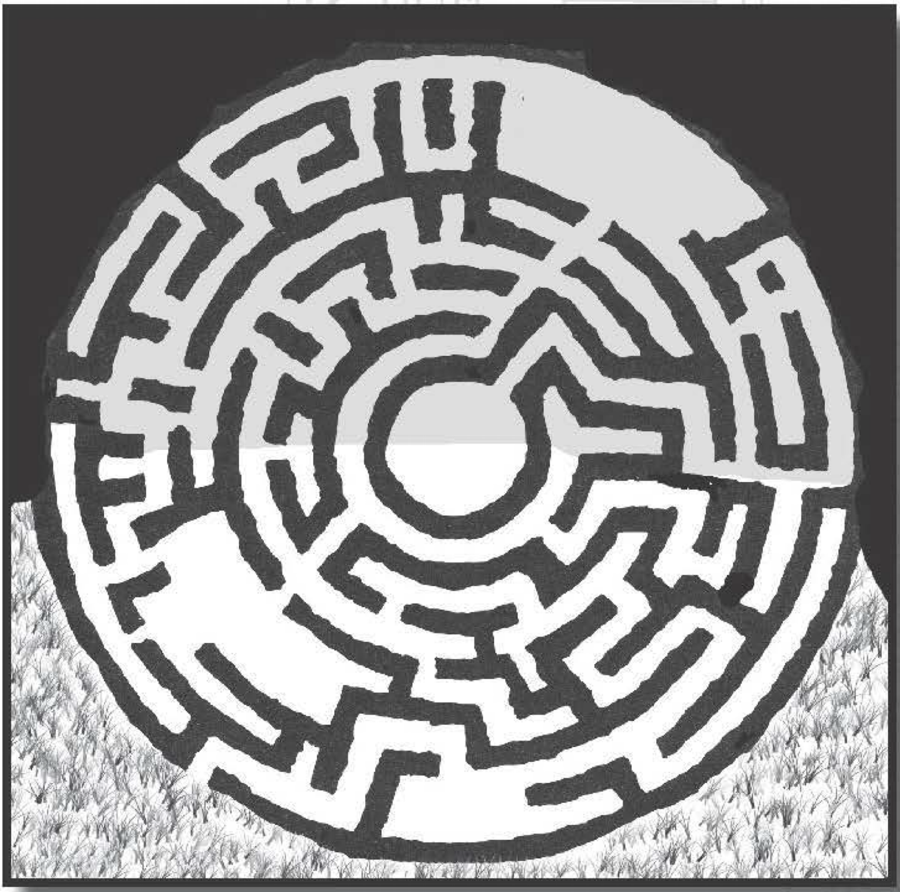

#######################
Labyrinth of Kephalos
#######################

Kephalos, an emperor who was justly elected with
the help of a carafe of poison, thought it would be a
good idea to sink a decade’s worth of his kingdom’s
income into the construction of an elaborate labyrinth.
His people, while showing their appreciation at being
driven to the brink of poverty, misplaced a dagger
between his ribs. Rumor has it that pieces of his corpse
were accidentally tied to large rats and released into
the labyrinth.

Centuries later the labyrinth — or Kephalos’ Demise,
as it’s also known — remains an impressive legacy of
the Kephalos reign. In fact, modern descendants in the
region view the construct with a sense of pride, and look
back on the emperor’s era with a certain nostalgia.

Our travels brought us to this labyrinth in the spring,
with the heat high and our tempers short. To make a
complex story simple, someone in our group was found
in a compromising position with the current emperor’s
curious daughter, there was a trial, and this person
was thrown — along with his companions — into the
labyrinth. Th  is person is truly sorry, and has learned
a valuable lesson: Don’t get caught.

Anyway, this kingdom’s laws have evolved for seri-
ous offenses to a trial by ordeal; those who escape
are considered innocent, and those who don’t are
considered guilty. (Th  ere’s actually a fair bit of debate
about how this code of
justice evolved; apparently before Kephalos,
there was an elaborate
judicial system that
relied on a "jury by
peers"; this system was
discarded after Kephalos' reign. I suspect the
rationale was, "Well,
as long as we have this
great labyrinth ...")

We were allowed to
bring all our gear; the
reasons behind this
were confusing, having to do with the time
of year, the omens of
the stars, and (for all
I know) the size of our
boots. Apparently, the
essence of transgressors' guilt and punishment is determined by
the emperor, while the
priestess determines
the classification of
guilt and the conditions
of punishment. (In our
case, the emperor found
us guilty of doing something wrong; the priestess
decided it was an "imperial transgression.") The result
of this is that the emperor gets to decide whether
someone is thrown into the labyrinth, while the
priestess decides how easy it is to get to the center
and light the signal fire, which notifies the keepers to
unlock the entrance to the maze. Then, the prisoners
need to safely make it back to the beginning, which
has become the way out.

In researching the matter, I learned of some other
conditions the priestess has placed on those tossed
into the maze:

-   Weapons only; no armor (or vice versa)

-   All gear except torches, lanterns, or other light sources

-   The group must be attached to each other in a line with chains

-   No gear or clothing permitted

-   The party must escape within a certain amount of time (for example, a day)

-   The party must spend a certain amount of time within the open -air chamber (for example, a day)

And so on. The limitations so placed seem constrained
only by her creativity.

We learned that the labyrinth also is used for other
rituals and festivals, especially the larger chambers
and open -air portions. For example, one of their local
temples sponsors a "Closeness of Community" ritual
each spring solstice, where the faithful mill about the
maze, learning to rely on each other to ensure that no
member of the community is lost or left behind. Before
these events, a group of brave individuals scopes out
the labyrinth, clearing out any obvious corpses or critters and negotiating with the Minotaur. These groups
are prevented from getting lost by the tying one end
of a spool of string to the beginning of the entrance,
with the party unwinding the spool as they travel; they
only need to rewind the spool to find their way out. (Of
course, if someone or something within the labyrinth
were to cut, eat, or retie the string, life could get very
complicated for those travelers ... )

However, this information didn't help us in our
punishment. The underground half of the construct
contained no light source and was thus completely
dark; however, the open-air portion was lit by whatever
ambient sunlight shone from above. The labyrinth's
walls were smooth yet intricately decorated, containing glyphs, engravings, and pictographs, as well as
the clawing and scratching of those who've passed
through the maze. Although it would be Very Difficult,
I imagine anyone who had an appropriate scholar ability
could learn a lot about the history and customs of this
region's past; who knows what treasures the carvings
might describe? (Of course, going voluntarily into the
maze specifically for such lore would be a foolhardy
move, in my experienced opinion.)

The maze itself was challenging, and the chittering
of various life forms kept us on edge. We managed to
get to the center and light the signal fire in short order,
but then we realized we had forgotten how to get back
to the start. After wandering the corridors for a half hour, we had an encounter with a fearsome creature:
a three -meter -tall Minotaur!

Resisting the urge to fight or flee, Raichael invoked
a miracle that soothed the creature and
helped us charm it into guiding us to escape.
It's lucky we did, because I'm sure we would
have wandered there for much longer, and
possibly encountered some of the maze's
other strange inhabitants. However, shortly
before we were lead to the exit, the Minotaur
seemed to become enraged and lunged for
us; it took some lucky evasive maneuvers
to outrun the beast.

..  _cheating:

..  admonition:: CHEATING

    While it may be tempting to cheat in the Labyrinth of
    Kephalos by going over, under, or through walls, it's by no
    means easy.

    All walls within the maze have a toughness of hardened
    brick (3D+2), as per the "Breaking Things" rules on page 69
    of the D6 Fantasy Rulebook. Furthermore, at least 15 points
    of damage must be dealt to make a hole of roughly Human
    size; this number is adjusted by one for every two points of
    a scale value, rounding up; thus a Cyclops (large, scale value
    6) would need to deal 18 points of damage to make a hole big
    enough for it, while making a hole large enough for an owl
    familiar (small, scale value 7) would require 11 points of wall
    damage. Such damaging attempts would certainly reverberate
    throughout the labyrinth, and it is likely some of its denizens
    would come to investigate.

    Since half of the maze exists in the open air, it may occur
    to some to clamber over walls. They are 10 meters tall and are
    considered smooth for climbing purposes (+2D difficulty; see
    "Climbing" on page 56 of the D6 Fantasy Rulebook), although
    given enough time and effort, it's certainly possible. Of
    course, those able to fly over the walls would not have any
    such difficulty.

    Finally, some might consider digging their way under the
    walls. This is slightly easier but more time consuming than
    going through the walls. The floor has a toughness of2D+ 2 and
    takes 12 points of damage to yield a hole big enough for one
    Human-sized tunneler (modified by the scale rules, as above);
    it takes two such successful attempts to get under a wall.

    Regardless, most of these efforts would be, of course,
    damaging to the Labyrinth of Kephalos. If these attempts are
    discovered and the damage is significant, the emperor would be
    most displeased (as would some of the maze's inhabitants).

Scarcely an hour after we set into the
maze we emerged, much to the emperor's
sputtering disbelief. The emperor grudgingly decided that we must be innocent,
anda wedding was prepared for the offender
(whoever he may be) and his daughter. We
fled that night, with said daughter graciously providing the supplies we needed to
escape . I think we both agreed that getting
devoured by a Minotaur was a preferable
fate to being stuck with each other.

Aischros the Minotaur
=====================

Aischros is a sad specimen of a Minotaur.
Long ago, Aischros stole some supplies
from the original construction site of the
Labyrinth ofKephalos. When the emperor's
guards tracked down the bull-headed creature, they dragged him back before the
ruler. Whether Emperor Kephaloswas more
or less merciful to Aischros than similar
thieves (whom he sentenced to death) is
open to debate; Kephalos decreed that
Aischros stay within the confines of the
construction site for the rest of his days. The
priestess, Lady Thaleia of the Half-Light,
insisted that her own will be added to the
sentence. She asked her deity to bestow
Aischros with longevity and the need to
never eat. (Scholars who know this tale
suspect it is the first instance of this kingdom's unusual
dual sentencing ritual.)

Over the course of years, the rest of the maze was
constructed around the Minotaur; the last brick sealed
the hole where his glowering red eyes peered out.

Over the centuries since, Aischros has wandered the
labyrinth. The intense solitude has caused his mind
to fracture. Part of him wishes nothing more but to
escape. However, shortly before reaching the exit, the
other portion of his mind awakens; this part wants
nothing but to dwell within the maze forever, and so
he wanders to the center of the maze again . At this
point, his other personality takes control and the cycle
repeats: go near the exit, go to the center.

Neithe r aspect of Aischros knows about the other.
However, the continual wandering has proved deeply
confusing and unhinging, and he is even angrier than
other Minotaurs. It's still possible to reason with him,
however, especially if one convinces his escaping half
that they can help him get out.

How he might ultimately leave his fate is up to the
gamemaster, and could make a good story, especially if
he knows the location of a valuable treasure from long
ago. However, those who would seek to aid Aischros
should beware; his unaging is tied to the ground of
the labyrinth, and leaving it would cause him to age to
dust within minutes unless that aspect of his longevity
could be counteracted.

..  include:: ../characters/minotaur.txt

..  admonition:: Other Encounters

    The Labyrinth of Kephalos is home to all manner of unusual
    creatures, although most of them are small or can leave via the
    open-air portion of the maze. Appropriate encounters from
    D6 Fantasy Creatures include the giant bat, domestic cat, ooze,
    scorpion, giant spider, and toad. These creatures may have a
    die or two of navigation Labyrinth of Kephalos or Infravision/
    Ultravision, representing their adaptation to their environment.
    Undead such as skeletons and zombies might be formed from
    the corpses of those who are lost within the maze.

    In addition, those within the Labyrinth may encounter any
    other any Human or humanoids who are forced to the maze
    at the same time. Of course, why these people would be here
    and whether or not they can be trusted to team up with could
    form an interesting encounter all by itself ...
