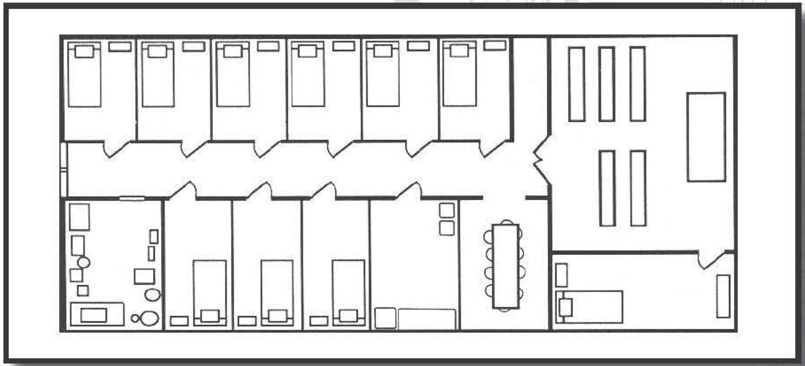

#############
Monastery
#############

At the request of Raichael's superiors, we found
ourselves visiting a collective of monks to build stronger ties between her faith and theirs. The monastery
- beautiful in an understated kind of way - belonged
to the Order of the Highest Sun. (As an aside, I wonder
why more religions don't use exotic travel as a means
of recruiting: "Become a traveling holy minister and
make your friends jealous of all the fantastic places
you'll visit!")

..  admonition:: Typical Monk

    ..  include:: ../characters/monks.txt

The abbot, a jovial round -faced older man
named Brother Nyll, informed me that this
particular monastery was fairly small, capable of
supporting 10 monks - 20 if they installed bunk
beds. ("Monk bunks?" I volunteered helpfully.
Okent elbowed me in the ribs.)

Raichael and Brother Nyll needed to discuss
business, so I took an opportunity to investigate
the monastery. I was done in what seemed like five
minutes, although it might have been six. Abbeys
and monasteries, I realized, are places where the
devoted go to escape the distractions of worldly
trappings. As such, anything that isn't necessary to
the base needs of living is devoted to the clearing
of the mind or the deepening of faith.

In fact, even some things that are necessary for
living have a decidedly different bent. For example,
the Order of the Highest Sun has (logically) the
sun as its central focus. As such, they work the sun
into many of the sundries of life. For example, they
don't have a fireplace. Rather, a ladder leads from
the kitchen to the roof, where a highly polished
huge shallow metal bowl collects the sunlight and
focuses it, giving the heat necessary to boil water,
cook, and so on. (I asked Brother Nyll what they
did on those days when the sun didn't shine. "Pray
harder," he said, betraying a slight smile.)

The chapel is the focal part of the abbey, serving
as the physical reminder of the monks' spiritual
lives. This particular chapel had a beautiful stained
glass ceiling, which allowed the sun to enter in a
blinding and glorious display, especially when it
loomed high overhead.

The lay brothers made their residences in two
types of chambers - small and large, although
even the "large" ones still made me feel slightly
claustrophobic. All chambers consisted of an
uncomfortable bed, a simple wooden box that
served as both a night table and storage, and a
candle. The abbot's chamber was a little bigger
and contained a shelf with numerous scholarly
books and religious artifacts.

The dining room had barely enough room for
10, so I deduced that, should the monastery ever
have more residents, they would need to eat in
shifts or make other arrangements. The kitchen,
while functional, definitely served to reinforce a
life free of material distractions. The storeroom
contained enough supplies that, fully stocked,
could feed 10 for four months (assuming relatively
light eaters and that their nearby well would continue
supplying water). For most of the year, the brothers
kept their supplies much lower, with the supplemental
space used for their crafts.

What crafts? Well, many monasteries are self-sufficient, and as such they will often have crafts or
artistic products that they can use to make money.
Common crafts or talents include book or manuscript
scribing, cheese making, and making wine or beer.
(Speaking from firsthand experience, I can say that
some monasteries make a truly divine brew.) Basically,
anything that requires a lot of patience, skill, and spare
time - but n ot constant supervision or work - is a
good candidate for a monastery. Alternatively, if it's
something that requires a lot of effort, then the act
itself can be worked into the spiritual regimen of the
monastery, such as melodic chanting. Scribing is also
common in this regard because spending hour after
hour writing is a great way to reflect on one's soul.
The Order of the Highest Sun has an unusual craft:
mirrors. Feeling that mirrors reflect the radiance of
their divine inspiration, the Order creates some of the
most breathtaking mirrors I've ever seen, made from a
durable, highly polished metal. They receive the metal
elsewhere, cut it into shape outside, and polish it at
the dining room table while ritually praying for hours
on end. (I've heard of some places making mirrors out
of silver-backed glass, but they are much more fragile,
and aren't as free of warping as polished metal. Trust
me - glass mirrors will never prove common.)

So what's there to do at a monastery? Well, if you're
a monk, the answer is obvious: Pray. These institutions
serve as places of spiritual solitude, away from the
distractions of the world. When I asked Brother Nyll
what they hoped to accomplish, he replied, "To keep
the sun shining bright." It's a place for those who feel a
yearning to a holy life but who do not feel they have the
calling to be a leader within the faith. They pray for the
good of their order, their believers, and - ultimately
- the world. I postulated that the faithful have their
communities strengthened by having these places as
part of their fold. Brother Nyll chuckled and said, "And
the existence of the faithful strengthens ours."

For those who do not belong to a monastery, there
are still opportunities for improving one's well-being,
either physical, mental, or spiritual. Monasteries are
often home to people skilled in healing arts, so they
can be an ideal place to rest and recover. Such ministrations aren't free - especially if one isn't a member
of the order's religion - although most monasteries
will heal those who seem at least somewhat aligned
to their goals for Moderate Funds (a gold piece or two
per day). Of course, if a person were poor and in dire
need, it seems unlikely most monasteries would turn
him or her away, at least for a night.

Monasteries are also great sources of information.
In some regions, they remain the primary (or only!)
means of duplicating documents, manuscripts, and
books. Given how rare and precious a commodity their
lore can be, almost all monasteries require those seeking
knowledge to gain permission of the abbot (and possibly
even higher up in the religious hierarchy, depending on
what is sought). Regardless, it will usually be Difficult
to afford their knowledge (at least a couple dozen gold
coins), and it will be Very Difficult to buy one of their
books outright (at least 100 gold), assuming they would
be willing to part with such information; far more common in this regard would be to trade a deed or favor
from such seekers in exchange for the lore. Nevertheless, monasteries remain the sole surviving source for
some information, and they can be worth it.

..  _mirror_of_the_highest_sun:

..  admonition:: Mirror of the Highest Sun

    ..  include:: ../items/mirror_of_the_highest_sun.txt

Finally, monasteries serve to strengthen the souls of
the faithful or those seeking reaffirmation or enlightenment. Although not their primary function, they
can nevertheless serve as temporary homes for those
requiring a spiritual respite, either for a couple of days
or a more extended period (perhaps years).

Monastic life is not for the fainthearted. Most monasteries rigidly define one's life, telling monks when to
sleep, eat, worship, and perform other duties. Monks
must usually take vows beyond a conviction to the
monastery's order: chastity, poverty, and silence are
all common. (In particular, the vow of silence is often
misunderstood. Like most such vows, it teaches self-discipline, and isn't an absolute; most monks are permitted to speak or sing during prayer, when completely
necessary to finish a work assignment or respond to a
visitor, or when addressed by a superior.)

Of course, one doesn't spend the better part of a
day at a monastery - waiting for one's clerical companion to stop gabbing with another religious superior
- without coming up with other ideas. As such, here
are some other possibilities for what I might do, if I
wrote a tale set in a monastery.

Monasteries offer seclusion and insularity. While
this is wonderful for those seeking respite from worldly
distractions, it can also provide an ideal canvas for
stories requiring secrecy. For example, a murder mystery
is ideal for a monastery; it's a closed-off
environment and there are a limited number
of suspects - many of whom don't speak! A
monastery would also be a good place for someone unscrupulous to hide; presuming he could
con his way in, he could remain undetected for
months or even years. And if this miscreant
had other nearby objectives, he could use the
monastery as a base of operations.

A monastery can serve as the last stand
against some evil, either physical, spiritual, or
both. Although not fortresses, most monasteries are designed to withstand some level of
attack, especially if they contain items, crafts,
or knowledge of value. A group of heroes might
seek to aid a region under attack by using the
monastery as a line of defense, working with
the monastery to cobble together offensive or
defensive strategies. Of course, for this story to
work, the monastery (or at least the abbot) would need
motivation to thwart the assailants; many monasteries
place themselves above the petty squabbling of nations
and wars. But attacks of an evil, mystical nature would
surely draw the monastery's attention, and woe befall
any attackers who forget that such places often commune
with higher powers dedicated to order and good.

Finally, the establishment or rebuilding of a monastery might be a long-term goal for a sufficiently
pious individual, bringing much of the same flavor of
castle-building tales while advancing the holy person's
religion and faith.

As for myself, I volunteer to help any monastery
that has sufficient brewing ambitions to hone their
offerings.
