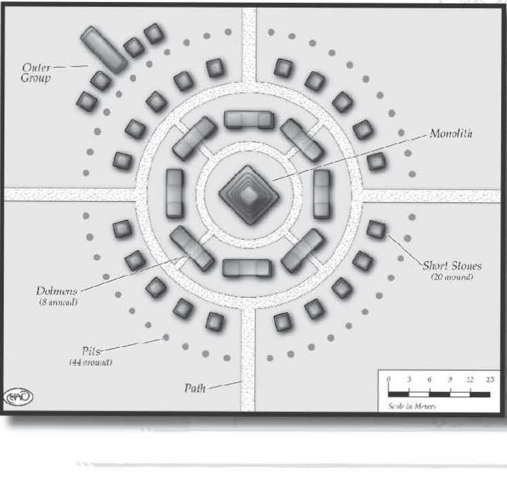

###############
Stone Circles
###############

I'd always believed that there was a point of wetness beyond which one could eclipse; for example ,
a rock thrown in a lake became as wet as that rock
could get. After days of trudging through the nonstop
downpours of that cold island nation, I realized I was
wrong. and considered jumping in a nearby lake in an
effort to dry off.

I emphasize the gloom and dreariness because is
the only reason we hadn't seen the stone circles before
almost literallysmackinginto them. Sure, in most situations a group of stalwart adventurers should spot a
large collection of five-met er-tall stones on flat land,
but it was raining. A lot.

We knew this location bore further investigation ,
so we made camp, using a giant stone as a brace for
our tents.

We awoke the next morning to the commanding
voice of a man dressed in leather and furs, arranged in
ornamental strips radiating from a thick gold ring in
the center of his chest. He exuded authority and power.
"Who dares to defile our sacred site?" he demanded. I
pointed to Okent.

I knew the fur-wearing man had to be powerful,
because his presence marked the first time it wasn't
raining since we got to this land. Raichael, using her
divinely inspired charisma, quickly smoothed the situation
and kept Okent and
the fur-dad warrior-priest from striking
anyone. The holy man,
who referred to himself
only as "Precursor to
the Perpetual Falling
Land," served about
three dozen men and
women as both secular
and religious leader.
This group lived in the
foothills, in a cavern system containing enough
bolt-holes, traps, and
hidden ambush points
to made us thankful we
didn't discover their
community the previous night.

The Precursor (as I
called him, lacking the
desire to devote more
ink than necessary to
his full name) was not a pleasant man, and it seemed his
hospitality sprang mostly from the fact that he hadn't
found any reason to kill us yet. However, his reluctance
in talking about his people did not extend to his faith,
about which he was more than willing to explain.

Unfortunately, his explanations just didn't make
much sense. His people seemed to believe in the notion
of falling. When they sacrificed animals on the main
altar stone, the blood flowed into the earth along with
its spark. They contend that the world's spark - and
all life - stems from within the earth, from whence
it is renewed and where it shall return. All aspects of
their beliefs stem from this idea of falling: The sun
doesn't rise, but rather the earth falls each morning,
its momentum carrying it away enough to give the sun
reason to itself in turn fall back into the earth. They
claim that lava and natural springs are the land's soul,
proof of the essence that shall fall into it. "After all,n
he explained, "when our blood flows from us, we turn
cold; our warmth has descended into the ground, from
whence it shall come again. Lightning strikes, bringing
fire to what it touches. The fire, too, will ultimately die
down, to fall into the earth." It made my head hurt.

(Raichael later explained that our confusion stemmed
from the faith's antiquity. Their ideas were born at least
two Human Ages ago, perhaps even older. They had
only rudimentary ideas of community and faith, all
centered on the stone circle. They didn't even believe
in a god or gods, per se, so much as elemental forces
that governed the universe. That the rest of the world
existed was of little import to the Precursor, who she
guessed felt that all life radiated from this circle, and
back to the circle all life would eventually fall.)

..  admonition:: Precursor To The Perpetual Falling Land

    ..  include:: ../characters/precursor.txt

The Precursor took us on a tour of the circle, and I
made a map as best I could. Although each stone looked
near -identical to the others, each had a sacred name,
which only the Precursor and his followers knew. "This
is Vleya - the moment of clarity before impact. This
is Af'nyara - the ever-increasing speed of a body's
decent. This is ... " and I tuned out after a while.

I asked the Precursor if his people or ancestors built
this circle. He looked at me quizzically and mock laughed. "Did your people build that ?" he asked,
pointing at the sun. I stammered a protest. Surely, this
monument could be built by people, perhaps using giant
ramps and log rollers to move carved stones from the
nearby foothills. (I even pointed out what
seemed to be the remnants of Human-made
valleys, long overgrown, that seemed to
support my idea.) But he just frowned at the
prospect. ""All things fall. The rain. The over-ripe fruit. The newborn calf. This circle. All
things have fallen into place as they should.
And it falls to us to ensure the cycle."

I asked what he meant, and he seemed reticent. Raichael coaxed him, and we learned
that the next morning was their most holy
day. After more convincing, he agreed to
let us observe.

Several hours later, we found ourselves
shivering in the pre -dawn hours, still mercifully clear of rain. The initial preparations had
been completed, and we were only awaiting
the dawn. In an effort to understand the
coming ritual, I asked the Precursor what
he and his people were going to be doing.
Again, he looked quizzically, and said, "My
people and I are keeping this world alive. It
is by our actions that the land's spark stays
within it, and life remains possible. We can
do no more, and we must do no less."

I chuckled inwardly, disbelieving the
enormity of his proclamation. Less than
half an hour later, the sun arose.

I find myself pausing, trying to convey the
enormity of this stone circle and what we
witnessed. The circle, while impressive, had
seemed to our eyes a random phenomenon,
akin to a child on the beach placing shells
in a pattern pleasing to her. But I realized
there was more going on here than I could conceive.
For, as the sun's rays hit the first stone, the Precursor
chanted a prayer extolling the virtues of the forces of
that stone. And just as he finished, the sun had risen
enough to strike the two stones next to that first. And
again he praised the stones by name.

As each stone became alight and alive with sunrise,
I found my spirit soaring with possibilities. And then
the sunlight hit the altar stone . I winced, unprepared
for the display. For the sun proceeded to shine through
the focus stone, directing its brightness on the center
altar, its light following the precise line work etched
in the slate. The light illuminated the fawn's falling
blood, absorbing into the sodden earth with a glow fd
not attributed to blood before. Words cannot express
the precision and beauty of this display; it was like the
world's most intricate sundial, acting with the complexity
of a water clock but using light instead of fluid. And
this spectacle was being played out on
a display larger than any I'd ever imagined possible by Human hands.

..  admonition:: USES FOR STONE CIRCLES

    Stone circles represent a convenient plot hook for all manner of
    stories; since their immediate use isn't obvious, anything that seems
    reasonable can become the focus of a plot. Some ideas include:

    -   The site of a spell or miracle

    -   The only means of creating or destroying an object of great power

    -   A means of teleporting to another location or opening a gate to another dimension

    -   A way to decipher an ancient formula or celestial calculation

    Of course, these ideas can be combined; perhaps a villainous
    necromancer has calculated the perfect time for his grandiose
    undead creation ritual via a stone circle, and a band of heroes
    needs to use the same circle to forge a weapon that can defeat
    this new nightmare army.

    Traditionally, stone circles are associated with astronomical
    phenomena, such as the ability to track or predict the movement
    of heavenly bodies. They have also been the cite of various spiritual
    and religious movements, usually involving pagan beliefs.

    Stone circles represent the flip side of the coin presented by
    the Ruins of the Ancients. While the Ruins symbolize a mystery
    from ages long past standing apart from humanoid accomplishments, a stone circle is a long-lost mystery that could be created
    by people, given sufficient resources, time, and dedication. As
    such, while the Ruins of the Ancients are probably never able to
    be fully understood within a fantasy campaign, stone circles can
    theoretically be deciphered and their secrets utilized. Of course,
    what influence such secrets would have on the world is up to the
    gamemaster.

    The effect of a stone circle on miracles and magic depends on
    the rarity of the circle and the conditions under which it can be
    activated. In most circumstances, unless stone circles are very common, they will qualify as "extremely rare" or "unique" components,
    and thus count as a -6 or -7 Negative Spell Total Modifier (see the
    D6 Fantasy Rulebook, page 91). In addition, if the spell or miracle
    can only be used in the stone circle at a certain time, this counts as
    an Other Condition, worth -3 for daily events (sunrise or sunset),
    -4 for a seasonal effect (equinoxes or solstices), -5 for an annual
    event, and -6 for an event only occurring every few years or rarer.
    See the D6 Fantasy Rulebook page 94 for more information.

The sun eventually rose higher, ending its breathtaking display. But for at
least a day afterwards I found myself
believing instead on some level that
the ear th had fallen into place under
the sun. Our group remained another
day, and I noted that the sun's display
was not repeated the next morning
within the stone circle (although it
was still beautiful); whatever we were
observing, it was obvious that it only
worked on certain days a year.

I found my mind divided. On the
one hand, there was no miracle here,
per se; nothing we had witnessed
could not be explained beyond mere
tricks of the stones' placement. On
the other, these stones were huge,
and each weighed more tons than I
wanted to consider. Could Human
minds have understood how to position these stones to account for this
display? Also, the stone only fulfilled
its seeming primary function a couple
days a year at most; this leaves little
room for trial and error. ("Hmm.
Nope, that wasn't spectacular enough.
Hey, Thadius! Help me move those 10 ton stones a few finger-widths to the
left and we'll try again!") This stone
circle either stood as a monument to
a near -dead religion that sprang from
wisdom we cannot fathom; or else it
was crafted by Human minds, pointing to a former glory and expansiveness of intellect the likes of which we
no longer possess. Or perhaps both
are true.

It rained the day we left.

Seven months later, we found ourselves in a dark and twisted land over
a thousand kilometers away from that
monument. If grass and forests ever
grew there, if there were ever people,
if there were ever birds or bugs or any
sign of life, then no evidence remained
beyond the dried, decaying posts of
once-mighty trees dotting the muddy
landscape.

After countless miles of trudging through this bleak
region, we came across a fi  ve-meter-tall stone, which
— we soon discovered — formed part of another
stone circle. However, this circle was in disarray,
with stones overturned, broken, or missing entirely
(although the indentations remained where these
stones once stood).

All indications pointed to the fact that the calamity behind the land’s death lingered far in the past,
although we couldn’t determine exactly what happened.
Regardless, as we finished surveying the remains of
the circle, we reached a conclusion: Th  is circle was an
exact duplicate of the one we had already visited, save
for its ruination.

And that conclusion led to questions: Could that
warrior-priest have been telling the truth when he said
that he and his followers were keeping the world alive?
And if so, what would happen if his devotions were ever
disrupted, his faith shaken, or his circle damaged?
