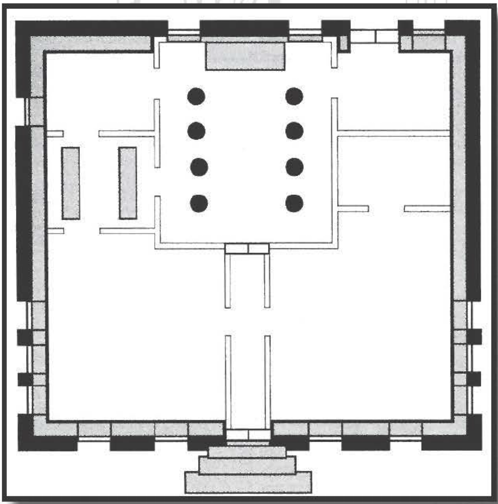

######
Temple
######

In our travels, we investigated hundreds of temples.
Sometimes, it was because Raichael had been asked to
by her order; sometimes, it was out of curiosity or a
desire to explore; sometimes, it was to patch up our
wounds. Although there are as many types of temples
as there are religions, most temples have the same (or
similar) features.

Above all else, temples exist to serve a religion and
its community. For any belief system that has been
around for more than a few years, almost no aspect of
its temples is designed by accident; the layout, shape,
size, color, and appointment of temples generally refl  ect
its dogma and symbolism.

Here are some features we’ve found in various
temples.

**Narrow corridors** might represent that the precepts
of its faith dictate everyone must ultimately go to visit a
deity one at a time after death. Conversely, **wide open**
areas might signify that community is exceptionally
important to the religion.

A temple may have many **windows**, both to provide
light and to expose its members to the glories of the
natural world. Or it may have very few, because the
religion demands that its community not lose focus
by distractions of the outside world.

**Food** might be presented or sacrificed at a temple.
Fruits and grain products such as bread are the most
common offerings (to be collected and eaten by the
clergy or — especially in open-air temples — eaten
by animals or left to rot). Animals are generally sacrificed, the blood often gathered to represent purity or
impurity, depending on the faith. (However, at least
one religion we witnessed had a touching ceremony
where the priestess describes how they are about to
celebrate their faith with the struggling, flustered dove
before her ... only to release it just before plunging a
dagger into the wooden altar top. Th  e dove’s escape
to the open skies represents the faith’s triumph of
mercy and forgiveness over humanity’s base desires
to kill and defile.)

The most important element of almost any temple
is the **altar**, here defined loosely as the focal point of
the faith’s prayers and devotions. The altar is where the
faith’s community leader directs the prayer services.
While it’s possible to have a temple without an altar
of some kind, in practice we’ve only seen this twice. In
one, fi ve clerics address the congregation while standing
against each wall of the pentagonal temple. In the other,
taking place in a near-pitch-black temple, the priest’s
sermon took place from amid the congregation (the
acoustics made it diffi   cult to discern where, exactly, he
was). At the midpoint of the ceremony, he performed
a miracle that summoned a ball of light; this hovering
ball became the focal point of the mass.

Unlike monasteries, temples are devoted to the
greater needs of larger groups of the faithful. As such,
they generally have a gathering area of some kind;
this is almost always by the altar, usually containing
seats, pews, or benches for the faithful to sit, kneel, and
stand. Alternatively, some temples have special mats or
other portable seating arrangements. In general, these
gathering areas are usually the most richly appointed
and adorned sections of the temple.

In addition to one or more formal gathering places,
temples often have other contemplation areas
where the faithful can visit to pray, meditate, compose
their thoughts, or the like. Th  ese can be sections of the
main gathering area (such as a shrine to a lesser but
still important deity or prophet), other rooms within
the temple, or even separate buildings or locations
on the temple’s grounds. Th  ese places run the gamut
from ornate to plain, although they almost never have
as many resources devoted to them as the altar or
main gathering area. I hesitate to say they are “worse”
because that’s an aesthetic judgment; I’ve often found
my (admittedly weak) spirituality more kindled by
these simple, tasteful shrines or rooms than I have by
the ostentatious temple center.

To be honest, even if an element does seem incidental,
the religion will usually come up with some justification as to why it is such.
“We enter the temple from the
west because ... er, that is the direction of the sun’s setting, and our illumination begins
where the world's light ends. And
the large fire in the antechamber
represents the purifying love of
our ... no, wait. That's not supposed
to be there. Run!" (More seriously,
incense is used in some temples to
mask the aroma of sweaty farmers
... although the faith might incorporate this real-world necessity
by pointing out the smoke rises
to the heavens like the spirits of
believers.)

Most temples have on-premises
clerics, monks, deacons, or the
like, and as such must provide
living quarters for them. Depending on the region, religion, and
relationship with local nobles or
community, these holy people
may also be charged with the
defense of the temple in the event
of attacks; if not, then there will
presumably be knights or trained
militia citizens marshaled in that
situation. (In case it's not obvious,
these arrangements exist because
temples are usually the first target
of an attack on a community, owing to the wealth most
temples have on their premises; statues, ornamentation,
or dressing that are considered sacred to the faithful are
merely seems gold and silks suitable only for reselling.)
Of course, these measures assume that a region knows
the threat of invasions. While this is usually the case,
our group encountered one temple in a remote region
that had never known warfare or invasion, so they had
absolutely no concept of the notion when we visited.
(All the while we were there, I kept saying to myself,
"Please don't be invaded while we're here. Please don't
be invaded while we're here ... "Fortunately we weren't
... although, in hindsight, it would've made a pretty
exciting story if that had happened.)

Finally, most temples have ample storage, whether
for seasonal adornments, ceremonial garb for the holy,
or other odds and ends. There's generally little noteworthy
about such areas. However, our group once found a
temple that promised its followers a means of directly
interacting with their god; after some investigation, we
discovered a gearwork assembly in a store room that
controlled a giant "talking" visage above the altar. (f m
generally skeptical of any miracles that require constant
lubrication.) If a temple has any significant stores of
treasure, they'll usually be kept in a locked or guarded
vault room or other heavily protected area.

The Nyg-Fa Temple of the Fa'ayn belief (translating to
"truth" in their language) illustrates both the commonalities and individuality of these places of worship.

The Nyg-Fa Temple has a traditional altar; in this
case, it's made out of top and bottom layers of basalt
with an outer ring of bamboo. Locked within this
bamboo "cage" is a plant with broad blue-green leaves
and tiny yellow flowers. In talking with the Temple
Elder, Raichael learned that this plant is a Gar-Fa ("the
growing truth"). All Fa'ayn temples contain one of these
plants, and according to their traditions, all these plants
are descendants from the original Gar-Fa created by
Fana'ayn, their faith's beautiful druidic founder. In fact,
this plant is so sacred to them that living specimens are
only permitted to be within Fa'ayn temples, although
a leaf from the temple's specimen might be presented
to a particularly devout member or family on a special
occasion. (No doubt, should a temple's Gar-Fa become
endangered, the Temple Elder would go to great means
to ensure its recovery and safety.)

Nyg-Fa's followers bring thin, soft mats made from
richly dyed green fibers. Over the course of their thrice-
weekly religious services, followers go from sitting
crouched on the matt to kneeling to standing with their
arms over their heads - simulating the "growth" of
the followers as part of the community.

The Nyg-Fa temple has two meditation areas. The
first is adjacent to the ceremonial hall and is lined
with beautiful wood carvings depicting the religion's
tenants; so fine is the line work and artistry that it's
possible to miss seeing them the first few minutes
you're within the chamber. (For a donation of a few
silver, the Temple Elder will provide parchment and
charcoal for people wishing to make rubbings of a
particular engraving. Given the beauty and intricacy
of the etchings, this could well be a bargain ... and I
swear I saw something resembling a map in one of
the pieces.) The second is an elaborate garden that is,
according to the Temple Elder, exactly 360 steps from
the rear entrance of the garden - one for each degree
of the circular sun, "from which all good life ultimately
springs" (or so says the Elder).

Although not universal, temples are often centers of a community (for believers, at any rate).
The purpose and structure of this center depend
on how popular, universal, and strong the faith
is within a community. In a township with many
rival religions, these gathering sites might be small
and intended primarily as a meeting spot before
services. In communities with one primary religion,
however, these sections of the temple can be large
and elaborate, serving the role as a gathering spot
to keep the community strong. Of course, how much
the community uses these areas depends also on
how spiritual the people are in the first place. In
several communities, we've seen solitary temples
with large antechambers almost awash in dust, with
uncaring citizens bustling around it.

Such a fate has not befallen the Nyg-Fa. The
temple enjoys the status of belonging to the second-most prevalent religion; as a result, its people are
a vibrant community, especially among farmers.
This temple has two adjoining rooms. Three times
weekly, one room is used for small meetings of select
groups, and once a week, both rooms are used for
gatherings after religious services.

Like most religious living quarters, those of the
Nyg-Fa are pretty spartan. There are two rooms -- one for the Temple Elder and one shared by the
two neonates. Their proximity to the altar means
they are the first line of defense for the temple,
although in the event of an emergency, the Elder's
only duty is to retrieve the Gar-Fa and escape -- usually out the back exit.

The Nyg-Fa storage facilities are mundane, containing nothing more than spare mats, ceremonial
garb, food, and other items necessary for formal and
informal functions. It has no "hidden" wealth to speak
of, although the temple uses a fair amount of gold
(actually gold plating) throughout, since they see a
symbolism between gold and the rays of the sun.

While Raichael was debating metaphysical
nuances with the Temple Elder, I found myself
wondering what other sorts of events might happen at a temple.
To be sure, “evil” temples (those who
worship dark gods, evil forces, politicians) have been a
staple of literature for quite some time, not to mention
a constant thorn for do-gooders of this world.

Of course, most of the story possibilities of the
monastery apply to temples as well. They are very
similar buildings, except a temple serves the needs
of the faithful public while monasteries tend to its
private holy people.

It’s possible that a group might have to infiltrate such
a place, perhaps to recover information or fi nd a secret
lurking within. While it’s usually nice to be diplomatic
and polite, some religions are more insular than others,
and it’s not always possible to even see those in power
at a temple. For example, one palatial house of worship
we encountered had as a precept that its High Priest
was unapproachable. Unfortunately, we had learned
that an assassin had tricked her way within the temple
and was planning on killing the High Priest. (If this
had happened, the region would likely have plunged
into turmoil.) Denied any direct means of warning the
church, we had no choice but to infiltrate it ourselves;
we eventually found and stopped her, but it was nerve
wracking for a while.

Many temples have a policy of “sanctuary” — those
seeking asylum within such a temple are protected
from the secular law by staying within. In theory,
those who receive sanctuary are expected to live by the
moral code of the religion; they have, in eff  ect, been
given freedom from secular authorities in exchange
for obeying the church. In practice, many unscrupulous people have used this asylum in the past merely
to escape prosecution, hoping to fl  ee from the church
— and justice — later.

Temples often provide services to the community,
such as healing, research, or access to holy items.
Sometimes these are only furnished to members of the
religion, but often they will be given to others if the
need is great or if they feel that doing so might persuade
someone to join their faith. Some temples just don’t
care, and off  er their services to anyone willing to meet
their nonbeliever prices. Th  is is most common in war-
torn or conflicted regions where showing favoritism
would be tantamount to choosing sides, which could
prove devastating to weak temples.

Finally, visiting a temple can be a deeply moving
event for the faithful; those who are devoted to their
causes can fi nd themselves refreshed, and even those
who aren’t particularly religious can fi nd themselves
rejuvenated by watching the simple act of those believing in what’s right doing what they can to express their
belief and commitment to those ideals.

As an aside, I note that it’s also possible for people to
be in conflict with a religion, yet neither side being “evil,”
as we think of it. For example, if two temples exist in a
town, and one preaches restraint and self-denial while
another celebrates the openness and freedom of alcohol
and casual interactions, then these two will probably
be in conflict. Neither is “evil” (per se), although both
would probably view the other as misguided. (But if the
head of the temple cackles maniacally and expresses
confidence in his ritual to allow a venomous god to
snuff   out all life in the world, thus sating primal dark
appetites ... well, you should stop that person.)

Fa’aya
=======

Those who follow Fa’aya (or the Fa’ayn Path, as
it is otherwise known) believe in the holiness of its
founder, the druid Fana’ayn. Although upholding the
sacredness of life as most other druids do, she asserted
that everything has the potential for divinity through
the process of growth. She taught that all good things
grow, and that the only criteria for the divine is they
do not stop “growing.” (One of her ideas most often
scorned by other religions is that stars are actually
akin to the sun, and similarly divine; the light from
these orbs has merely “grown” outward infinitely, and
refl  ect in the night sky visibly as a result.) Because of
this faith, followers of Fa’aya believe in healthy growth
in all things; whether growing mighty oaks, erecting
high towers, expanding the mind through learning,
building muscles, or raising tall and healthy children,

Fa’aya teaches that all growth and expansion is proper,
holy, and a way to achieve divinity.
Fana’ayn’s most remarkable deed came during the
most incredible drought and pestilence seen in the
region for centuries. As crops withered and thousands
died from illness and hunger — and with the threat
of even greater death looming — Fana’ayn convinced
everyone in the village to replant their crops, request-
ing that, in the four corners of their fields, they should
plant clippings of her own plant. Th  ese crops grew just
enough to feed the region, even without minimal water,
an abbreviated growing season, and fewer skilled farm-
ers than normal. Once the plants were harvested, all of
Fana’ayn’s clippings withered and died, despite their
having been left in to grow out of respect; in fact, all
clippings of this plant in the world supposedly died.
The only plant to survive was Fana’ayn’s original one.
This became known as the Miracle of the Gar’Fa, and
all Fa’ayn temples supposedly contain off  spring of this
original plant, although the fate of that fi rst plant is
unknown.

..  _clearing_the_undergrowth:

..  admonition:: MIRACLE: CLEARING THE UNDERGROWTH

    ..  include:: spells/temple.src

At present, there is a slight schism within the community; a splinter sect, calling themselves Fa'aya Engar
(meaning "grandiose truth"), has taken Fana'ayn's mandate to grow to also mean weight. Many members of
this sect are thus phenomenally obese. Fa'aya's official
position is that this is not "healthy growth" as mandated
by Fana'ayn; the splinter sect counters that, according
to Fana'ayn, all growth is healthy and holy. The outcome
of this ideological conflict is uncertain.

Fa'aya is a religion favored by farmers and cosmopolitans alike; anyone devoted to the concept of growth
- whether it's tending crops, expanding a mercantile
empire, learning new languages and philosophies, or
designing castles - is welcome. Their sworn enemy
is entropy and war of all types. They teach a mild
aversion and prejudice against those who
avoid the sun, especially Humanoids such
as Dwarves who are shorter than Human
average (who, their precepts argue, "have
stopped growing because they have turned
their backs on light").

Clerics of Fa'aya
==================

Clerics of Fa'aya with access to Miracles
almost universally prefer the favor extranormal skill, since ideas of growth most
often correspond with those of aiding the
world or others. The second most common
is strife; this surprises many, who assume
that skill's destructive capabilities are antithetical to the ideals of growth. While this
is true, smart Fa'ayn clerics realize that to
make something grow it's often necessary
to destroy or cut it; for example, cutting circular open wounds into a square enables the
body to heal much faster. The least common
is divination; it is difficult to directly justify
many aspects of this skill, since Fa'ayns do
not dwell in the past and they also believe
the future is what a person grows toward.
Still, some clerics realize that learning is a
step of personal growth and can often work
divination miracles that lead to a greater
growing good.

Required Aspect
---------------

Gesture (-2): Making something
seem to grow (fairly simple). This is most
commonly accomplished by making a fist
and then opening it, palm up; the fingers
are "growing" outward. However, there are
variations: curling into a ball and standing
upright, and so on. One Fa'ayn cleric who was bound
and held captive in a prison cell was able to invoke a
miracle by puffing out her cheeks.

Recommended Aspects
-------------------

Gar'Fa Leaf (-5): Every year on the spring equinox,
all fully vested clerics of Fa'aya receive one leaf from
their temple's Gar'Fa leaf. This is the most powerful and
sacred holy symbol of the Fa'ayn, and is irreplaceable; if
a cleric loses it or has it destroyed, he must wait until
the next equinox to receive another. In dire straits, a
Fa'ayn cleric can have the component become consumed
at the end of invoking a miracle; this destroys the leaf
but imparts an additional -5 aspect modifier (see "Components" on page 91 of the D6 Fantasy Rulebook).

Incantation (varies): Prayer to Fana'aynor exaltation on the power of growth. This is most often a -1
modifier (for common mantras such as "Good stems
from growth" and "Sun, I reach foryou") although it can
rise as high as -6 (for reciting, from memory, Fana'ayn's
"Sermon of the Fresh-Cut Gar'Fa").

..  include:: ../characters/temple_clerics.txt
