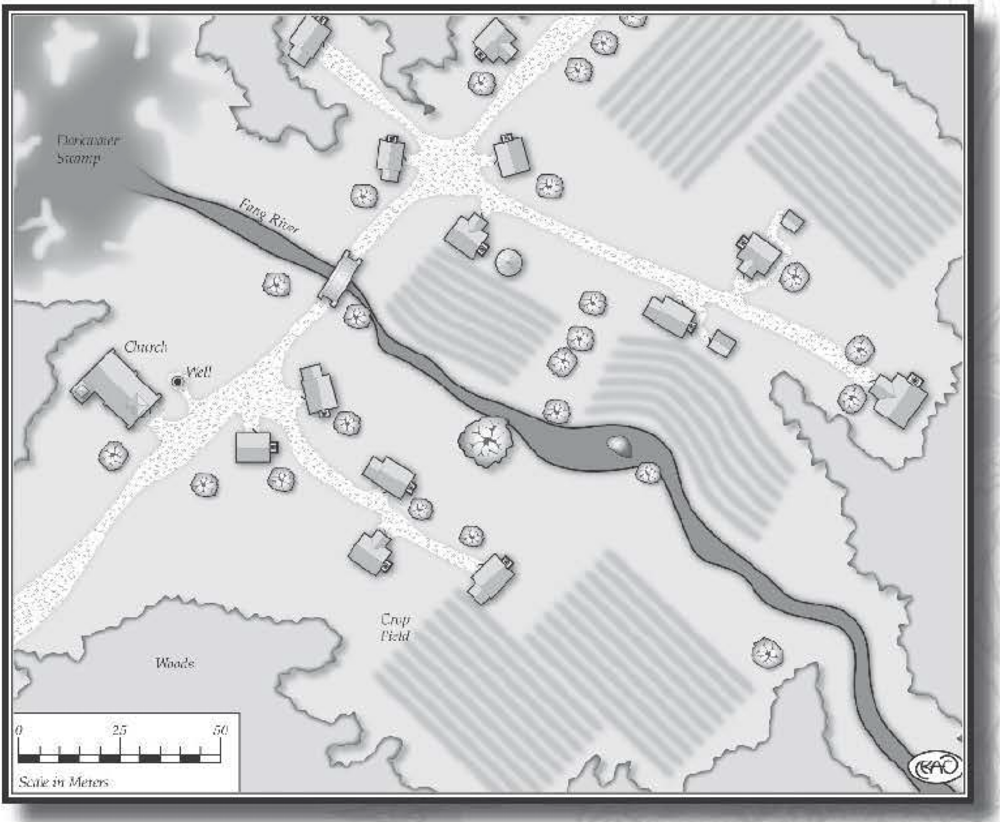

############################
Delmara, Forest-side Hamlet
############################

Standing alongside a trade route is the small hamlet
of Delmara. The ancient deciduous forest that edges
the city provides the inhabitants with the material for
housing, fuel, and trade. Carpenters, wainwrights,
and shipwrights favor the ancient hardwood trees
in the area, providing most of the 300 denizens with
a valuable commodity for barter. Those in Delmara
who are not foresters rely upon farms for their sustenance,
selling their excess nuts, fruits, vegetables,
and livestock at markets. Even though the hamlet is
small, it's situated upon a heavily traveled trade road,
bringing many merchants to the settlement. In turn,
Delmara's solitary inn is quite successful and is a
favored gathering point at sunset. Not even Bede
Trowbryde, Delmara's mayor, is immune to the
appeal of the Forest Nymph Inn.

Although the fertile ground makes the land
surrounding Delmara perfect for farming, its
rich soil Jacks an abundance of stone. Over
the years, many people have attempted to dig
a stone quarry, but each attempt has failed
as there's seldom enough stone for the construction of more than one or two
buildings. The majority of the structures in
the settlement are wattle and daub
buildings.
These are constructed of woven strips of oak, covered with
a mud and straw plaster to insulate against the cold
weather.

Delmara Forest
==============

Spanning for miles around the hamlet are the tall,
brooding hardwood trees of the Delmara Forest. Bards
sing songs about this ancient woodland, and the
resilient trees. The songs recount a history of a forest
imbued with magical properties, tended and farmed by
Elves. The Delmara Forest in these songs is often called
the Bowood Forest, as it's told that for centuries elves
used the trees to make beautiful and powerful bows.
Most folk in Delmara consider this nothing more than
a folktale. Certainly many bowyers have attempted to
construct bows from the hardwood of the trees, but
none have succeeded, as the wood either cannot be
bent or snaps during shaping.

Darkwater Swamp
===============

Just north of Delmara is the foreboding Darkwater
Swamp. This place is avoided by aJJ of the inhabitants
of the hamlet. Both animals and people have lost their
lives in this treacherous region. Many folk believe
that the swamp is not natural, that it's a living thing
itself. It's said that it often calls to those who wander
within its sight, luring them into its watery clutches
with familiar voices. Or its fetid stench is replaced by
an alluring smell of food that leads animals to a watery
grave. At night, for those who dare to look, lights are
often seen floating over the black waters, dancing about
as though they were alive. All who visit Delmara are
warned away from the Darkwater Swamp.

The Hamlet
==========

**Pushcart Market**: Just off the road, north of the
Forest Nymph Inn, is where the local farmers gather
each day with their pushcarts. In this small, mobile
market, fresh fruits and vegetables are sold. Salted
and smoked meat is also offered. While the hamlet is
small, the market sees much traffic, as all of the locals,
and some travelers, frequent the spot for food. On
occasion, a traveling caravan that offers cloth, spices,
pottery, and other rare products joins the farmers. By
noon each day, the pushcarts vanish as quickly as they
appeared, only to return again on the morrow.

**Church**: One of the few buildings to be constructed
of stone is Delmara's church. In the early years of the
hamlet, the cleric Cernay Avers arrived, and with his
newly acquired flock, constructed the church. Believing
the daub and wattle building did not properly serve his
deity, Cernay convinced his sect to rebuild the church
in stone. It's become an emblem of Delmara's staunch
and steadfast devotion. Many travelers who encounter
Cernay find him a trifle over zealous. The locals tend
to overlook his determined attitude.

..  include:: ../characters/cernay_avers.txt

**Bede Trowbryde's House**: Opposite the Fang River
from the church stands Delmara's second stone building, the mayor's house.
When the building was
first erected, the intention was to make it the
abode of the elected
mayor. As it happens,
Bede Trowbryde has
been the elected mayor
for 20 years. Most of
the people in the hamlet now simply refer
to the dwelling as the
"Trowbryde House"
or "Bede 's House."
Because of the stone
and mortar used, the
building stands two stories high, and is
quite comfortable
compared to many of
the smaller residences
in Delmara.

..  include:: ../characters/bede_trowbryde.txt

..  _settlement_considerations:

..  admonition:: Settlement Considerations

    Settlements in fantasy settings vary depending upon many
    factors. Population, resources, location, and trade are often
    the influential elements that give a settlement its distinct
    personality, whether it's a small hamlet or a booming metropolis.
    Some locations serve focal points for trade and travelers,
    while others may possess small populations but have abundant mineral mines or farms. Gamemasters need to consider
    these aspects when designing settlements or when heroes are
    exploring them. Every city is distinct. Intrigue, adventure,
    and excitement are plentiful in such places. Avoid making villages nothing more than spots to purchase equipment; doing
    so, while sometimes entertaining for players, slows the pace
    of a scenario. This is not to say that the players' characters
    should not be allowed to resupply; rather, gamemasters can take
    advantage of this to introduce subplots, new characters
    or entirely new adventures. The locations included in this
    chapter serve as templates and ready-made settlements for
    immediate use. Additionally, the "Settlement Design Sheet"
    provides a quick system for creating hamlets, villages, towns,
    cities, and other similar places.

