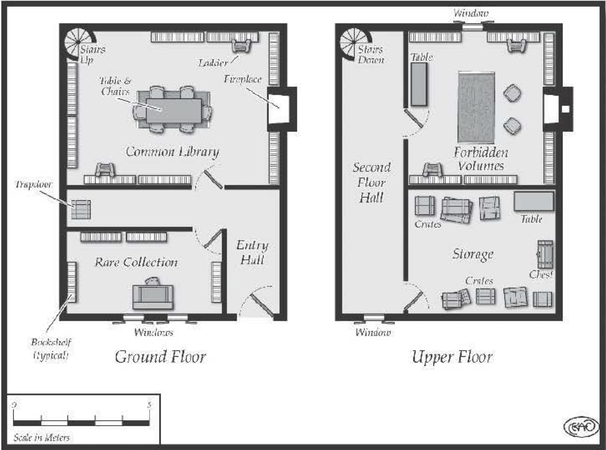

#################################
Inachon's Point, Coastal City
#################################

Perched on the side of a coastal mountain is the
seaport city of Inachon's Point. For over 200 years, the
city has served as a coastal beacon with its towering
lighthouse. Inachon's Point is a free city-state, ruled
by a six-member governing council and an Assembly
of 500 citizens, legislating for a population of nearly
100,000.

Decades before the city's founding, it served as a
base for pirate fleet that scoured the coastal cities,
plundering every place encountered. But all residents
of the now thriving trade and port city agree that the
ugly history is behind them.

Defended by massive stones walls, a rocky outcrop,
and the sea, this maritime settlement is well protected -- which was part of the appeal for the original pirate
base. Visitors to the city find plenty of soldiers patrolling
the streets and docks. While all are welcome to enter
the magnificent city, those who disrupt business or
cause civil unrest are dealt with severely.

From a distance, the brilliant white houses of lime
and sandstone catch the sun, making Inachon's Point
shine like a gem. Even at night, its lighthouse blazes,
warning ships of the shallows and welcoming them
to a delightful haven. Merchant ships, caravans, and
traders all descend upon the thriving city
each day. Spices, textiles, precious metals,
gems, and common and rare items are all
to be found within its time -worn walls.

The Port
========

When the city's location existed as a
pirate base, a lonely, ramshackle pier served
all the ships that ventured into port. But
after the pirates were forced from their
stronghold, the newly formed Assembly
constructed a marina that extends for
nearly one mile. This mammoth undertaking has served Inachon's Point well.
It allows over 100 ships to dock and load
or unload cargo. Like most other areas
of the city, soldiers patrol it. Damage to
the harbor would be catastrophic for the
city's economy. All those who threaten this
important part of the city are executed for
the crime.

The Bazaar
==========

Located near the port is the open-air
bazaar where merchants sell, trade, and
barter all manner of goods. Day and evening, the bazaar bustles with traffic, its
narrow cobblestone streets so crowded that
simply moving from one end to another is
time consuming. During the hot afternoons, many of
the merchants hang rugs above their stalls, offering
shade to their customers in the hopes of selling more
wares. Lamps and candles guide the customers once
the sun sets, while the enormous flames from the
lighthouse add an eerie cast to the area. But all business ends at midnight: Even the profitable merchants
need to rest.

Heroes who venture into the maze of merchant stalls
and pushcarts are likely to find most anything they
could need. The air is redolent with the sweet and spicy
smells of cooking food, the calls of hawkers, and the
consistent buzz of amazed customers. Unless a player's
character is familiar with the bazaar or has a guide, he
must make either a Moderate streetwise or a Difficult
search attempt to find a particular merchant during the
day. The difficulty increases by +5 at night.

If a hero is in search of a particularly rare item (such
as a well-crafted weapon, poison or exotic materials for
spells), increase the difficulty by +10 during the day and +15 during the night.
A guide familiar with the twisting
streets of the bazaar can reduce the difficulty by 10, but
an incompetent one can make things worse!

The prices in the bazaar vary from day to day. A
gamemaster might change the location or price each
day, or require a player's character to haggle over prices
- the more unusual the item, the greater the cost.
Some items have such high prices that heroes might
have to work for the merchant before the fee is met.
Many merchants in the city hire daring adventurers to
seek out extraordinary things to resell.

Kasen The Merchant
------------------

For the entire 40 years of his life, Kasen has lived in
the city of Inachon's Point. From outer appearances, he
is a moderately successful spice merchant - but this is
deceiving. During the years of toiling at his stationary
wagon, Kasen has acquired a vast amount of wealth. He
has also purchased stalls for family members who, while
not as successful as he, have done well for themselves.
Although Kasen has much experience, this is not the
secret of his success. Rather, he sells unusual potions
and incense that possess nearly magical qualities. His
years of working in the bazaar have provided him with
numerous contacts from distant shores, and the amazing
qualities of his product have made him a favorite
among warriors and wizards. His goal is to one day sell
his stall and move to a large house above the city. To
protect his investment, he sleeps in
a caravan wagon in the bazaar, and
he has hired two guards, who never
leave his side.

Because of Kasen's renown, many
potential customers seek him. Trying to get Kasen to part with some
of his special stock requires a suitable (and successful) interaction
attempt, greased by an appropriate
monetary offering. The merchant
response much better to charm than
anything else.

..  include:: ../characters/kasen.txt

Kasen's Potions and Incense
---------------------------

..  include:: ../items/kasens_potions.txt

Guards
-------

..  include:: ../characters/nevest.txt

..  include:: ../characters/cire.txt

The Scar
=========

Nearly at sea level, running along the outskirts of
the bazaar is Inachon's
slum quarter. This district
of the city is the oldest,
and it looks its age. Scattered throughout the ramshackle neighborhoods
are the occasional stone
buildings, but for the
most part, the structures
are comprised of rotting
wood. Age and the damp
wind have conspired to
destroy many of the once
beautiful residences and
stores.
Gathered in this neighborhood are the laborers
who load and unload cargo.
There are far more people
then there are jobs, so each
morning thousands of the
Scar's denizens trot to the
docks, each waiting in line,
hoping to be selected for
work. The pay is low and the work is bard. But desperate people work for desperate wages.

Fane's Tavern
=============

Sitting among the myriad rows of unassuming buildings in the Scar is a shuttered shack that has served as
tavern and secret guild house for decades. Although
history tells that the pirates who once called Inacbon's
Point home are long dead, it isn't the case. On the contrary, the pirates have simply adapted. When sailing
the seas and stealing gold and jewelry became too risky,
many of the former seamen traded their sea legs for
walking boots - soft -soled walking boots.

On the surface, Fane's appears nothing more than
a rats' nest of a tavern. All respectable citizens of Inachon's Point avoid the despicable site. But underneath
its haggard facade is the gathering place for the city's
thieves. Beneath the floor of the tavern is the cellar
where meetings, plans, and territories are discussed
The descendents of the forgotten pirates do not limit
themselves to stealing from wealthy houses. They help
themselves to cargo on the docks -bribing soldiers to
watch the stars while barrels and crates vanish into the
night. They also smuggle cargo into the city, avoiding
tariffs and taxes, allowing them to resell it to merchants
on the cheap. This is accomplished by a series of smugglers' coves that pepper the coastline, with a maze of
tunnels leading beneath the city. The members of this
exalted guild are sensitive about freelancers.

..  _politics:

..  admonition:: Politics

    One essential element in designing a settlement is the
    political system. The very nature of villages, towns, and
    cities requires them to be organized under some form of
    rule of government.

    The type of political system used in a settlement is mainly
    determined by the gamemaster in the end. However, consistency does make fantasy locations more credible - although
    bending the rules of politics can create intriguing and memorable places. To make a hamlet or metropolis fascinating for
    players, a gamemaster can allow them to discover through
    role playing the type of government present. As the heroes are
    likely to travel from one land to another, from one kingdom
    to another, from one city-state to another, it's quite plausible
    that they would not be aware of the laws of each place they
    stop. If the laws or politics of a settlement is an essential part
    of the location's "personality," then the gamemaster needs to
    define these elements before the players' characters arrive.
    However, it's not necessary for a gamemaster to become
    entangled in the complications of politics to devise a political system. Sometimes using an land lord who is appointed
    by a king is sufficient. Unless the politics of a settlement are •
    essential to an adventure, then all that need be done is to
    provide enough surface information to give the village or
    town plausible background. The list in the "Types of Leaders"
    sidebar gives some common possible political systems that
    can be used when designing a settlement.

    Of course, each of these basic political structures can
    be modified with various flavors of political philosophies
    such as democracy, communism, oligarchy, monarchy,
    republic or constitutional government, and scores of oth- •
    ers. Possibly the best rule that a gamemaster can adhere to •
    when designing a government for a settlement is the rule
    of consistency. Avoid placing political systems that oppose
    each other within the same borders, unless the realm is
    a collection of city-states. Don't create laws that conflict
    with a settlement's politics simply to control or confuse
    the heroes. And equally important, keep the politics in the
    background unless it's essential to the story.

Any thief who attempts to practice her trade inside
the city is certainly going to encounter a member of
the guild. Such an event is only a matter of time. When
this happens, the "scab" thief is given the option to join
the guild, usually by performing several jobs that are
both risky and profitable, or the thief is told to leave
the city. If one or the other option is not accepted, the
members of the guild are ruthless in
remedying the situation.

Fane, Tavern Owner
==================

Fane is a spry man in his mid-fifties,
with dark hair streaked with gray. He
is rotund , friendly, and unimposing.
Underneath this friendly exterior is
the head of the thieves' guild, and a
ruthless criminal. Although he no
longer practices his trade, he does
train and guide the members of his
guild. He assures their interests a re
protected by eliminating any other
guilds that vie for power, and by
preventing any outside thieves from
working the city.

Any new customer who enters
Fane'sbusinessiscarefullyscrutinized.
Unable to resist practicing his ar t to
some degree, Fane greets all new faces
with a warm smile, while patting them
down for money and belongings. He
never steals anything; he just sizes up
his prey. He doesn't' want to draw any
attention to the tavern by having a client accuse him or one of his customers
of theft. Once he knows the "worth"
of a person, later that night he sends
out one of his guildsmen to acquire
the goods .

Besides being the leader of the
largest underground business in
Inachon's Point, he is also a useful
source for rumo rs and information.
Heroes who manage to befriend him
find him a useful ally for garnering
secrets, gossip, and news.

..  include:: ../characters/fane.txt

..  include:: ../characters/guild_member.txt

High Town
==========

Sprouting from the mountainside
upon which the city's lighthouse
rests are numerous residences, each
growing larger as they move upward.
This quarter of the city is where the
money lives. It can be seen in the
limestone-plastered houses, and
the mansions lining the cobblestone
streets. Groomed gardens and spraying fountains are common fare for this
neighborhood. Few residents walk the
streets, preferring to ride in carriages.
Every morning, there's a great exodus
from High Town as the servants plod
down to the bazaar to purchase food
and daily necessities. Unlike the lower
levels of the dty, this is the land of
successful merchants, bankers, politicians, and city officials.

..  _types_of_leaders:

..  admonition:: Types of Leaders

    Elected Leader: The ruler is selected by the general
    populace or by specific officials. These officials in turn might
    be elected, or they might have the ability to foresee the
    future, thereby making them the best people to choose
    a ruler. The ruler might be of average ilk, be a persuasive
    orator, have demonstrated leadership ability, possess
    mystical qualities, or claim birthright. The title can vary
    from chief to constable to mayor, depending upon the
    nature of the settlement.

    Appointed Leader: In some cases, this class of ruler
    doesn't differ much from an elected le;ider. However,
    in most instances, an appointed leader is one who has
    been granted the rule of power by a higher authority in
    an empire, kingdom or city-state. Titles for this class
    of ruler vary from consul, governor, pro-consul , mayor,
    lord, or prince.

    Self-Appointed Leader: Occasionally these rulers are
    benevolent and concerned about the welfare of the people
    they govern. In most instances, though, they're tyrants
    who have come into power through money, otherworldly
    means, or military might. These self-appointed leaders
    might adhere to a rigorous military code or be religious
    zealots , determining laws by whim and interpretation of
    their belief system.

    Ruling Councils: Rather than limit governing of
    people to a solitary person, ruling councils have multi pie •
    members, ranging from two to hundreds. These rulers
    could be selected by a law that requires each member of
    the settlement to serve as a member of the council, by the
    drawing of lots. Or they might be elected or appointed,
    depending upon the political landscape of the country they
    occupy. Th.is is also a common system of government for
    large city-state that are independent of greater rule.

Phylo Duran's Library
=====================

Standing tall among the stone buildings of High
Town is the city's only library. Funded and erected
by one of the city's most eccentric citizens, it serves
as a research library for Inachon's Point scholars. It's
visited by people from hundreds of miles away and
across the sea.

While the library's oblong, eight -story exterior is
rather bland, it's one of the tallest buildings in the city.
Prom the port and from the city gates, the bright white
library stands out among the surrounding buildings.

Besides being a library with a vast collection of
manuscripts, it's also the residence of Phy lo Duran. His
private rooms can be found on the highest floor. On
warm days, he stands upon the flat roof, either reading
in the sunlight or gazing at the horizon.

Even though Phylo is a lighthearted man, he doesn't
let everyone peruse his collection of tomes. Heroes
longing to gain entrance to this large and unusual
library must first persuade Phylo. A hero that succeeds
through charm or bluff is welcomed into the library. If
she fails, she must return on another day, and Phylo
adds a +2 bonus to his opposed mettle total. For each
failure, another bonus accumulates.

Another approach is to engage Phylo in a scholarly
debate. Again the player's character makes an opposed
roll against Phylo, both using their scholar skills. If
the player's character wins, the librarian is stumped
and invites the character into the library for further
discussion.

The last alternative is the use of a letter of reference.
The persuasion or reading/writing total used to craft
the letter must beat Phylo's reading/writing roll by
five points, as he's always careful to examine a letter
of reference closely to make sure it isn't
a forgery.

Phylo Duran, Librarian
------------------------

The somewhat eccentric librarian lacks
good interpersonal skills. He spends much
of his time with books, which seldom speak
back. The endless years of one-way conversations has made Phylo a bibliophile and an
introvert. He is lanky, gray haired, and 55
years old. He tends to overdress and is seldom seen without a book in hand. The truth
is Phylo feels awkward without the heft
of a volume of lore to balance him. When
engaged in conversation, he occasionally
turns away and commences reading from
whatever book he is toting around. He is
very imaginative, so sometimes when an
idea is lodged in his head, he tends to stare
into the distance, pondering whatever
thought has captured his fancy.

The peculiar librarian is a difficult man to
befriend. Even if a hero manages to charm
him, this only lasts for a few hours, after
which, Phylo grows weary of the person's
presence and requests her to leave. The
only sure method of gaining the man's
favor is by enter ing into a debate with him
or by presenting him with an interesting manuscript .
Because of his vast collection, the character's scholar
roll must beat Phylo's scholar total, with a +S modifier
to the librarian's total . If this succeeds, the hero has
gained a lifelong friend.

..  include:: ../characters/phylo_duran.txt

The Library
------------

1.  Entry Hall : This is the main entrance to the library.
    The door is made of oak with iron rivets hammered into
    the wood to strengthen it (Toughness of 3D). Most of
    High Town's residences consider this an unnecessary
    security measure that only reduces the beauty of the
    neighborhood. However, it does make the door much
    more difficult to smash. (Picking the lock has a difficulty
    of 22.) Also located in this hallway is a trapdoor, which
    leads to the cellar. The door is normally locked and has
    a difficulty of 15 to successfully be picked. The cellar
    stores mostly food and wine.

2.  Common Library : Shelves stacked with books,
    scrolls, and loose paper clutters this room. In the center
    is a reading table, and a fireplace is set into the eastern
    wall. A tall ladder leans against each shelf, providing
    access to the higher texts in the room. In the northeast
    corner is an iron spiral staircase leading to the next
    level. Performing a search in this room with a difficulty
    of 15 reveals the majority of volumes on the shelves are
    historical and probably only of interest to local scholars.
    (Exceptionally high totals may reveal a hidden book of
    obscure and valuable significance.)

3.  Rare Collection :
    This smaller room off
    the entrance hall is
    designed for private
    study. It also has a
    collection of unusual
    manuscripts, many of
    which discuss legendary beasts and magical practices.
    Heroes
    who use search have
    a difficulty of 10 to
    finding some of Phylo's
    personal notes.

4.  Second-Level Hallway: The spiral
    stairs that lead to this
    level continue upward,
    all the way to the top
    level. Locked and set
    in the eastern walls of
    this hallway are two doors. The locks on both doors
    have a difficulty of 15.

5.  Forbidden Volumes: This library only Phylo
    and his most trusted associates may enter. It contains
    several volumes of works that would prove dangerous
    in the wrong hands. Rumor of this precious library has
    reached ears as far as the Scar - Fane has even heard
    of them but has not devised a method of acquiring
    them that won't result in his capture. If asked, Phylo
    simply claims that this room is storage. A successful
    opposed roll of bluff against Phylo's bluff allows a hero
    to discern that Phylo is fibbing about the room.

6.  Storage Room: This is a storage room. Inside
    are several crates of bound manuscripts and barrels
    of scrolls that Phylo hasn't inspected yet. After he
    scans them, he places them in the proper location in
    the library.

The Scroll of the Lost City
---------------------------

Secreted away in Phylo's library is a lengthy scroll
that describes a lost city located deep within a desert.
The unknown author of the manuscript describes
the city as being covered by a sandstorm, and all of
its occupants smothered in their homes. While the
document itself is no more than one century old, the
knowledge it contains dates back several centuries.
There are enough clues in the book that a character,
through careful examination, could figure out where
the lost city is.

Additionally, scattered throughout its pages are
also spell fragments. With some months of study, a
player’s character can piece together these fragments
and form entire spells.

The Point
==========

Nearly 1,000 meters above the city, at the highest
point of the stony mountain, rests Inachon’s lighthouse.
It’s guarded day and, as it’s the guiding beacon for
those who journey to the city. As night approaches,
one guard carries a torch, climbing a spiraling staircase,
to the stone summit. Th  ere he ignites the wood that
burns until morning. Each morning, the guards clear
the summit and restock the wood so the lighthouse
has fuel for the next night.

..  include:: ../characters/lighthouse_guard.txt

Smugglers’ Tunnels
===================

Staggered along the coast on both sides of the city’s
port are numerous smugglers’ tunnels. When Inachon’s
Point served as a pirate base, these subterranean routes
were often used to transport material and people in and
out of the city. Although most people have forgotten
them, Fane and his gang have not. Thieves regularly
use them to haul cargo in small boats to and from
ships anchored off   the coast. Forming a vast network
beneath the city, it’s possible to exit at most any place,
providing the person navigating the tunnels knows her
way around. Th  e tunnels require a Difficulty navigation
roll to get through. A roll can be made once per hour.
A failure means that the hero spends another hour
searching the tunnels for an exit. To find a specific
exit from the tunnels, one other than the one that was
used to enter the tunnels, the difficulty increases by
+5. The gamemaster should add modifiers if the hero
is in a hurry or is traveling without a light.

The tunnels themselves are rugged and filled with
water. In most areas, the water is only waist high, but
in other locations, it requires swimming or the use of
a boat to pass through. Unless a hero has experience in
the tunnels, there’s no way of knowing which passages
contain which depth of water.
