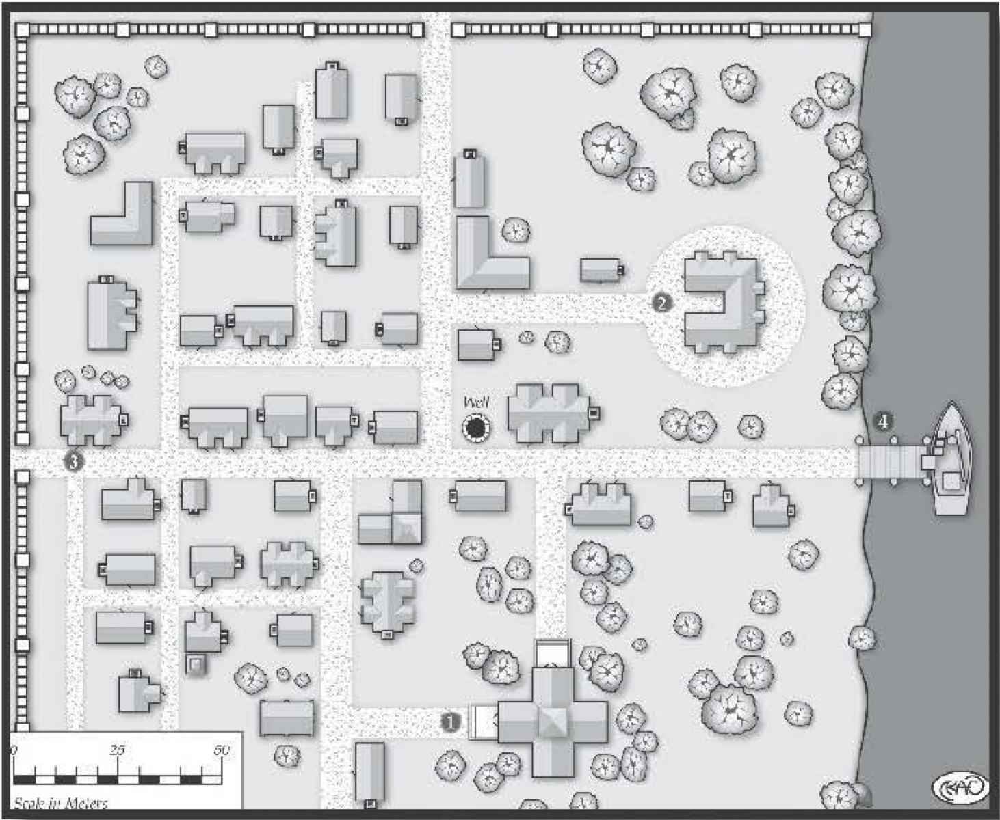

#################################
Kiselton, Riverside Town
#################################

Nestled upon the banks of the Durbin River is the
town of Kiselton. With a population of over 1,000,
it's a booming trade center that relies upon its salt
mines as a chief source of revenue. Like most settlements of its size,
Kiselton has a ruling council and a
mayor to perform the civic duties, such as appointing
a sheriff, negotiating trade agreements, and collecting
the taxes required to maintain the town's dock, roads,
defensive walls, and government buildings. Over the
years, Kiselton has done well, attracting laborers to
work in the mine for wages seldom seen in smaller
villages or warrens. Along with the opportunity for
greater earnings comes a broad range of entertainment,
attracting more residents with a variety of talents to
the riverside town. Its ease of access makes it a popular stopping place for travelers, caravans, and various
touring merchants.

The Salt Mines
===============

Located northwest of Kiselton is the vast series of
underground salt mines that have brought the town
its rapid growth and wealth . Each year, several tons
of salt are pulled from the earth and sold to smaller
and larger cities, near and far. Although the work is
wretched and dangerous, it's the lifeblood this thriving riverside settlement. The recent deaths of miners
have forced Mayor Garvin Belot to place city guards
inside and outside the mines. No one in Kiselton is
sure what or who is killing the workers, but the talk in
the taverns is that a monster is lurking about, feeding
upon warm flesh.

Such rumors do not sit well with the mayor, or the
ruling council. At every opportunity, all town officials
deny claims of monsters; instead, they place the blame
on rogues, claiming that soon a band of brave souls will
arrive and offer to rid the town of the "bandits." These
so-called heroes are the true perpetrators, and the members of the council
anticipate their arrival.

Rumors of War
=============

Perhaps council members have
hired ruffians in an attempt to oust
the firmly planted mayor. Or maybe
they hired toughs, but there's also a
monster prowling about. However,
should the players' characters hear the
rumors and offer to help, the mayor
doesn't hesitant to have the sheriff
arrest them, and he proclaims he has
captured the villains responsible for
the deaths, hoping to keep the favor
of the people.

The Town
========

With wealth often comes a fear of
losing that wealth. As Kiselton started
to prosper, one of the first undertakings of the ruling council was to
construct defensive walls around the
town, leaving only the riverfront open.
Each wall has a guarded gate, which is
normally open during daylight hours. During the night,
the gates are closed, though the guards remain. Gaining
entry to the town is much more difficult at night, as the
guards carefully inspect all who wish to enter.

Here are a few of the locations with the town, but
there's plenty of other places that weren't visited during
a visit not too long ago. As things hardly ever change
in these little places, it's likely that other visitors will
find the sights familiar from these descriptions.

Locations in Kiselton
=====================

1.  Government House (Mayor 's Abode):
    This luxurious manor was one of the first town structures
    to be erected. Beautifully tended, old hardwood trees
    surround the structure, providing plenty of shade for
    the three flagstone patios situated on the north, west,
    and south sides of the building. Standing two stories,
    constructed of stone and mortar, the Government
    House is the location for council meetings and trade
    negotiations with merchants and emissaries from
    neighboring cities.

    ..  include:: ../characters/garvin_helot.txt

2.  Temple:
    Kiselton's temple rivals the Government
    House in size and beauty. Entirely built at the cost of
    the temple's followers, it's another of town's prominent structures. Not only does it serve as a house of
    worship for the locals, it also provides boarding for
    its growing number of clergy. Presently, the temple
    houses 15 priests, but it's capable of rooming twice
    that number.

    ..  include:: ../characters/ladira_almer.txt

    ..  include:: ../characters/acolyte.txt

3.  Durbin River Inn:
    This inn existed years
    before the city walls were
    erected around Kiselton.
    It's a favorite haunt of the riverboat crews and road-weary travelers. Its sturdy wooden frame stands
    three stories high, and it has 20 rooms, varying from
    cramped and windowless on the lower floors to large
    and brightly lighted on the top floor. As with most
    settlements, the local inn is a locus of rumors, gossip,
    and shady deals.

    Renting a room at the Durbin River Inn varies in
    price with the quality of the room. Cramped, single
    bed rentals are Very Easy (10 copper pieces), while
    large two-and three -bed suites are Moderate (four go Id
    pieces). Jurin is not fastidious when it comes to cleaning the cheaper rooms. Dust and discarded material are
    included in the low-budget rentals, and the bedding is
    crawling with lice. These extra amenities are not found
    in the upper, more expensive suites.

    ..  include:: ../characters/jurin_coram.txt

    ..  include:: ../characters/ori_swifthand.txt

4.  Dock:
    While commerce is readily conducted by
    road, it's much easier by water. This is truer when
    transporting heavy loads of salt. While many of the
    neighboring settlements haul the precious mineral
    by horse, along the rutted roads leading to and from
    Kiselton, the larger cities use riverboats, carrying vast
    cargos of salt to be resold to even more distant locations.
    As a result, the dock has become an essential part of
    the town's economic success. It's not difficult to hitch
    a ride on one of the river boats - for a small fee paid
    to the captain, naturally.

    ..  include:: ../characters/dock_worker.txt

Rumors
======

All who spend an evening at the inn
are likely to hear numerous rumors.
The gamemaster can use the following
table for determining random rumors,
decidingwhichistrueandwhicharenot .
Amend the table to suit the needs of an
existing adventure, if desired.

1.  A clandestine band of thieves practices their trade in town.
    They identify each other and communicate through secret gestures.

2.  The mayor is planning on expanding the dock.
    The ruling council had a private meeting.
    They intend to purchase the houses along the river before announcing the plan, so that they can buy the property at a low price.

3.  The priestess at the temple is an excellent healer.
    It's said she came here from a distant city, hiding from the elders of her order for a crime she committed.

4.  Monsters did not kill the mineworkers!
    The mine foreman had them murdered to slow the production of salt. The foremen have been secretly mining it and selling on their own.

5.  The mines run deep into the earth.
    Something has been disturbed there, something that should not have been awakened.

6.  The bard Selwyn of Burch knows many histories of Kiselton and the local lands.
    Often he visits the inn, regaling customers with forgotten tales and delightful songs.

..  todo:: Selwyn of Burch, Bard.
